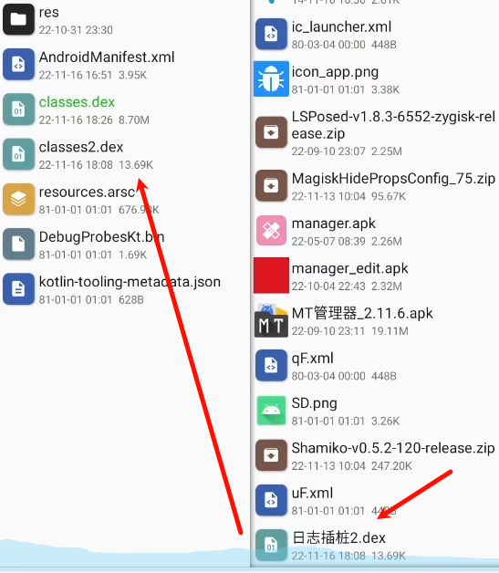

## **1.什么是动态调试**

动态调试是指自带的调试器跟踪自己软件的运行，可以在调试的过程中知道参数或者局部变量的值以及履清代码运行的先后顺序。多用于爆破注册码(CTF必备技能)。

注册码是根据机型特征特定算法生成的存储在临时变量寄存器中。动态调试读取即可。


## **2.动态调试步骤（adb+Windows+jeb）**

### 1.修改debug权限
apk需要开启debug权限模式来运行，才能调试。
查看是否开启
```
1、XAppDebug模块里右上角选择已经开启的APP

2、adb shell dumpsys package com.humen.crackme010 | findstr flags
`
`flags=[DEBUGGABLE HAS_CODE ALLOW_CLEAR_USER_DATA]` ⇒ 开启调试

若只看到
`flags=[HAS_CODE ALLOW_CLEAR_USER_DATA]`⇒ 未开启调试
```

^
开启方式如下
方法一:在AndroidManifest.xml里添加可调试权限。重新打包
```xml
android:debuggable="true"
```

方法二：XappDebug模块hook对应的app
项目地址[XappDebug](https://github.com/Palatis/XAppDebug)
记得重启设备即可开启debug

方法三：Magisk命令(重启失效)

```
1.  adb shell #adb进入命令行模式
    
2.  su #切换至超级用户
    
3.  magisk resetprop ro.debuggable 1
    
4.  stop;start; #一定要通过该方式重启
```

方法四:刷入MagiskHide Props Config模块(永久有效，但我这两台手机都不行)

一般来说，在4选项中如果有ro.debuggable那就直接修改
没有的话就选5

修改ro.debuggable的值为1


### 2.端口转发以及开启adb权限


版本号点击七次开启开发者模式并开启adb调试权限，USB调试权限。

夜神模拟器：adb connect 127.0.0.1:62001

### 3.jeb下断点
激活jeb：<https://www.52pojie.cn/thread-1598242-1-1.html>
jeb.bat启动，将安装包apk拖入。
底部快捷字符搜索，字符常量。\
字符常量，右键解析，跳转java代码。\
java代码，双击进入函数。

jeb中
ctrl+b下断点 

### 4.debug模式启动
终端
```
使用adb shell dumpsys activity top命令获取当前界面信息。
使用adb shell am start -D -n com.yaotong.crackme/.MainActivity 命令加了-D就以Debug模式启动app指定界面

adb shell am start -D -n com.zj.wuaipojie/.ui.MainActivity
```
adb shell am start -D -n
adb shell am start -D -n 包名/类名
am start -n 表示启动一个activity
am start -D 表示将应用设置为可调试模式

此时返回jeb点击debug按钮运行。
查看局部变量：p1,p2是传参参数。
局部变量类型：类型可以修改是string修改为string才正常显示输入。

^
### 5.jeb使用
激活jeb：<https://www.52pojie.cn/thread-1598242-1-1.html>

jeb.bat启动，将安装包apk拖入。

底部快捷字符搜索，字符常量。
字符常量，右键解析，跳转java代码。
java代码，双击进入函数。

快捷键：
F6进入方法
F7从方法中跳出来
F8
R运行到光标处

下断点：
ctrl+b

## **3.Log插桩**
类似于调试获取变量值。

定义：Log插桩指的是反编译APK文件时，在对应的smali文件里，添加相应的smali代码，将程序中的关键信息，以log日志的形式进行输出。

1、将特定dex文件加入apk里，并命令为classes2.dex。

2、在目标dex中使用dex编辑器搜索定位到想要查看的变量寄存器，如v0，再下方插入如下代码。
```
invoke-static {对应寄存器}, Lcom/mtools/LogUtils;->v(Ljava/lang/Object;)V
invoke-static {v0}, Lcom/mtools/LogUtils;->v(Ljava/lang/Object;)V
```

3、打包运行，用算法助手进行log捕获。