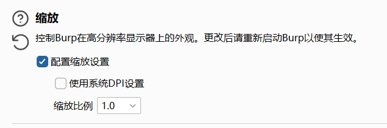

BurpSuite
中文文档：<https://geekdaxue.co/read/Burp_Suite_Doc_zh_cn/desktop-penetration-testing-index.md#%E4%BD%BF%E7%94%A8Burp%E7%9A%84%E5%9F%BA%E7%A1%80%E7%9F%A5%E8%AF%86>
^
Proxy：代理拦截
Intruder：入侵者，测试器
Repeater：重放器，重发器
Sequencer：序列器
Decoder：编码解码器
Comparer：比较工具
Extender：扩展

如果bp中光标不对齐：

方式1、burp启动参数加上：-Dsun.java2d.uiScale=1 ，即可，如果字体小改大即可。
方式2、修改字体大小，将字体大小设置为14或8的倍数，‌例如16pt

