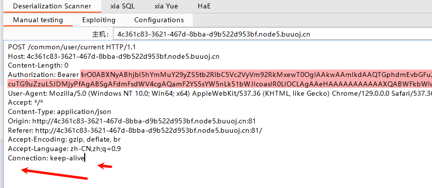

## **基础使用**
可以下载一些漏洞识别插件，脚本插件.jar或.py。
jython环境安装教程：<https://blog.csdn.net/weixin_40412037/article/details/103648034>
插件路径不要有中文。

BurpSuite的扩展存在一个问题，插件安装过多会导致卡顿、内存溢出等，尽量关闭不必要功能

扩展输出的结果，漏洞结果一般可以在所有问题面板查看。

扩展中底部也可能有实时输出。


^
## **多功能BurpSuite漏洞探测插件—TsojanScan**
综合性漏扫插件
<https://mp.weixin.qq.com/s/2uTxakCAfApDNMQyx0y8dg>

## **更多**
OneScan框架指纹识别，TsojanScan框架识别、HaE框架识别(关键字正则颜色匹配，3.0后规则自带，更改规则要重新加载)

^
## **前端加解密插件**
1、<https://github.com/whwlsfb/BurpCrypto/blob/master/README-zh_CN.md>
2、Galaxy


^
## **测未授权接口**
autorize
autorize是一个可以发现未授权漏洞的工具，
下载方式：BurpSuite -> 扩展 -> BApp商店 -> Autorize -> 安装

举个例子：
有一个接口例如 https://get-shell.com/api/adduser ，这个接口的本意是留给管理员权限（高权限）使用，
普通用户（低权限）无法使用，但是如果这个接口没有做鉴权处理，导致了低权限用户也可以使用，那么这就是一个未授权访问漏洞。
而这个插件就可以发现这个问题，需要在插件页面的右面窗口放入低权限用户（未登录）状态下的cookie或者点击Fetch Cookies Filters自动填充获取最近获得的Cookie，
然后点击Autorize is off开启检测，插件会有三种状态：
```
绕过（Bypassed）！- 红色（可能存在未授权）
强制执行！- 绿色（不存在未授权）
强制执行???（请配置强制检测器） – 黄色
根据需要，重点查看绕过（Bypassed）！- 红色（可能存在未授权），如果这是一个高权限API或者一个高权限的页面，在去掉cookie后仍然可以访问，那么这就是一个未授权漏洞！
```
也可以直接用下面的xia越

## **越权**
xia越
>每次手动启用后，会自动监听将数据包改包发送到这里，比较原包、低权限token包、未授权包响应大小
>使用的时候需要在插件右面替换一下低权限的token
>打✓就是存在


## **SQL**
xiaSQL

^
## **lazyCSRF**
CSRF POC
lazyCSRF<https://www.freebuf.com/articles/web/305569.html>

## **java反序列化利用链检测**
java Deserialization Scanner插件扫描可利用链，或者代码审计依赖利用链。
常规可以直接使用ysoserial.jar打。
配置路径
```
D:\java1\jdk8\bin\java.exe
E:\myHVV\java\ysoserial.jar
```
有一个坑，POST请求体没有内容的话要把所有换行去除，手动删除，否则发包失败。



## **其他介绍和使用教程**
<https://www.cnblogs.com/mr-ryan/p/17774683.html>

<https://blog.csdn.net/Kris__zhang/article/details/136525162?ops_request_misc=&request_id=&biz_id=102&utm_term=tsojanscan%E4%BD%BF%E7%94%A8&utm_medium=distribute.pc_search_result.none-task-blog-2~all~sobaiduweb~default-2-136525162.142^v100^pc_search_result_base2&spm=1018.2226.3001.4187>

<https://x1lys.github.io/2024/07/24/Burp%E6%8F%92%E4%BB%B6%E6%8E%A8%E8%8D%90%E9%9B%86%E5%90%88%E4%B8%80/>

log4jscan：
<https://github.com/whwlsfb/Log4j2Scan>
<https://github.com/j5s/Log4j2Scan-1>