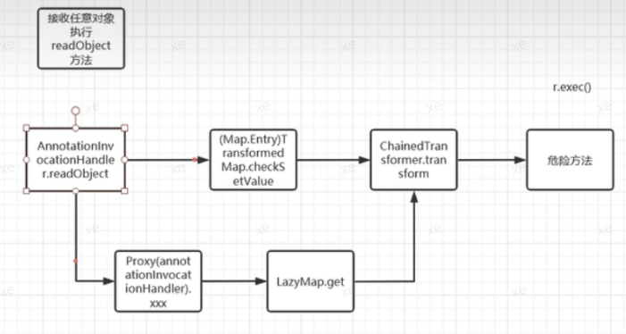
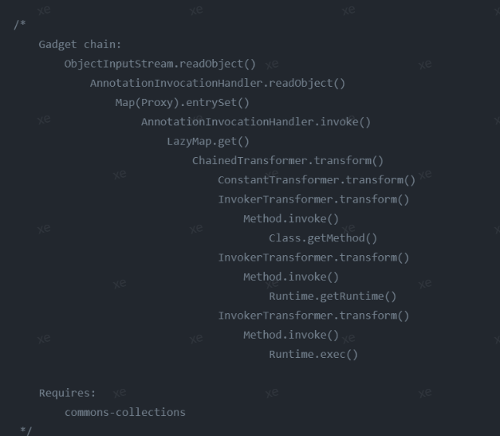

CC1链：java<=JDK8u71、CommonsCollections<=3.2.1

Java原生的反序列化要利用一定要满足两个条件，入口类实现了序列化接口并且重写了readObject函数。实现序列化接口的类才能被Java序列化和反序列化，重写readObject方法才有可能执行到危险方法。否则无法调起和执行其他代码，更无从谈起利用。

要找到这么一个类，他可以反序列化并且重新了readObject方法，readObject方法中可以利用，则我就反序列化这个类。
CommonsCollections库中就有这么一个类AnnotationInvocationHandler。
并且通过中间的Transformer类，可以任意执行代码，成功通过反射Runtime.class执行命令。

## **执行流程**

## **修复**
因为在JDK1.8的8u71之后的版本反序列化不再通过 defaultReadobject 方式，而是通过readFields来获取几个特定的属性，defaultReadobject 可以恢复对象本身的类属性，比如 this.memberValues就能恢复成我们原本设置的恶意类，但通过 readFields 方式，this.memberValues就为null，所以后续执行get()就必然没触发，这也就是高版本不能使用的原因。

