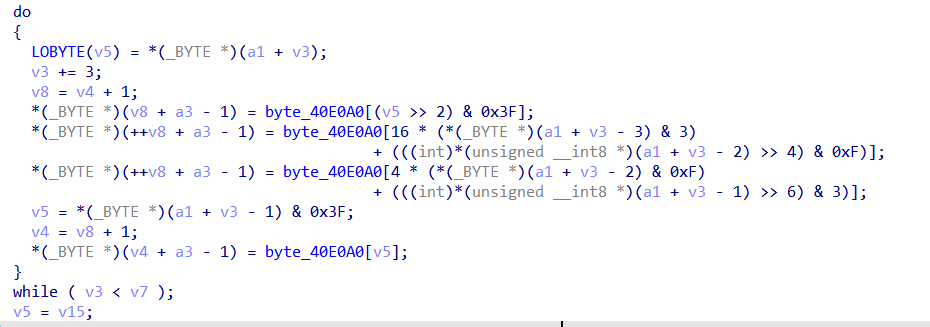

与Crypto结合：
CrackMe（破密码，不改程序）
KeygenMee（生成注册码）

与隐写取证结合：Recover（恢复文件）

题型：
控制台游戏题
迷宫maze
数字逻辑游戏
常见算法识别
对抗静态分析技术

## **关键跳题**
找到关键跳，如果不能静态反编译成c代码，使用od动态调试，在关键跳打断点，查看寄存器或堆栈中值。

## **控制台游戏类题**
玩游戏达到多少分才会给flag，直接玩完不成。
1.反编译成高级代码，找到flag生成逻辑。
2.反汇编，找到关键跳，patch跳转限制，直接拿flag(可用keypatch插件方便操作)。
ctrl+alt 将条件跳转的汇编 转成 相反的跳转汇编等，jnz->je 或jne->jz
修改完后，点击Edit-Patch program-Apply patchs to 应用生效。

3.对于exe、apk文件，解压后里面可能有特殊资源文件。

## **迷宫maze**
走迷宫用了特定的步数走出才会显示正确的flag。
做法：确定迷宫内容和控制符，手动走迷宫or写BFS之类的走迷宫算法
```
如两个变量v4，v5的值变化进行运算，最终满足到达出口位置的路线的输入。
v4是控制上下走变量，v4++向下走 一般对应s 相反w
v5是控制左右走变量，v5++向右走 一般对应d 相反a
```
根据代码，或初始位置，结算位置，计算迷宫的长宽。
有的题给出了迷宫布局如数字000111111000...，代码中确定行高，将0000111100放在excal表格中变成迷宫布局，可以看到起点和出口，直接手动走到出口记录按键值。

## **数字逻辑游戏**
输入一个字符串以满足程序的完成，这个字符串就是flag。
用代码实现对逻辑游戏（如数独、数织、数方....）的判断
不会在题面提示，只会隐含在check()检测函数里。
做法：
1.可以一边逆逻辑，一边根据经验猜测是否为某个逻辑游戏
2.如上一步猜测成功那就可以直接按照那个游戏的规则去找题面找到以后直接手做or找现成算法跑(如跑数独)
3.如猜测不成功就只能当成一般逆向题来逆逻辑了

## **常见算法识别**
**RC4流对称加密**
是一种基于密钥流的对称加密算法，它的密钥长度可变密钥长度在1-256 字节范围。它的特点是算法简单、运算效率高，而且非线性度良好。
特征:
1.256频繁出现
2.与输入有关的只有最后一个循环中的最后一步xor


**微型块对称加密算法（TEA）**
是一种易于描述和执行的块密码，通常只需要很少的代码就可实现的对称加密。
特征：
1.明文和密文均为2个32位整数，密钥为4个32位整数。（通常会将字符四个一组转成整数进入TEA函数）2.delta=0x9e3779b9（或其补数0x61c88647，运算时+改为-），也有可能是自己魔改的常数。


**DES不安全的块对称加密**
特征：
1.块长度为8字节，密钥长度为8字节（实际有用的仅有7字节，有一字节校验位)。
2.非常多的常量数组。
3.明显的数组拆分整合。

**AES安全块对称加密算法**
特征：
1.S盒或者逆S盒。
2.四大阶段：SubBytes、ShiftRows、MixColumns、AddRoundKey。

**Base64**
Base64是网络上最常见的用于传输8Bit字节码的编码方式之一，Base64就一种基于64个可打印字符来表示二进制数据的方法。
特征:
1.base64编码表 (可魔改) 如：字母位置变化，以及输出大小写转换
2.算法过程。有类似4，16的特征

拓展：Base系列(Base32、Base58、Base85、Base92)

**MD5信息摘要算法**
是一种被广泛使用的密码散列函数，可以产生出一个128位（16字节）的散列值，用于确保信息传输完整一致。
特征：
1.初始化常量（0x67452301、0xEFCDAB89、0x98BADCFE、0x10325476)
2.算法过程。
```
特征函数CryptCreateHash:
CryptCreateHash(phProv, 0x8003u, 0, 0, \&phHash) )
`0x8004u`是SHA-1的标识符，而`0x8003u`是MD5的标识符。

md5输出32位
sha1输出40位
注意输出一般为小写，有的比较为大写
```

^
**其他算法**
异或
```
A^12 == B
A^12^12 == A
B ^12 == A
```
取余
```
(A-10) % 128 == B

(B+10) % 128 == A
```

解决：一般用双重循环即可解决。或容器的curd。或暴力遍历。

^
## **对抗静态分析技术**

花指令是主流对抗静态反编译的一种技术。
使用特定的二进制码使程序能正常运行，但会干扰反编译软件分析。
常见花指令之jmp,call

llvm混淆
命令替换成复杂的

