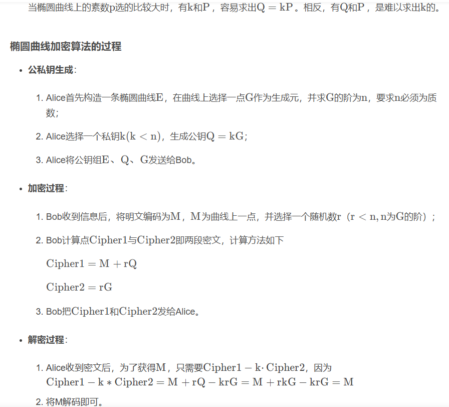
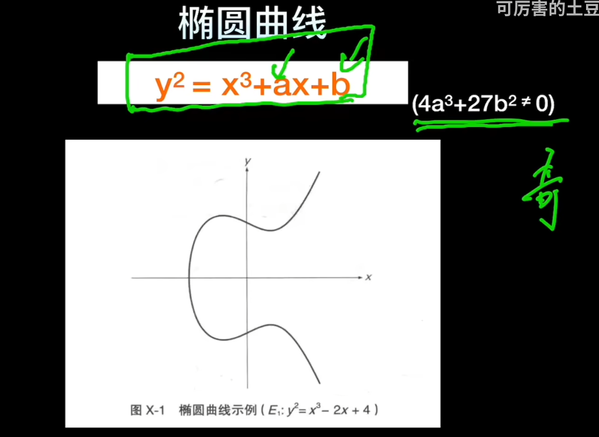

ECC非对称椭圆曲线加密算法。和椭圆没关系。

ECC通过椭圆曲线上的点的坐标，得出公钥。
Q=kP
这里是k乘P，基点P在曲线上变化k次后为Q，知道k P很容易求Q，知道P Q 几乎不能求k。
k就是私钥，Q就是公钥。

## **RSA和ECC**
1. RSA基于大数分解问题，而ECC基于椭圆曲线上的离散对数问题。
2. 密钥交换和加密：它们可以用于密钥交换、数字签名和数据加密。
3. 标准化：ECC和RSA都有相关的标准和规范，如PKCS#1（RSA）和SEC（ECC）

1. **算法基础**：
   * **RSA**：基于数论，特别是大整数的因数分解。
   * **ECC**：基于椭圆曲线上的几何性质。

2. **密钥大小**：
   * **RSA**：通常需要较大的密钥（例如2048位或3072位）以确保安全性。
   * **ECC**：可以用比RSA小得多的密钥（例如256位）提供相同或更高的安全性。

3. **性能**：
   * **RSA**：在某些操作上（如签名）可能比ECC慢，特别是在低性能设备上。
   * **ECC**：通常在计算上更高效，需要的计算资源更少，速度更快。

4. **应用场景**：
   * **RSA**：广泛用于电子邮件加密（PGP、S/MIME）、SSL/TLS证书、数字签名等。
   * **ECC**：常用于移动设备、智能卡、物联网设备等资源受限的环境。

5. **安全性**：
   * **RSA**：由于量子计算的发展，其安全性可能会受到影响，因为量子计算机能够有效地分解大数。
   * **ECC**：被认为对量子计算攻击更加免疫，但目前尚无广泛的量子攻击缓解措施。

^
## **列题**
<https://blog.csdn.net/MikeCoke/article/details/108949256#:~:text=%E5%88%86%E6%9E%90%E9%A2%98%E7%9B%AE%EF%BC%9A%20%E9%80%9A%E8%BF%87%E5%88%86%E6%9E%90>
