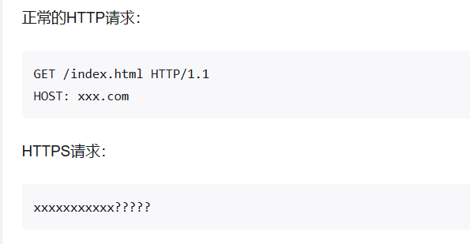

## **https原理**
使用非对称加密建立https连接，使用对称加密进行加密数据传输。

HTTPS 加密的主要目的是保护通信的内容(如：请求体、包括方法、URI、头、body)，使得通信内容在传输过程中不被窃听或篡改。但是 HTTPS 并不会对通信的元数据进行加密，因此请求的目标域名仍然是可见的。
<https://www.zhihu.com/question/326876165/answer/2978754556>



^
## **https流量解密**
得有tls.keylog_file文件：（你看到的通常是环境变量 `SSLKEYLOGFILE` 指向的那个文件，例如 `D:/ssl.log`）
是 **TLS 主密钥日志文件**，也常简称为 **SSLKEYLOG**。
它把 TLS 握手阶段生成的 **主密钥（Master Secret）** 以明文形式记录下来，供外部工具（Wireshark、tcpdump、mitmproxy 等）解密捕获到的 TLS 流量。下面分三点说明：

***

1. 是什么

* 纯文本文件，每行一条 NSS Key Log 格式记录，典型内容：
  ```
  CLIENT_RANDOM 8bc4d0b8… 1a2b3c4d…SERVER_HANDSHAKE_TRAFFIC_SECRET … …
  ```

* 文件本身不是证书，也不是私钥，而是“会话密钥”的备份。

2. 有什么用
* 让 **Wireshark** 在 “Preferences → Protocols → TLS → (Pre)-Master-Secret log filename” 里指定该文件后，就能把抓到的 HTTPS、HTTP/2、QUIC 等密文直接解密，显示为明文 HTTP。
* 调试自己写的客户端/服务端、分析 API 交互、定位 TLS 扩展或证书问题时，比搭 MITM 代理更轻量。

3. 怎么产生

* 只要客户端用的是 **OpenSSL ≥ 1.1.1**、**GnuTLS**、**NSS**、**BoringSSL**、**mbedTLS** 等支持 key logging 的库，并在启动前把环境变量 `SSLKEYLOGFILE` 设成可写路径即可：\
  Windows PowerShell


  ```
  $env:SSLKEYLOGFILE="D:/ssl.log"  
  curl.exe https://example.com
  ```

  Linux / macOS
  ```
  export SSLKEYLOGFILE=/tmp/ssl.log
  wget https://example.com
  ```

  浏览器（Chrome、Firefox、Edge）也遵守这个变量，因此给浏览器设置后，再抓包就能直接解密。

* 如果程序静态链接了 OpenSSL，但 **没调用 `SSL_CTX_set_keylog_callback`**，则不会写；Go 标准库（crypto/tls）目前**不**支持该格式，需用 `SSLKEYLOGFILE` 无用。

* 文件由应用**运行时主动写入**，不会自动生成；若路径不可写，则静默跳过，不会报错。


^
## **MSF流量解密**
MSF，得有私钥key.pem
<https://taomujian.github.io/2023/10/08/MSF_Meterpreter_Traffic_Parser/>

## **CS流量解密**
CS，得有.cobaltstrike.beacon_keys