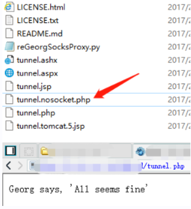
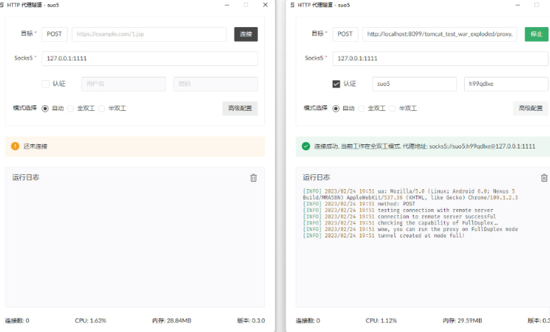

例如有一台主机运行了web服务IP映射到公网的80端口任何人都可以任意访问，还有一台主机是内网中的主机外部访问不到（或者本地数据库只让本地访问）。这个时候借助80端口的HTTP服务端口实现正向代理。
## **reGeorg正向代理**
假设在公网的web主机已经上传了webshell，但无法反弹shell，无法直接将内网主机通过端口映射到外网主机。reGeorg这时就起作用了，通过上传reGeorg文件在web服务运行，使得攻击者发出的请求以及目标机器的响应经web服务的http转发，达到攻击者可以和内网主机进行通信的效果。


项目地址：
<https://github.com/sensepost/reGeorg>


```shell
windows_hacker:(192.168.29.139)
目标服务器：(192.168.29.130)  80web端口已开 
```
用脚本帮你将目标机器上的内网信息通过socks隧道转到windows_hacker的9999端口上来。


### 命令执行
目标机
```shell
将对应站点开发语言的脚本传到目标服务器上，能访问成功即可（php开发的就传php的脚本,即：tunnel.nosocket.php）
```    
`windows_hacker` 
需要用python2.7以下
```shell
python2 reGeorgSocksProxy.py -p 9999 -u http://192.168.29.130/tunnel.nosocket.php
```


### 测试

将文件上传到目标服务器后，在hacker机器上能访问成功即可。
使用python2环境运行脚本，socks5代理127.0.0.1:9999端口。


^
## **suo5正向代理**
suo5是一个高性能 HTTP 隧道代理工具（socks5），它基于双向的 Chunked-Encoding构建, 相比 [Neo-reGeorg](https://github.com/L-codes/Neo-reGeorg) 等传统隧道工具, suo5的性能可以达到其数十倍。
官方：
<https://github.com/zema1/suo5/>
服务端脚本下载：
<https://github.com/zema1/suo5/tree/v1.3.1/assets>


本地端也有GUI：

