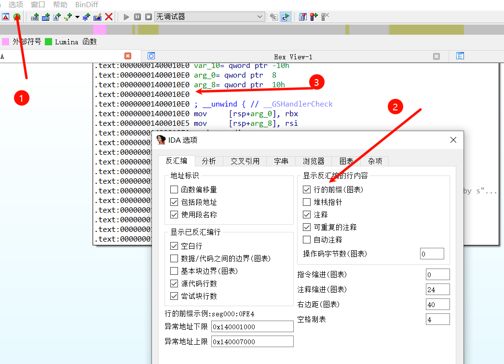
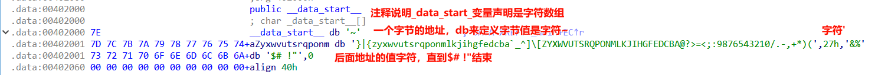
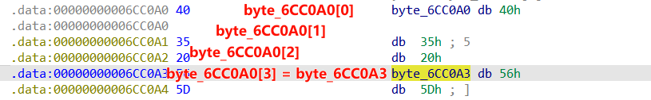
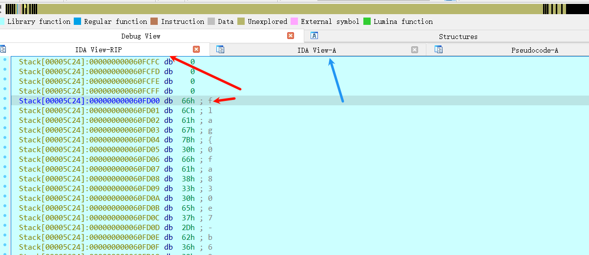
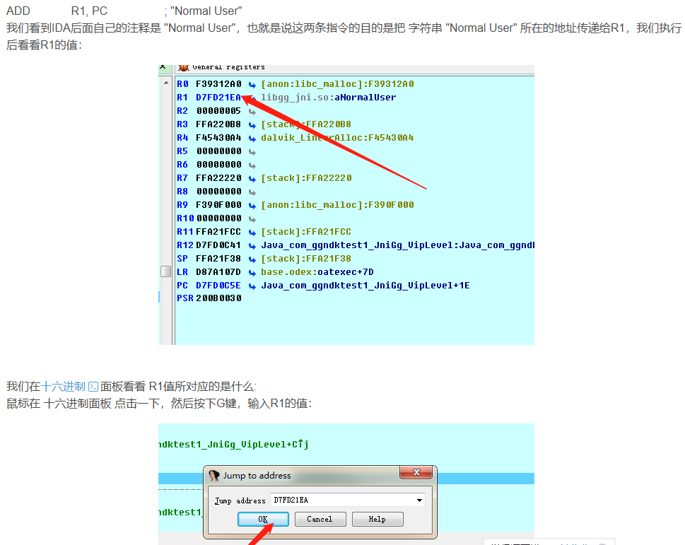

## **IDA安装**
安装使用：<https://www.bilibili.com/video/BV1uA411V7LK/?vd_source=972491eeb83c0ed4c0015aef1be6c537>(不推荐)
推荐渊龙，吾爱破解的。如ida 7.7插件整合版

目录：
ida.exe 对32位
ida64.exe 对64位
plugins/  插件放在这个目录
python/  内置的python环境
cfg：包含各种配置文件，基本IDA配置文件ida.cfg，GUl配置文件idagui.cfg，文本模式用户界面配置文件idatui.cfg，
idc：包含IDA内置脚本语言IDC所需要的核心文件
ids：包含一些符号文件
loaders：包含用于识别和解析PE或者ELF
procs：包含处理器模块

教程：
<https://www.yuque.com/cyberangel/rg9gdm/fig8x5>

## **视图窗口和操作**
用户可以通过View ->Open Subviews ->打开各种未显示的子窗口。
用户可以通过debugger->Open debugger Subviews ->打开各种调试子窗口。
上方有代码函数据进度条，常规函数为蓝色，蓝色最前面就是main函数入口，蓝色可以反编译。
按table键切换窗口。
流程图显示偏移量地址在菜单栏中设置：option-->general-->line
函数调用图：view-->graphs-->Functioncalls（快捷键Ctrl+F12）
函数流程图：view-->graphs-->flowtchart（快捷键F12)

#### **IDA View 反汇编窗口**
按空格 切换显示模式：

显示偏移量地址在菜单栏中设置：option-->general-->line

操作：
点击选中 右键 有一些数据转换显示
点击选中+x快捷键 查看被调用
点击选中+h快捷键 16转10
点击选中+r快捷键  10转ascii字符
点击选中+e快捷键  ascii字符转16
点击选中+a快捷键  16转ascii字符

CTRL+S快捷键 查看段分布
列举出二进制程序的段的开始地址、结束地址等信息

G 快捷键 跳转指定地址
alt + t 搜索字符串

点击后+d 转成单字节格式显示

点击：或；在汇编后面来添加注释。
：是填写常规注释，；填写的是可重复注释。如果填写了常规注释和可重复注释，那么只显示常规注释。
快捷键A 以ascii码值显示;备注。 
快捷键U 以字母显示;备注。 


选择后shift+e 可以导出汇编为c代码，16进制数据等。
一般导出为C unsigned char array(hex)，变成c数组或python列表数组，进行遍历操作。
数据段的值：需要注意定义

注意变量指向的地址


^
#### **Pseudocode伪代码窗口**
F5 汇编反编译转C语言。返回用tab键。
点击选中+x快捷键 查看函数被调用
把光标放到函数名（或函数体内任意位置）→ **按 `x`** → 所有调用点一目了然。
| 快捷键       | 作用                            |
| :-------- | :---------------------------- |
| `x`       | 查看 **被调用** 引用（xrefs to）       |
| `Shift+x` | 查看 **当前函数发出** 的调用（xrefs from） |
| `Ctrl+x`  | 把结果输出到 **“交叉引用子窗口”**（可排序、过滤）  |


点击/ 添加注释。
Esc返回上一级
点击选中+n快捷键 统一重命名C语言代码函数，或C语言变量名。
点击选中+y快捷键 统一修改变量类型，如字符数组类型，修改int s 为_BYTE * s方便查看。
点击选中+r快捷键  10转ascii字符。
点击选中+h快捷键 16转10。ascii转16。


伪代码常见特殊函数：
```
1、memset是 C 语言标准库中的一个函数，用于将内存的一段区域设置为指定的值。
void *memset(void *s, int c, size_t n);
`s` 是指向要设置的内存区域的指针。
`c` 是要设置的值，对于字符串来说，通常是字符的 ASCII 码。
`n` 是要设置的字节数。


2、memcpy函数用于将内存从一个位置复制到另一个位置

3、strcat函数用于将一个字符串追加到另一个字符串的末尾。
具体来说，`strcat`函数会将`Source`字符串（包括终止的空字符`\0`）
复制到`Destination`字符串的末尾，并返回`Destination`字符串的指针。


```
注意：
```
int类型的数组和变量，一般是连续的
  int v7[2]; // [esp+8h] [ebp-20030h] BYREF   //8h+4=Ch  //Ch+4=10h
  int v8; // [esp+10h] [ebp-20028h]
  int v9; // [esp+14h] [ebp-20024h]
  int v10; // [esp+18h] [ebp-20020h]
fun1(v7, 0, 4);//实际上v7到v10都传进入函数了


在C语言中，当在函数中定义局部变量时，它们会按照声明的顺序在栈上连续分配空间。
这里是这些变量在内存中的布局顺序：
1字节8位
1. `_BYTE v4[12];` - 占用12个字节。
2. `_DWORD v5[3];` - 每个`_DWORD`通常是4字节，所以这个数组占用12字节。
3. `_BYTE v6[5];` - 占用5个字节。
4. `int v7;` - 通常占用4字节。
5. `int v8;` - 占用4字节。
6. `int v9;` - 占用4字节。
7. `char v10;` - 占用1字节。
8. `int i;` - 占用4字节。
9. unsigned __int8  u 占用1字节。
10. __int64 i 占8字节

内存地址：
  _BYTE v4[12]; // [esp+12h] [ebp-2Eh] BYREF
  _DWORD v5[3]; // [esp+1Eh] [ebp-22h]
  _BYTE v6[5]; // [esp+2Ah] [ebp-16h] BYREF
  int v7; // [esp+2Fh] [ebp-11h]
  int v8; // [esp+33h] [ebp-Dh]
  int v9; // [esp+37h] [ebp-9h]
  char v10; // [esp+3Bh] [ebp-5h]
  int i; // [esp+3Ch] [ebp-4h]

IDA经常会自动生成假名字。他们用于表示子函数，程序地址和数据。
根据不同的类型和值假名字有不同前缀
sub 指令和子函数起点
locret 返回指令
loc 指令
off 数据，包含偏移量
seg 数据，包含段地址值
asc 数据；ASClI字符串
byte 数据，宇节（或宇节数组）
word 数据，16位数据（或字数组）
dword 数据，32位数据（或双字数组）
qword数据，64位数据（或4字数组）
flt浮点数据，32位（或浮点数组）
dbl浮点数，64位（或双精度数组）
tbyte浮点数，80位（或扩展精度浮点数）
stru结构体（或结构体数组）
align对齐指示
unk未处理字节
```

^
#### **String字符串窗口**
IDA不会默认打开String窗口，shift+f12 查看字符串窗口，即可ctrl + f 搜索。
可以根据字符串初步判断是什么高级语言打包的可执行文件，如py会有很多Py_xx字符串。
如有关键字符串，双击进入字符串的存储地址，ctrl+x（交叉引用）查看那段函数调用了该字符，再反汇编反编译f5。
简单逆向题：<https://blog.csdn.net/YueXuan_521/article/details/135675052>


^
#### **Functions函数列表窗口**
ctrl + f 可搜索


#### **16进制窗口**
Hex View


#### **Imports导入表窗口**
显示其他动态链接库导入的所有函数，当程序加壳后识别不了。


^
## **程序退出保存**
默认退出的模式，会保存成在同目录一下一个 同名.idb数字 文件，里面有纪录修改。
退出选择最下面选项，则不会保存修改后的记录为文件。


^
## **IDA插件操作**
OBPO 自动去除混淆。

Keypatch Patcher 修改条件才跳转的汇编代码。

lazyIDA 在汇编页，右键有NOP可以快去去除花指令（先点击后+d 转成单字节格式显示，NOP单字节变90），
右键有Convert类似Export data可以导出python格式数据。

D-810 去除混淆

GPT辅助分析插件：<https://github.com/WPeace-HcH/WPeChatGPT>

汇编指令转16进制：<https://armconverter.com/>

^
## **IDA动态调试**
exe本地动态调试。
linux和安卓远程动态调试。
<https://www.cnblogs.com/lsgxeva/p/18629167>

使用场景
```
比较两个字符串变量a==b相等，
a为用户输入(可能会有变换，需要静态逆向)，
b为动态生成(可能静态给了比较值，但是没给全esp+1没连续给值。或在运行过程中有变化)。

动态调试在比较时，esp指向的栈中有a和b的真实值。
根据b的真实值，作为逆向a代码的数据源。

其他场景：
b为.data段里的一个指针地址，在程序初始化过程才赋值。
静态分析b的生成比较困难等。


参考：
在输入的变化处F2下断点。F8单步。
在比较前下断点。F8单步。
在函数中的CMP（compare）指令下断点。
在调用函数前下断点。
```
^
载入exe
左上角debugger选择本地windows运行。
绿色三角运行。
汇编页，F2打断点。
继续左上角debugger F9继续，进入动态调试页的断点处。

IDA View-RIP窗口：主要用于调试过程中动态跟踪程序的执行指令。可以看到寄存器变量中具体值。
IDA View-A窗口： 则是用于静态分析程序的反汇编代码，帮助用户理解程序的逻辑结构。

调试so参考图:


^
### **动态修改**
右上角可以修改EIP寄存器，双击修改，下一跳地址，如0x00401520是一个函数A的地址
F9下一步
如此实现进入动态修改的内容，进行调用函数A。


^
### **静态修改**
静态汇编页中修改
#### 1、绕过某个函数
步骤（照着干就行）
1. 确定要改多少字节
   x86 的 `ret` 只占 **1 字节：`0xC3`**\
   但为了保证栈平衡，最好把 **push ebx** 也抵消掉，所以改前 2 字节即可：

   ```
   00000790  53                    push    ebx00000791  E8 95 00 00 00        call    sub_82B
   ```
   改成：

   ```
   00000790  C3                    ret00000791  90                    nop
   ```
   这样栈也没问题（少了一次 push/pop，但 `begin` 里自己还有 `pop ebx`，所以完全平衡）。

2. 在 IDA 里打补丁

   * 光标放到 `0x790` 行 → `Edit → Patch program → Patch bytes`
   * 把 `53 E8 95 00 00 00` 改成 `C3 90 90 90 90 90`（后面多余字节填 NOP，防止你改错位数）
   * 再 `Edit → Patch program → Apply patches to input file…` → 勾选备份 → OK

