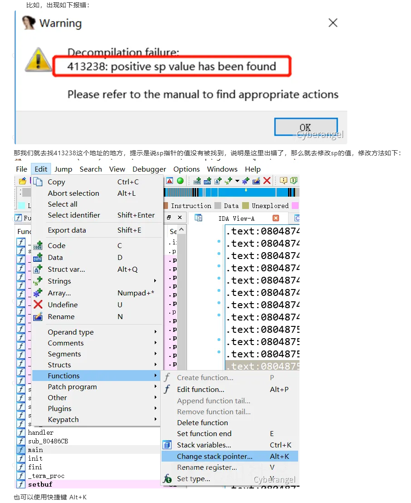
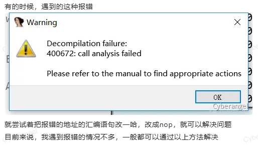

遇到的反编译报错的情况，一般是两种：
一是由于程序存在动态加密，导致程序的某些代码段被修改，从而反编译出错，这种情况，就需要去使用IDA-python解密一波，再进行F5反汇编。
二是由于某些玄学问题，直接提示了某个地方出错，一般来说，就按照IDA的提示，去进行修改。

## **1、positive sp value has been found**

## **2、call analysis failed**
