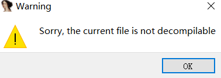
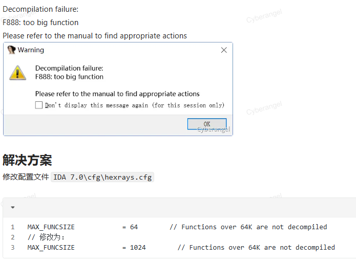
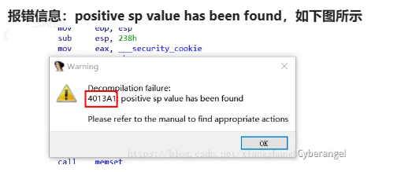
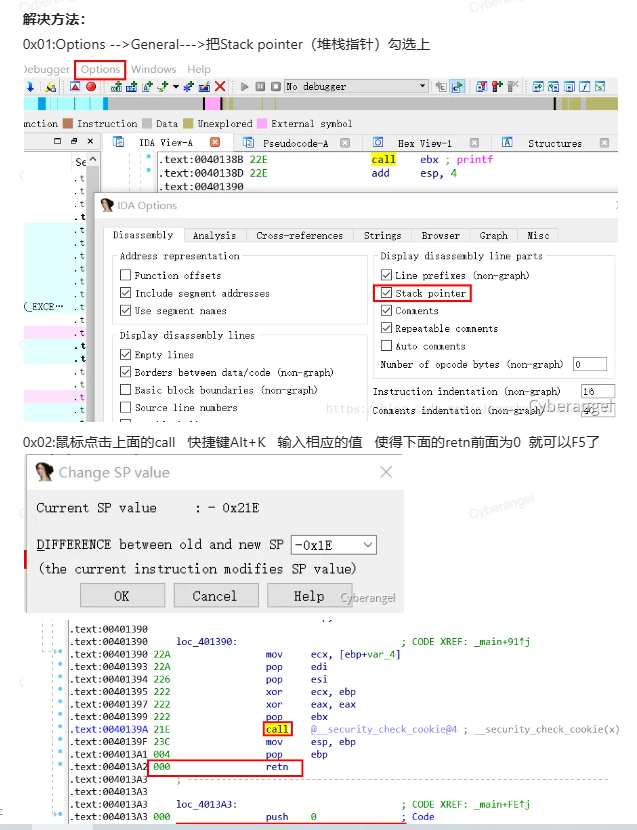

## **高级语言无法伪代码**

是高级语言，如C#，python。用对应的工具一键反编译调试即可。

## **由于汇编代码过长导致无法查看伪代码**

^
## **由于堆栈不平衡导致无法查看伪代码**
一次函数调用前后，调用方与被调方对栈指针（ESP/RSP 或 ARM 的 SP）的“加减”必须完全抵消，
保证 RET 时 SP 跟 CALL 前一模一样；
否则就是堆栈不平衡—— 程序大概率在 RET 或 POP 时崩溃。

看到4013A1
