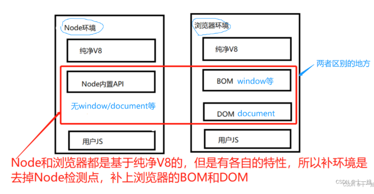
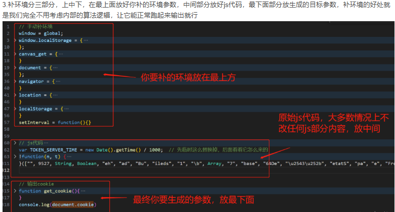

补 a_b 环境在工程上只有一个目的：
让只能在浏览器里运行的混淆/风控/加密代码，在 Node 等无头环境也能正确跑通，从而拿到跟浏览器完全一样的输出。
如：爬虫签名对抗
   抖音、头条、小红书等站点把请求签名（a\_bogus、x-b、\_signature）藏进 VMP 或混淆 JS，并埋了大量 `if (typeof a_b === 'undefined') debugger;` 之类的环境探针。把代码扣到本地后，必须在 Node 里补齐 `window、navigator、document、canvas、WebGL、plugin` 等一整套 BOM/DOM，签名函数才能吐出正确值，否则直接 403 或空响应

^
为什么要补环境：简言概括下，是因为我们知道这个js文件代码内容会生成我们想要的参数，但是放到本地nodejs环境下运行不出结果，因为缺少浏览器环境特有的一些window/document/navigator/localstorage等参数，所以我们需要把这些缺少的浏览器环境补上让这份js代码在本地nodejs环境下也能运行出结果来。
参考：<https://blog.csdn.net/weixin_43411585/article/details/132440165>

^
## **补环境框架**
使用补环境框架补环境：分析加密函数放下面，环境用插件一键提取代码放加密函数上面即可。
v_jstools插件：<https://github.com/cilame/v_jstools> 不要下载官方的1.1版本
1.0：<https://gitee.com/qqizai/v_jstools>
1.0最好：<https://pan.baidu.com/s/1gFYnVyeqCtUeC1QT4chOow?pwd=5e22>

使用：
<https://blog.csdn.net/weixin_43411585/article/details/132440165>

<https://blog.csdn.net/freeking101/article/details/121668637>