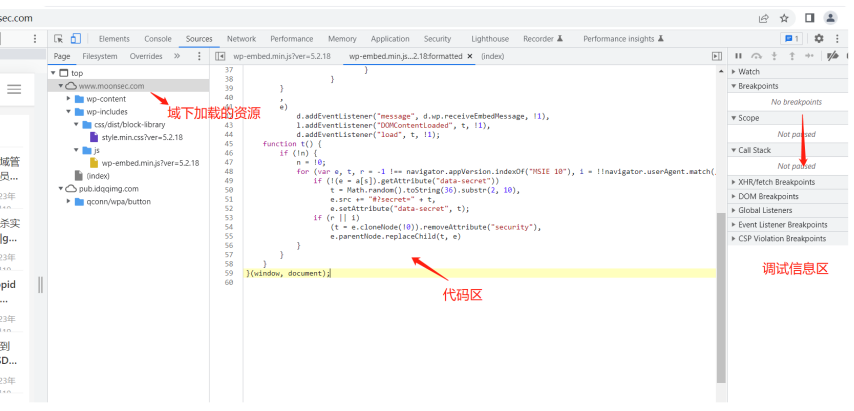
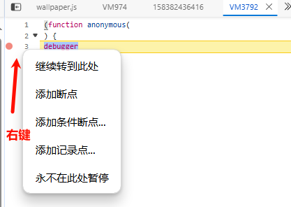
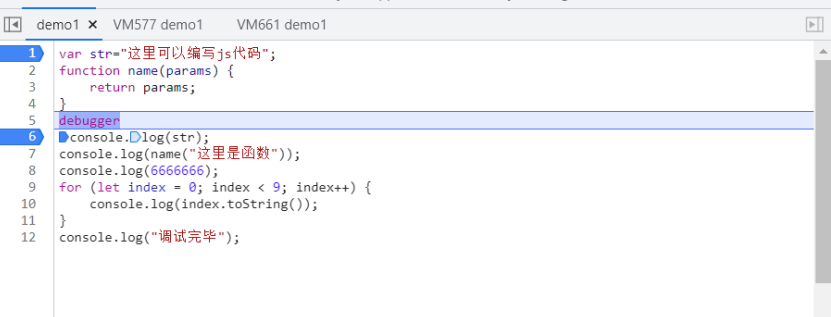
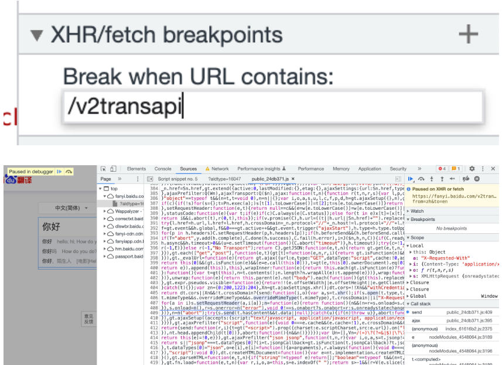

## **浏览器调试**


源码区域
```
最左侧的序号部分，每⼀个序号都可以点击，点击时会在这⼀⾏加⼀个断点信息，再次点击时，就
会取消改⾏的断点。

左下角{}：可以格式化代码。

断点：就是当代码运⾏到该⾏时，则会停⽌运⾏，需要你进⾏操作才继续执⾏。

打断点调试时，可以鼠标放在源码的变量上，查看变量的实时值。
```

调试信息区域
```
breakpoints : 这个选项显示源码区域打断点的信息。
Scope : 这个区域包含当前所有可⽤的局部变量，全局变量以及闭包的变量，并且实时更
新。
Call Stack：调用堆栈，函数的调用栈，从栈往上找看函数调用。

Watch : 学过vue的⼩伙伴，应该很容易理解，就是⼀个监听器，监听你想看的值或者是表达式，并
且是实时更新的。
```


^
## **下断点方式**
```
* 元素下断： dom标签右键
* 事件下断： Sources面板的事件监听器断点
* XHR下断： Sources面板的XHR中搜索请求的url
* 搜索下断： 全局搜索参数变量，搜索值
```

1、源码中序号左边打断点：
右键可以打条件断点。

也可以在指定的地⽅debugger关键词 断点调试


^
2、下元素断点：
元素标签中右键选择Break on->subtree modification

^
3、XHR下断点：

在接口可以被断住的情况下，XHR断点是迅速找到调用方法位置的断点方式。
复制请求链接?前的部分路径，如/v2transapi，到Source下的XHR断点处新增包含就下断，再触发xhr请求即可。
即可断到对应的方法。



