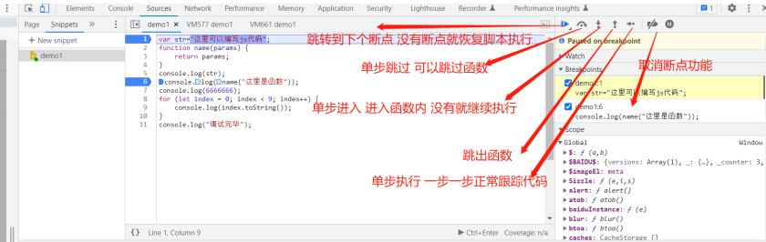

## **浏览器调试**

```
源码区域
最左侧的序号部分，每⼀个序号都可以点击，点击时会在这⼀⾏加⼀个断点信息，再次点击时，就
会取消改⾏的断点。

左下角{}：可以格式化代码。

断点：就是当代码运⾏到该⾏时，则会停⽌运⾏，需要你进⾏操作才继续执⾏。
```
```
调试信息区域:
breakpoints : 这个选项显示源码区域打断点的信息。
Scope : 这个区域包含当前所有可⽤的局部变量，全局变量以及闭包的变量，并且实时更
新。
Watch : 学过vue的⼩伙伴，应该很容易理解，就是⼀个监听器，监听你想看的值或者是表达式，并
且是实时更新的。
```



^
## **下断点方式**
```
* 元素下断
* 事件下断
* XHR下断
* 搜索下断
```

1、源码中序号左边打断点：
也可以在指定的地⽅debugger关键词 断点调试


^
2、下元素断点：
元素标签中右键选择Break on->subtree modification

^
3、XHR打断点：
复制请求链接?前的部分路径，如/v2transapi，到Source下的XHR断点处新增包含就下断，再触发xhr请求即可。


