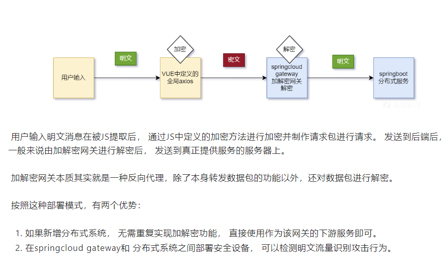

## **浏览器F12操作**
常见操作：
基础：<https://mp.weixin.qq.com/s/OhgSdEMOLaIkrq6POiwDRA>

系列教程：<https://mp.weixin.qq.com/s/9ZghHAZ3ICJKhFQuLCdUZg>

案例：JS逆向百例

## **常见js加密算法**
RSA 常使用jsencrypt库
AES 常使用crypto-js库 CryptoJS
DES

sign : 
sign一般都是对提交的data和一个时间戳timestamp进行哈希，对于这种我们只要找到关键的加密函数
sign也有可能有个+固定值再哈希MD5
```
var str="password=123456&timestamp=1691141967479&username=admin&secret=123456"
console.log(SHA1_Encrypt(str)) //sign
```

搜索关键词
```
encrypt(
AES.encrypt(
CryptoJS.pad.Pkcs7
CryptoJS.mode.ECB
MD5(
SignMD5

encrypt
hash
crypto
```
1、直接搜值，然后多打几个断点慢慢来也能找到。
2、利用断点调试，一步一步跟。
3、利用工具(ast-hook)来直接定位加密算法。
4、利用v_jstools插件，控制台输出hook的位置，再断点分析加密函数。
不要下载官方的1.1版本。
1.0：<https://gitee.com/qqizai/v_jstools>
1.0最好：<https://pan.baidu.com/s/1gFYnVyeqCtUeC1QT4chOow?pwd=5e22>


## **运行js**
1、可以将代码保存到.js文件中在本地nodejs的集成环境中运行。
2、可以在浏览器的控制台中运行。
3、对于一些依赖Windows对象环境的值，如果值固定的可以抠下本地运行，否则可以在[源代码/来源]的[代码段]Snippets面板中运行。
4、html中等等。

^
## **python中调用js**
python中调用js文件中方法：使用execjs库等。

>如果你的JavaScript代码依赖于外部加密库（如`crypto-js`），你需要确保这些库在执行环境中可用。对于Node.js环境，你可能需要使用`npm`安装这些库。

扣出js代码，让python调用：
<https://mp.weixin.qq.com/s/Sg8ADUF919vNkhaCP6iGow>
```
js导出方法：
module.exports = { getBv,    getSalt,    getSign,    getTs}


python调用方法获取返回值：
def getKey(msg):
    key = {}
    with open('./某某.js', encoding='utf-8') as f:
        jsDoc = execjs.compile(f.read())
        sign = jsDoc.call('getSign', msg)
        bv = jsDoc.call('getBv')
        ts = jsDoc.call('getTs')
        salt = jsDoc.call('getSalt')
        key['sign'] = sign
        key['bv'] = bv
        key['ts'] = ts
        key['salt'] = salt
    return key
```

^
## **常用工具**
<https://blog.csdn.net/Not__Cry/article/details/139754358>


## **加密架构**



^
## **综合实战文章**
<https://xz.aliyun.com/t/14629?time__1311=GqAhYK0KBKAIP05DKBOxmxmuZ3NgPLh3x>