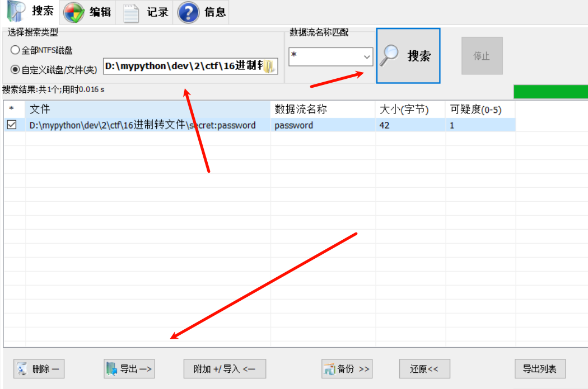

NTFS又叫ADS
.

cmd使用命令
notepad 加密文件名:寄生文件名
如：notepad 1.txt:flag.txt
即可看到寄生加密的内容

^
有NTFS的文件要压缩必须用WinRAR压缩和解压压缩包，否则可能会探测不到。

看到一个txt或rar可能加了寄生文件，如果知道寄生文件名就可以直接用上面命令，
如果不知道，则需要用NtfsStreamsEditor工具exe进行探测。
工具：<https://files.cnblogs.com/files/rainbow7/ntfsstreamseditor.zip>

