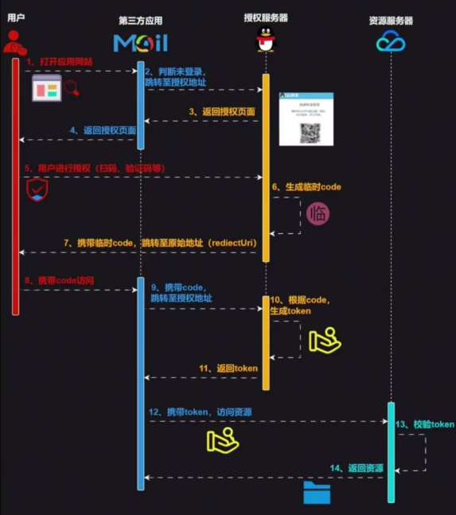

OAuth 提供了一种安全的方式来授权第三方应用访问用户资源，而无需暴露用户的用户名和密码。
OAuth是一个开放的授权标准，它允许用户授权第三方应用访问他们存储在另外服务上的信息，而无需将用户名和密码提供给第三方应用。OAuth 的核心思想是允许用户通过一个授权令牌（token）来授予访问权限，而不是分享他们的认证凭据（如用户名和密码）。

OAuth 的工作原理大致如下：
资源所有者（User）：希望授权第三方应用访问其资源的用户。
资源服务器（Service Provider）：存储用户资源的服务器，例如用户的邮箱、照片等。
客户端（Client）：请求访问资源的第三方应用。
授权服务器（Authorization Server）：负责发放授权令牌的服务器。

OAuth 的流程通常包括以下步骤：
用户（资源所有者）选择授权第三方应用访问其在服务提供商处的资源。
用户被重定向到授权服务器，通常是通过一个包含授权请求的URL。
用户登录（如果尚未登录）并同意授权请求。
授权服务器发放一个授权码（authorization code）给用户，用户将其提供给第三方应用。
第三方应用使用授权码向授权服务器请求访问令牌。
授权服务器验证授权码后，发放一个访问令牌（access token）给第三方应用。
第三方应用使用访问令牌直接向资源服务器请求资源。

OAuth 有多个版本，其中最常用的是 OAuth 2.0，它提供了更灵活的授权流程和更好的安全性。OAuth 2.0 支持多种授权流程，如授权码流程（Authorization Code Grant）、客户端凭据流程（Client Credentials Grant）、密码凭据流程（Resource Owner Password Credentials Grant）和简化流程（Implicit Grant）等，以满足不同场景的需求。


OAuth 2.0 的一个简单解释
<https://www.ruanyifeng.com/blog/2019/04/oauth_design.html>

<https://www.ruanyifeng.com/blog/2014/05/oauth_2_0.html>


^
## **以GitHub登录为例**
这里是两个后端接口，配合前端，实现认证。


### 1. GitHub登录请求的发起（后端githubLogin接口）

  1. **构建GitHub授权服务器地址**：

     * 基础地址为`https://github.com/login/oauth/authorize`。

     * 需要传递以下参数：

       * `response_type=code`：指定响应类型为授权码模式。
       * `client_id`：应用在GitHub上注册时分配的客户端ID（`GITHUB_CLIENT_ID`）。
       * `state`：一个随机生成的字符串，用于防止CSRF攻击。该值会存储到Redis中，与用户的IP地址关联，存储时间为30分钟。
       * `redirect_uri`：授权成功后GitHub会将用户重定向到的地址（`GITHUB_REDIRECT_URL`）。

     * 最终拼接的URL形式为：https://github.com/login/oauth/authorize?
response_type=code&client_id=your_client_id&state=generated_state&redirect_uri=your_redirect_uri。

  2. **返回授权URL**：

     * 方法返回给前端构建好的GitHub授权URL，前端接收到URL使用重定向将前端重定向到该地址。

  3. **GitHub授权**
     * 用户在该GitHub授权页面登录授权，授权后前端会重定向到your_redirect_uri，并且有加入code参数，如your_redirect_uri/?code=xxx&state。

  4. **前端请求回调地址**
     * your_redirect_uri页面的前端监听匹配到url变成了your_redirect_uri/?code=xxx&state，此时把?code=xxx&state作为参数再去请求githubCallback接口。

### 2. GitHub回调处理（后端githubCallback接口）

  1. **验证`state`参数**：
     * 从Redis中获取与用户IP地址关联的`state`值，与回调请求中携带的`state`参数进行比对。
     * 如果不一致，抛出异常，防止CSRF攻击。

  2. **向GitHub申请令牌**：

     * 使用GitHub提供的`https://github.com/login/oauth/access_token`接口，传递以下参数：

       * `grant_type=authorization_code`：指定授权类型为授权码模式。
       * `code`：GitHub授权服务器重定向时携带的授权码。
       * `redirect_uri`：与授权请求时一致的重定向地址。
       * `client_id`和`client_secret`：应用的客户端ID和密钥。

     * 发起POST请求，获取响应结果。

     * 响应结果可能包含：

       * 成功：`access_token`和`token_type`。
       * 失败：`error`和`error_description`。

     * 如果响应中包含`error`，抛出异常，终止流程。

  3. **获取GitHub用户信息**：

     * 使用获取到的`access_token`，访问GitHub的用户信息接口`https://api.github.com/user`。
     * 在请求头中添加`Authorization: token <access_token>`。
     * 获取到的GitHub用户信息包括`login`（用户名）、`id`（用户ID）、`avatar_url`（头像URL）等。

  4. **用户处理**：
     * 根据GitHub用户ID查询本地数据库，判断用户是否已存在。
     * 如果不存在，将GitHub用户信息保存到本地数据库，并设置默认密码（如`github-login`）。
     * 生成JWT令牌，用于后续的用户认证。
     * 将用户信息和JWT令牌存储到Redis中，设置过期时间。

  5. **返回用户信息**：

     * 返回用户信息和JWT令牌，前端可以使用该令牌进行后续的用户认证操作。


## **OAuth安全**
重定向的地址都写死封装到了后端接口里，无法篡改，比较安全。
>如果可以篡改重定向地址，则可能盗取code，从而获取用户令牌或登录系统。

处理回调的接口，即使你有code，需要验证state值防止csrf，比较安全。
>如果没有csrf的state，则可能攻击者的GitHub的code绑定到受害者的用户上。


^
后端接口封装了请求，也可能造成SSRF攻击。
```
// 向GitHub认证服务器申请令牌
String url = "https://github.com/login/oauth/access_token";
// 传递参数grant_type、code、redirect_uri、client_id
String param = "?grant_type=authorization_code&code=" + code + "&redirect_uri=" +
        GITHUB_REDIRECT_URL + "&client_id=" + GITHUB_CLIENT_ID + "&client_secret=" + GITHUB_CLIENT_SECRET;

// 申请令牌，注意此处为post请求
String result = HttpUtil.createPost(url + param).execute().body();
```
