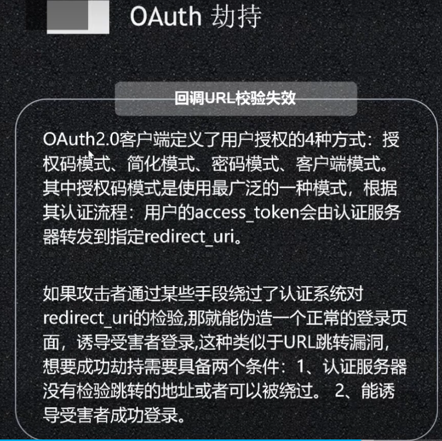
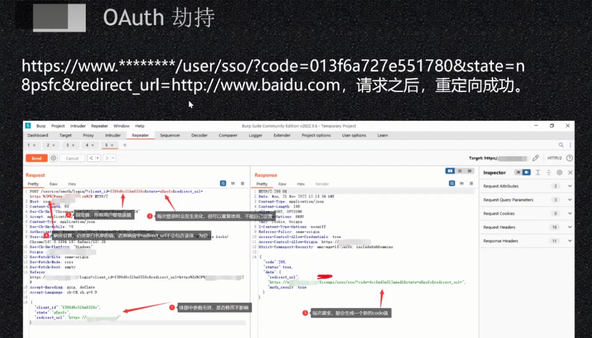
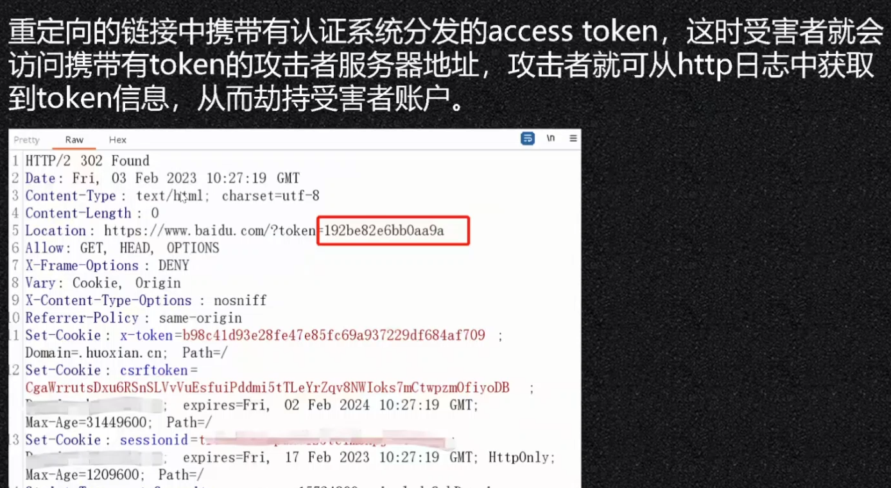
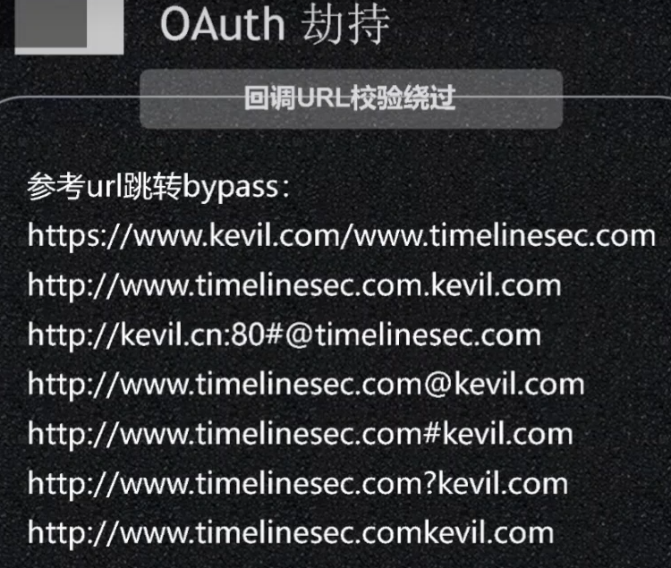
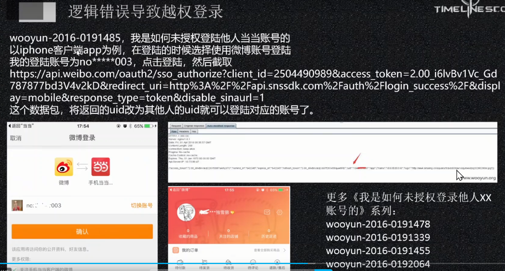
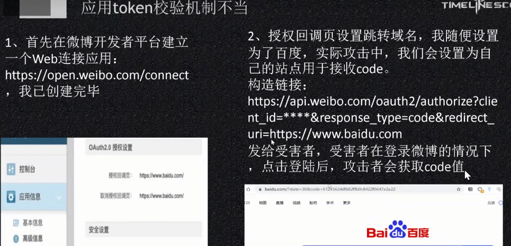
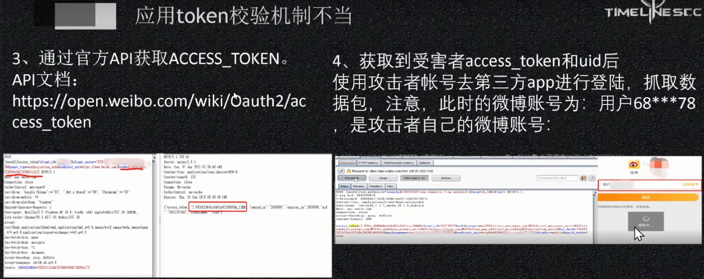
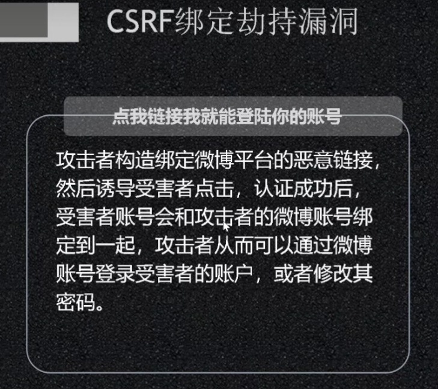
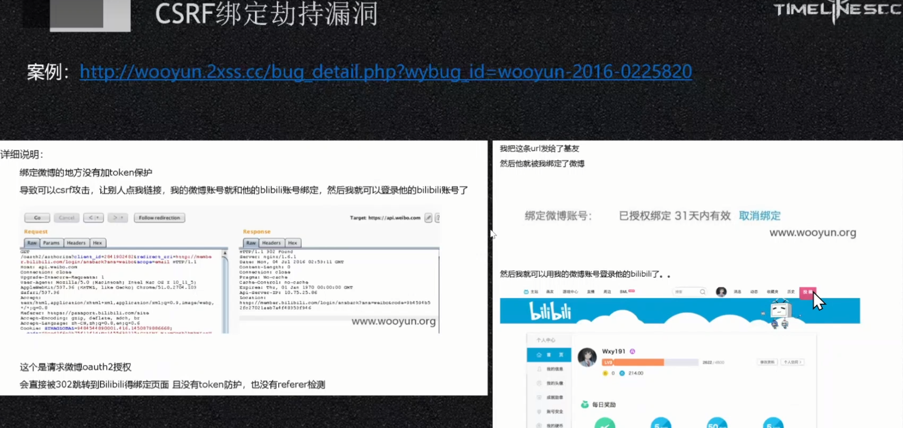

## **OAuth劫持**

回调绕过

或配合子域名的xss
最终携带出token

^

^
## **逻辑错误**

^
## **应用校验第三方不严**

^
## **CSRF绑定**

类似乌云文章
<http://wooyun.2xss.cc/whitehat_detail.php?whitehat=%E5%91%86%E5%AD%90%E4%B8%8D%E5%BC%80%E5%8F%A3&page=1>