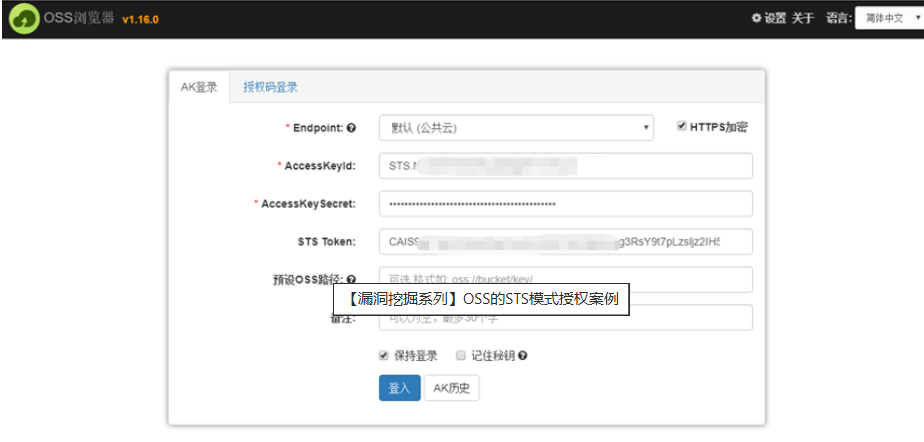

使用对象云存储OSS，基本杜绝文件上传漏洞。
    开通OSS
    新建Bucket
    配置Bucket属性
    配置Access访问
但会出现Accesskey泄露隐患。
如：前端，客户端直接使用AccessKeyId+AccessKeySecret连接OSS，造成泄露。
查看返回的图片地址判断是否为云存储地址。
F12里前端代码搜索AccessKey 探测。

^
知道AccessKeyId+AccessKeySecret了进行接管：
1.行云管家
2.云存储对应的客户端ossbrower

华为云存储叫OBS：
<https://zhuanlan.zhihu.com/p/481432691>
需要用OBS专门工具 obs-browser-plus

^
存储桶遍历：
<https://zone.huoxian.cn/d/918-oss>
<https://github.com/jdr2021/OSSFileBrowse>

^
防御：
前端不直接和OSS通信。
或者前端使用临时的sts和OSS通信：<https://blog.csdn.net/zzzzzhxxx/article/details/139377927>
虽然STS模式下accessKeyId、accessKeySecret和stsToken都是会变化的，但在有效期内（约3\~5分钟）我们仍然可以接管对应的存储桶。
<https://www.ctfiot.com/86868.html>

