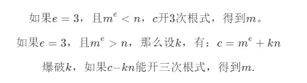

<https://mp.weixin.qq.com/s/DKyplEETXNzZ7Bt_Nm5-6g>
# **RSA题目大全**
题目须知
```
m='flag{20d6e2da95dcc1fa5f5432a436c4be18}'

m=libnum.s2n(m)
# libnum.s2n() 函数的作用是将字符串转换为数字。同bytes_to_long()
# 这个函数特别适用于处理十六进制或十进制的字符串，将其转换为对应的整数值。
# 在转换过程中，s2n() 函数会将字符串中的每个字符视为一个数字的一部分，
# 并按照其在字符串中的位置进行权重计算，最终得到一个整数。
# 具体来说，s2n() 函数的工作原理是将字符串中的每个字符转换为其对应的 ASCII 码值，
# 然后将这些 ASCII 码值按照十进制数的方式连接起来，形成一个大整数。
# 例如，如果字符串是 'aa'，那么 'a' 的 ASCII 码值是 97，
# 因此 'aa' 会被转换为 97 * 256 + 97 = 24929
# 因此还原的字符串的时候需要用对应的函数libnum.n2s(),或long_to_bytes()

给出的密文c可能是十进制大数
也可能是16进制0xad939ff59f6e70bcbfad406f2494993757eee98b91bc244184a377520d06fc35
pow()函数不影响

加密指数e
解密指数d
模数、大质数n
大质数p、q
```


## **1、一般用轩禹CTF_RSA工具秒。**
```
有dp，dq
只有dp
有e1 e2共模攻击
```


^
## **2、公私钥题：给你一个密文文件和一个公钥文件。**
>理论上，如果可以从公钥推算出 p 和 q，那么就可以计算出私钥。然而，由于 n 是两个非常大的质数的乘积，目前没有已知的算法能在合理时间内完成这个任务。这就是为什么RSA算法被认为是安全的。在CTF题中n往往比较小，或p和q太接近 或相差过大，可以算出p，q。
生成案例脚本：<https://www.bilibili.com/read/cv13392382/?from=readlist>
```
给你公钥文件pub.key，可以用轩禹CTF_RSA提取里面的n和e
利用n分解p,q，求出d。

再用python的rsa库生成私钥key。
key = rsa.PrivateKey(n,e,d,p,q)

文件读取加密文件，用私钥key解密。
rsa.decrypt(f.read(),key).decode()
```

^
## **3、共模、同模n攻击**
共模攻击，也称同模n攻击。
同模攻击利用的大前提就是，RSA体系在生成密钥的过程中使用了相同的模数n。
在CTF题目中，就是同一明文，同一n，不同e，进行加密。
即m，n相同，e，c不同，且e1和e2互质，如此求出m。

因此，同一m，同一n，不同e，进行加密。在不需要知道d的情况下，可以进行解密m。


^
## **4、wiener(维纳)攻击**
n很大分不了，e也很大。给出了c。
用维纳攻击，获取d，解密m


^
## **5、低加密指数小e3攻击**
普通e一般是65537，这里的e很小为3。n很大无法分解。


则无需分解n和求d，即可解密m


^
## **6、低加密指数e的广播攻击**
如果选取的加密指数e较低，如3，5，23等，并且使用了相同的加密指数e给一个接受者的群发送相同m的加密信息n、c，那么可以进行广播攻击得到明文m。
在CTF中，n、c不同，明文m，e相同，其e比较小。使用中国剩余定理求解后再开方，直接得m。

n和c为多组的对。
```
中国剩余定理（Chinese Remainder Theorem，简称CRT）是数论中一个非常重要的定理，它提供了一种解决一类特定线性同余方程组的方法。
这类方程组被称为同余方程组，形式如下：
给定一组两两互质的整数 n1​,n2​,…,nk​ 和一组整数 a1​,a2​,…,ak​，寻找一个整数 x 使得：
x≡a1​(modn1​) 
x≡a2​(modn2​) 
⋮
x≡ak​(modnk​)

中国剩余定理告诉我们，如果 n1​,n2​,…,nk​ 两两互质（即任意两个数的最大公约数为1），那么上述同余方程组在模 N=n1​×n2​×…×nk​ 下有唯一解。
这个定理解决的问题是：在给定一系列模数和对应的余数的情况下，找到一个数，这个数除以每个模数后得到的余数正好是对应的余数。
```

^
## **7、N不互素、模不互素（共享素数）**
两个n里使用有相同的素数p或q。如n1和n2有相同的q，则n1和n2不互素，共享素数。
在CTF中，同样一个e（一般为65537）和m，有两个或多组n和c时，那么n之间可能是共享素数的。

最大公约数求出q，再求其中一个n1的p1，再求d1即可解密m。

^
## **8、dp泄露**
已知公钥n，e，密文c。以及dp，其中dp = d mod (p-1)  #dq=d%(q-1)。而n无法分解。

根据dp求出p和q即d，解密m。

## **8、dp dq泄露**
已知p，q，密文c，不知道e。
还知道dp，dq
```
dp=d%(p-1)
dq=d%(q-1)
```

根据剩余定理，费马小定理，脚本直接求m。
