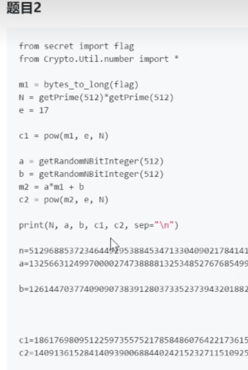

在线版：<https://sagecell.sagemath.org/>
sage的本地环境较大（接近10G）
离线版安装：<https://mirrors.aliyun.com/sagemath/win/index.html>


教程
<https://tanglee.top/2022/03/27/SageMath%E7%AE%80%E6%98%8E%E6%95%99%E7%A8%8B/>
使用
<https://kangming-ux.github.io/crypto/Use-of-Sagemath-in-CTF-Cryptography.html>
```
主要用于解决：
数论
椭圆曲线
RSA变形等题
```
```
安装后桌面：
SageMath 9.3

SageMath 9.3 Shell 命令窗口
可以安装库，如在里面执行 sage -pip install libnum
用离线版可以安装这些库方便数字和字符转换，用在线版会没有这个库，就不能用转换函数，在线版手动转。

SageMath 9.3 Notebook 运行这个此时会有网页版
```
网页使用即可


^
# **sage脚本**

## **1、m高位攻击**
已知n,c,e。n不能分解，e很小为3。
已知明文m高位，求明文m低位。得m
```
import libnum
def phase2(high_m, n, c):
    R.<x> = PolynomialRing(Zmod(n), implementation='NTL')
    m = high_m + x
    M = m((m^3 - c).small_roots()[0])
    print(libnum.n2s(int(M)))

n= 
e= 3
c= 
high_m= 

phase2(high_m, n, c)
```


## **2、p高位攻击**
已知n,c,e。n不能分解。
已知p高位，求低位。的p和q。再求m。

```
import libnum
def phase3(high_p, n):
    R.<x> = PolynomialRing(Zmod(n), implementation='NTL')
    p = high_p + x
    x0 = p.small_roots(X=2 ^ 60, beta=0.1)[0] #根据题目，注意 2^60  60需要修改相应的位数，出题是128就是128
    P = int(p(x0))
    Q = n // P
    print(P)
    print(Q) # 这里求出的P、Q
    assert n == P * Q

n=0x558477ce1d081f831cfa159290ee4fd14888422c216a16ad86e2b2d4335e3cb18ed0120a955f970b17b229a8e7d0ae1b6f0c40213ad0e127eba99ae0d8a82397
p4=0x8fbcbb7d1e9f393ee21b537d6e0bd2cf8629e315f4e356c1e000000000000000
e=0xf7278179324b11fd83d08aa6f
c=0x36e1c09ccad45cd63a0f07e704d3811c39d70cdfdad999d2df90255a76c58cf6fe99ac1ab1d5d99a4ce1a2ebdbfbc49ce72df2a0b90766ff84ab0ef62068d46b

phase3(p4, n)
```


^
## **3、d低位攻击**
已知n,c,e。n不能分解，e很小为3。
已知d低位，求p。再求d，解m。

```
import libnum
def getFullP(low_p, n):
    R.<x> = PolynomialRing(Zmod(n), implementation='NTL')
    p = x * 2 ^ 512 + low_p
    root = (p - n).monic().small_roots(X=2 ^ 128, beta=0.4)
    if root:
        return p(root[0])
    return None

def phase4(low_d, n, c):
    maybe_p = []
    for k in range(1, 4):
        p = var('p')
        p0 = solve_mod([3*p*low_d  == p + k*(n*p - p^2 - n + p)], 2^512)
        maybe_p += [int(x[0]) for x in p0]
    #print(maybe_p)

    for x in maybe_p:
        P = getFullP(x, n)
        if P: break

    P = int(P)
    Q = n // P

    assert P*Q == n
    print(P)
    print(Q)

    d = inverse_mod(3, (P-1)*(Q-1))
    print(d)
    print(libnum.n2s(int(power_mod(c, d, n))))


n = 9289
c = 561
low_d = 78767399

phase4(low_d, n, c)
```
^
## **5、小e的广播攻击**
如果选取的加密指数e较低，如3，5，13，23等，并且使用了相同的加密指数e给一个接受者的群发送相同m的加密信息n、c，那么可以进行广播攻击得到明文m。
在CTF中，n、c不同，明文m，e相同，其e比较小。使用中国剩余定理求解后再开方，直接得m。


```javascript
import libnum
e=13
n1= 
n2= 
n3= 
c1= 
c2= 
c3= 
def phase5(n1, c1, n2, c2, n3, c3):
    r = CRT([c1, c2, c3], [n1, n2, n3])
    m = int(r)^(1/13)
    print(m)
    print(libnum.n2s(int(m)))

phase5(n1, c1, n2, c2, n3, c3)
```


^
## **6、Franklin-Reiter attack**
FrankLin-Reiter 攻击RSA。
如果两条消息的区别仅在于两条消息之间的已知固定差异
并且是在相同的RSA模数N下进行RSA加密的
那么就可以恢复它们。

给出n，c1，c2。明文m1和m2的差异a,b。e很小如17。


```
n=
a=
b=
c1=
c2=
e=17

import libnum
def franklinReiter(n,e,c1,c2,a,b):
    R.<X> = Zmod(n)[]
    f1 = X^e - c1
    f2 = (X*a+ b)^e - c2
    # coefficient 0 = -m, which is what we wanted!
    return Integer(n-(compositeModulusGCD(f1,f2)).coefficients()[0])

  # GCD is not implemented for rings over composite modulus in Sage
  # so we do our own implementation. Its the exact same as standard GCD, but with
  # the polynomials monic representation
def compositeModulusGCD(a, b):
    if(b == 0):
        return a.monic()
    else:
        return compositeModulusGCD(b, a % b)

m=franklinReiter(n,e,c1,c2,a,b)
print(m)
print(type(m))
print(libnum.n2s(int(m)))
```

^
## **7、Boneh Durfee 攻击（类似维纳，e很大）**
d 较小时，满足dN^0.292d<N0.292B  时，Boneh and Durfee attack 比维娜 Wiener's Attack要强一些
知道e很大，另外d≤n^0.27。n很大分不了。

用类似维纳攻击，获取d。再手动解密获取m。
下面的Sage脚本可以获取d，代码中只需要n和e即可求d。
```
from __future__ import print_function
import time
# from Crypto.Util.number import long_to_bytes
# from Crypto.PublicKey import RSA

############################################
# Config
##########################################

"""
Setting debug to true will display more informations
about the lattice, the bounds, the vectors...
"""
debug = True

"""
Setting strict to true will stop the algorithm (and
return (-1, -1)) if we don't have a correct
upperbound on the determinant. Note that this
doesn't necesseraly mean that no solutions
will be found since the theoretical upperbound is
usualy far away from actual results. That is why
you should probably use `strict = False`
"""
strict = False

"""
This is experimental, but has provided remarkable results
so far. It tries to reduce the lattice as much as it can
while keeping its efficiency. I see no reason not to use
this option, but if things don't work, you should try
disabling it
"""
helpful_only = True
dimension_min = 7 # stop removing if lattice reaches that dimension

############################################
# Functions
##########################################

# display stats on helpful vectors
def helpful_vectors(BB, modulus):
    nothelpful = 0
    for ii in range(BB.dimensions()[0]):
        if BB[ii,ii] >= modulus:
            nothelpful += 1

    print(nothelpful, "/", BB.dimensions()[0], " vectors are not helpful")

# display matrix picture with 0 and X
def matrix_overview(BB, bound):
    for ii in range(BB.dimensions()[0]):
        a = ('%02d ' % ii)
        for jj in range(BB.dimensions()[1]):
            a += '0' if BB[ii,jj] == 0 else 'X'
            if BB.dimensions()[0] < 60:
                a += ' '
        if BB[ii, ii] >= bound:
            a += '~'
        print(a)

# tries to remove unhelpful vectors
# we start at current = n-1 (last vector)
def remove_unhelpful(BB, monomials, bound, current):
    # end of our recursive function
    if current == -1 or BB.dimensions()[0] <= dimension_min:
        return BB

    # we start by checking from the end
    for ii in range(current, -1, -1):
        # if it is unhelpful:
        if BB[ii, ii] >= bound:
            affected_vectors = 0
            affected_vector_index = 0
            # let's check if it affects other vectors
            for jj in range(ii + 1, BB.dimensions()[0]):
                # if another vector is affected:
                # we increase the count
                if BB[jj, ii] != 0:
                    affected_vectors += 1
                    affected_vector_index = jj

            # level:0
            # if no other vectors end up affected
            # we remove it
            if affected_vectors == 0:
                print("* removing unhelpful vector", ii)
                BB = BB.delete_columns([ii])
                BB = BB.delete_rows([ii])
                monomials.pop(ii)
                BB = remove_unhelpful(BB, monomials, bound, ii-1)
                return BB

            # level:1
            # if just one was affected we check
            # if it is affecting someone else
            elif affected_vectors == 1:
                affected_deeper = True
                for kk in range(affected_vector_index + 1, BB.dimensions()[0]):
                    # if it is affecting even one vector
                    # we give up on this one
                    if BB[kk, affected_vector_index] != 0:
                        affected_deeper = False
                # remove both it if no other vector was affected and
                # this helpful vector is not helpful enough
                # compared to our unhelpful one
                if affected_deeper and abs(bound - BB[affected_vector_index, affected_vector_index]) < abs(bound - BB[ii, ii]):
                    print("* removing unhelpful vectors", ii, "and", affected_vector_index)
                    BB = BB.delete_columns([affected_vector_index, ii])
                    BB = BB.delete_rows([affected_vector_index, ii])
                    monomials.pop(affected_vector_index)
                    monomials.pop(ii)
                    BB = remove_unhelpful(BB, monomials, bound, ii-1)
                    return BB
    # nothing happened
    return BB

""" 
Returns:
* 0,0   if it fails
* -1,-1 if `strict=true`, and determinant doesn't bound
* x0,y0 the solutions of `pol`
"""
def boneh_durfee(pol, modulus, mm, tt, XX, YY):
    """
    Boneh and Durfee revisited by Herrmann and May
    
    finds a solution if:
    * d < N^delta
    * |x| < e^delta
    * |y| < e^0.5
    whenever delta < 1 - sqrt(2)/2 ~ 0.292
    """

    # substitution (Herrman and May)
    PR.<u, x, y> = PolynomialRing(ZZ)
    Q = PR.quotient(x*y + 1 - u) # u = xy + 1
    polZ = Q(pol).lift()

    UU = XX*YY + 1

    # x-shifts
    gg = []
    for kk in range(mm + 1):
        for ii in range(mm - kk + 1):
            xshift = x^ii * modulus^(mm - kk) * polZ(u, x, y)^kk
            gg.append(xshift)
    gg.sort()

    # x-shifts list of monomials
    monomials = []
    for polynomial in gg:
        for monomial in polynomial.monomials():
            if monomial not in monomials:
                monomials.append(monomial)
    monomials.sort()
    
    # y-shifts (selected by Herrman and May)
    for jj in range(1, tt + 1):
        for kk in range(floor(mm/tt) * jj, mm + 1):
            yshift = y^jj * polZ(u, x, y)^kk * modulus^(mm - kk)
            yshift = Q(yshift).lift()
            gg.append(yshift) # substitution
    
    # y-shifts list of monomials
    for jj in range(1, tt + 1):
        for kk in range(floor(mm/tt) * jj, mm + 1):
            monomials.append(u^kk * y^jj)

    # construct lattice B
    nn = len(monomials)
    BB = Matrix(ZZ, nn)
    for ii in range(nn):
        BB[ii, 0] = gg[ii](0, 0, 0)
        for jj in range(1, ii + 1):
            if monomials[jj] in gg[ii].monomials():
                BB[ii, jj] = gg[ii].monomial_coefficient(monomials[jj]) * monomials[jj](UU,XX,YY)

    # Prototype to reduce the lattice
    if helpful_only:
        # automatically remove
        BB = remove_unhelpful(BB, monomials, modulus^mm, nn-1)
        # reset dimension
        nn = BB.dimensions()[0]
        if nn == 0:
            print("failure")
            return 0,0

    # check if vectors are helpful
    if debug:
        helpful_vectors(BB, modulus^mm)
    
    # check if determinant is correctly bounded
    det = BB.det()
    bound = modulus^(mm*nn)
    if det >= bound:
        print("We do not have det < bound. Solutions might not be found.")
        print("Try with highers m and t.")
        if debug:
            diff = (log(det) - log(bound)) / log(2)
            print("size det(L) - size e^(m*n) = ", floor(diff))
        if strict:
            return -1, -1
    else:
        print("det(L) < e^(m*n) (good! If a solution exists < N^delta, it will be found)")

    # display the lattice basis
    if debug:
        matrix_overview(BB, modulus^mm)

    # LLL
    if debug:
        print("optimizing basis of the lattice via LLL, this can take a long time")

    BB = BB.LLL()

    if debug:
        print("LLL is done!")

    # transform vector i & j -> polynomials 1 & 2
    if debug:
        print("looking for independent vectors in the lattice")
    found_polynomials = False
    
    for pol1_idx in range(nn - 1):
        for pol2_idx in range(pol1_idx + 1, nn):
            # for i and j, create the two polynomials
            PR.<w,z> = PolynomialRing(ZZ)
            pol1 = pol2 = 0
            for jj in range(nn):
                pol1 += monomials[jj](w*z+1,w,z) * BB[pol1_idx, jj] / monomials[jj](UU,XX,YY)
                pol2 += monomials[jj](w*z+1,w,z) * BB[pol2_idx, jj] / monomials[jj](UU,XX,YY)

            # resultant
            PR.<q> = PolynomialRing(ZZ)
            rr = pol1.resultant(pol2)

            # are these good polynomials?
            if rr.is_zero() or rr.monomials() == [1]:
                continue
            else:
                print("found them, using vectors", pol1_idx, "and", pol2_idx)
                found_polynomials = True
                break
        if found_polynomials:
            break

    if not found_polynomials:
        print("no independant vectors could be found. This should very rarely happen...")
        return 0, 0
    
    rr = rr(q, q)

    # solutions
    soly = rr.roots()

    if len(soly) == 0:
        print("Your prediction (delta) is too small")
        return 0, 0

    soly = soly[0][0]
    ss = pol1(q, soly)
    solx = ss.roots()[0][0]

    #
    return solx, soly

def example():
    ############################################
    # How To Use This Script
    ##########################################

    #
    # The problem to solve (edit the following values)
    #

    # the modulus
    N = 11651
    # the public exponent
    e = 11344
    c = 68387

    # the hypothesis on the private exponent (the theoretical maximum is 0.292)
    delta = .26 # this means that d < N^delta

    #
    # Lattice (tweak those values)
    #

    # you should tweak this (after a first run), (e.g. increment it until a solution is found)
    m = 4 # size of the lattice (bigger the better/slower)

    # you need to be a lattice master to tweak these
    t = int((1-2*delta) * m)  # optimization from Herrmann and May
    X = 2*floor(N^delta)  # this _might_ be too much
    Y = floor(N^(1/2))    # correct if p, q are ~ same size

    #
    # Don't touch anything below
    #

    # Problem put in equation
    P.<x,y> = PolynomialRing(ZZ)
    A = int((N+1)/2)
    pol = 1 + x * (A + y)

    #
    # Find the solutions!
    #

    # Checking bounds
    if debug:
        print("=== checking values ===")
        print("* delta:", delta)
        print("* delta < 0.292", delta < 0.292)
        print("* size of e:", int(log(e)/log(2)))
        print("* size of N:", int(log(N)/log(2)))
        print("* m:", m, ", t:", t)

    # boneh_durfee
    if debug:
        print("=== running algorithm ===")
        start_time = time.time()

    solx, soly = boneh_durfee(pol, e, m, t, X, Y)

    # found a solution?
    if solx > 0:
        print("=== solution found ===")
        if False:
            print("x:", solx)
            print("y:", soly)

        d = int(pol(solx, soly) / e)
        print("private key found:", d)
        ##我添加的输出：
#         m = pow(c,d,N)
#         print(long_to_bytes(int(m)))
        ##
    else:
        print("=== no solution was found ===")

    if debug:
        print(("=== %s seconds ===" % (time.time() - start_time)))

if __name__ == "__main__":
    example()

```


