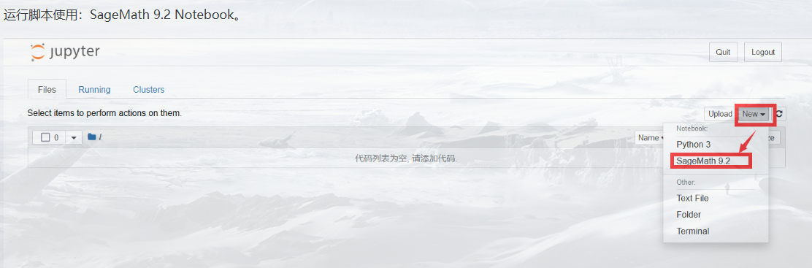
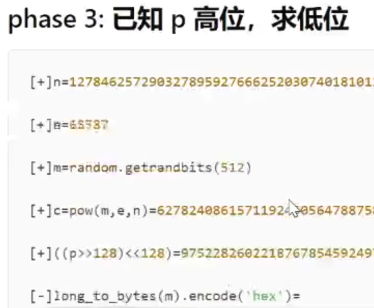
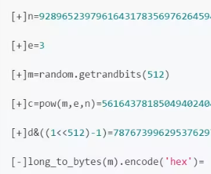

在线版：<https://sagecell.sagemath.org/>
sage的本地环境较大（接近10G）
离线版安装：<https://mirrors.aliyun.com/sagemath/win/index.html>


教程
<https://tanglee.top/2022/03/27/SageMath%E7%AE%80%E6%98%8E%E6%95%99%E7%A8%8B/>
使用
<https://kangming-ux.github.io/crypto/Use-of-Sagemath-in-CTF-Cryptography.html>
```
主要用于解决：
数论
椭圆曲线
RSA变形等题
```
```
安装后桌面：
SageMath 9.3

SageMath 9.3 Shell 命令窗口
可以安装库，如在里面执行 sage -pip install libnum
用离线版可以安装这些库方便数字和字符转换，用在线版会没有这个库，就不能用转换函数，在线版手动转。

SageMath 9.3 Notebook 运行这个此时会有网页版
```
网页使用即可



^
# **sage脚本**

## **1、m高位攻击**
已知n,c,e。n不能分解，e很小为3。
已知明文m高位，求明文m低位。得m
```
import libnum
def phase2(high_m, n, c):
    R.<x> = PolynomialRing(Zmod(n), implementation='NTL')
    m = high_m + x
    M = m((m^3 - c).small_roots()[0])
    print(libnum.n2s(int(M)))

n= 
e= 3
c= 
high_m= 

phase2(high_m, n, c)
```


## **2、p高位攻击**
已知n,c,e。n不能分解。
已知p高位，求低位。的p和q。再求m。

```
import libnum
def phase3(high_p, n):
    R.<x> = PolynomialRing(Zmod(n), implementation='NTL')
    p = high_p + x
    x0 = p.small_roots(X=2 ^ 60, beta=0.1)[0] #根据题目，注意 2^60  60需要修改相应的位数，出题是128就是128
    P = int(p(x0))
    Q = n // P
    print(P)
    print(Q) # 这里求出的P、Q
    assert n == P * Q

n=0x558477ce1d081f831cfa159290ee4fd14888422c216a16ad86e2b2d4335e3cb18ed0120a955f970b17b229a8e7d0ae1b6f0c40213ad0e127eba99ae0d8a82397
p4=0x8fbcbb7d1e9f393ee21b537d6e0bd2cf8629e315f4e356c1e000000000000000
e=0xf7278179324b11fd83d08aa6f
c=0x36e1c09ccad45cd63a0f07e704d3811c39d70cdfdad999d2df90255a76c58cf6fe99ac1ab1d5d99a4ce1a2ebdbfbc49ce72df2a0b90766ff84ab0ef62068d46b

phase3(p4, n)
```


^
## **3、d低位攻击**
已知n,c,e。n不能分解，e很小为3。
已知d低位，求p。再求d，解m。

```
import libnum
def getFullP(low_p, n):
    R.<x> = PolynomialRing(Zmod(n), implementation='NTL')
    p = x * 2 ^ 512 + low_p
    root = (p - n).monic().small_roots(X=2 ^ 128, beta=0.4)
    if root:
        return p(root[0])
    return None

def phase4(low_d, n, c):
    maybe_p = []
    for k in range(1, 4):
        p = var('p')
        p0 = solve_mod([3*p*low_d  == p + k*(n*p - p^2 - n + p)], 2^512)
        maybe_p += [int(x[0]) for x in p0]
    #print(maybe_p)

    for x in maybe_p:
        P = getFullP(x, n)
        if P: break

    P = int(P)
    Q = n // P

    assert P*Q == n
    print(P)
    print(Q)

    d = inverse_mod(3, (P-1)*(Q-1))
    print(d)
    print(libnum.n2s(int(power_mod(c, d, n))))


n = 9289
c = 561
low_d = 78767399

phase4(low_d, n, c)
```
^
## **5、小e的广播攻击**
如果选取的加密指数e较低，如3，5，13，23等，并且使用了相同的加密指数e给一个接受者的群发送相同m的加密信息n、c，那么可以进行广播攻击得到明文m。
在CTF中，n、c不同，明文m，e相同，其e比较小。使用中国剩余定理求解后再开方，直接得m。


```javascript
import libnum
e=13
n1= 
n2= 
n3= 
c1= 
c2= 
c3= 
def phase5(n1, c1, n2, c2, n3, c3):
    r = CRT([c1, c2, c3], [n1, n2, n3])
    m = int(r)^(1/13)
    print(m)
    print(libnum.n2s(int(m)))

phase5(n1, c1, n2, c2, n3, c3)
```


^
## **6、Franklin-Reiter attack**
FrankLin-Reiter 攻击RSA。
如果两条消息的区别仅在于两条消息之间的已知固定差异
并且是在相同的RSA模数N下进行RSA加密的
那么就可以恢复它们。

^
## **7、Boneh Durfee 攻击（类似维纳，e很大）**


