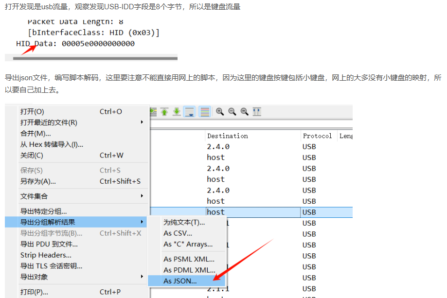

## **提取键盘数据USB.pcap中的明文数据**

1、linux的Tshark
```
sudo apt-get install tshark
tshark -r usb.pcap -T fields -e usb.capdata | sed '/^\s*$/d' > usbdata.txt
```

2、linux上：
python UsbKeyboardDataHacker.py key.pcap


3、
Jiayu工具箱：<https://github.com/isee15/ctf-tools/tree/master>

^
## **小键盘**

```
import json

normalKeys = {"04": "a", "05": "b", "06": "c", "07": "d", "08": "e", "09": "f", "0a": "g", "0b": "h", "0c": "i",
              "0d": "j", "0e": "k", "0f": "l", "10": "m", "11": "n", "12": "o", "13": "p", "14": "q", "15": "r",
              "16": "s", "17": "t", "18": "u", "19": "v", "1a": "w", "1b": "x", "1c": "y", "1d": "z", "1e": "1",
              "1f": "2", "20": "3", "21": "4", "22": "5", "23": "6", "24": "7", "25": "8", "26": "9", "27": "0",
              "28": "<RET>", "29": "<ESC>", "2a": "<DEL>", "2b": "\t", "2c": "<SPACE>", "2d": "-", "2e": "=", "2f": "[",
              "30": "]", "31": "\\", "32": "<NON>", "33": ";", "34": "'", "35": "<GA>", "36": ",", "37": ".", "38": "/",
              "39": "<CAP>", "3a": "<F1>", "3b": "<F2>", "3c": "<F3>", "3d": "<F4>", "3e": "<F5>", "3f": "<F6>",
              "40": "<F7>", "41": "<F8>", "42": "<F9>", "43": "<F10>", "44": "<F11>", "45": "<F12>",
              "59": "1","5a": "2","5b": "3","5c": "4","5d": "5","5e": "6","5f": "7","60": "8","61": "9","62": "0",}

shiftKeys = {"04": "A", "05": "B", "06": "C", "07": "D", "08": "E", "09": "F", "0a": "G", "0b": "H", "0c": "I",
             "0d": "J", "0e": "K", "0f": "L", "10": "M", "11": "N", "12": "O", "13": "P", "14": "Q", "15": "R",
             "16": "S", "17": "T", "18": "U", "19": "V", "1a": "W", "1b": "X", "1c": "Y", "1d": "Z", "1e": "!",
             "1f": "@", "20": "#", "21": "$", "22": "%", "23": "^", "24": "&", "25": "*", "26": "(", "27": ")",
             "28": "<RET>", "29": "<ESC>", "2a": "<DEL>", "2b": "\t", "2c": "<SPACE>", "2d": "_", "2e": "+", "2f": "{",
             "30": "}", "31": "|", "32": "<NON>", "33": "\"", "34": ":", "35": "<GA>", "36": "<", "37": ">", "38": "?",
             "39": "<CAP>", "3a": "<F1>", "3b": "<F2>", "3c": "<F3>", "3d": "<F4>", "3e": "<F5>", "3f": "<F6>",
             "40": "<F7>", "41": "<F8>", "42": "<F9>", "43": "<F10>", "44": "<F11>", "45": "<F12>"}


with open('1.json','r',encoding='utf-8') as fin:
    d = json.load(fin)
    outputKeyboard = ''
    for c in d:
        if 'usbhid.data' in c['_source']['layers']:
           usbData = c['_source']['layers']['usbhid.data']
           usbData = ''.join(usbData.split(':'))
           if len(usbData) == 16 :
               if usbData[4:6] == "00":
                   continue
               if usbData[4:6] in normalKeys:
                   if usbData[0:2] == "02":  # 表示按下了shift
                        outputKeyboard += shiftKeys[usbData[4:6]]
                   else:
                        outputKeyboard += normalKeys[usbData[4:6]]
               else:
                   outputKeyboard += '[unkown]'

    print('outputKeyboard :' + outputKeyboard)
#outputKeyboard :6d6f656374667b6e3168613077307930756469616e6c33323435317d
```
