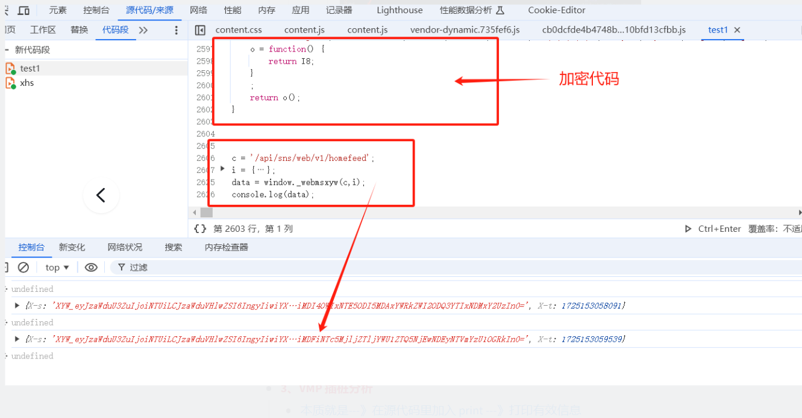

如果扣下来本地运行JS，需要补环境。
1、如果大量环境需要去补---》心累
2、环境里---》非常多的检测---》出现假值

使用VMP插桩，不将代码扣下来，就在浏览器环境里调用。

## **案例**

VMP 加密代码处理：

（1）把所有加密函数实现代码合起来---》copy 一份

（2）代码段---》创建独立文件---》代码复制过去

（3）开始调用：把函数拿过来---》把参数拿过来---》放到函数里面去（注意：加密函数和加密函数代码实现位置注意区分）

（4）运算---》代码段代码的时候---》一定要把所有断点取消

（5）把没用的代码删掉---》最后剩下代码进行分析

