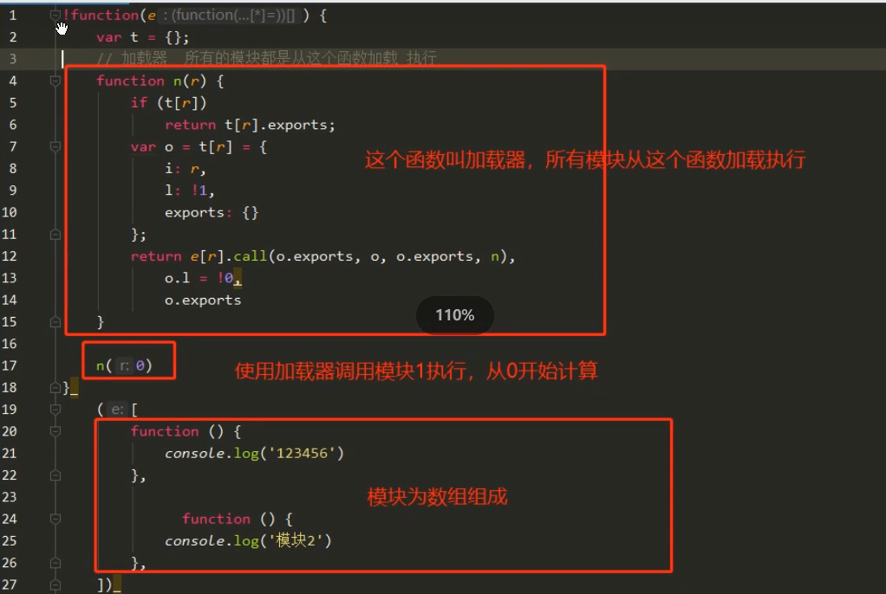
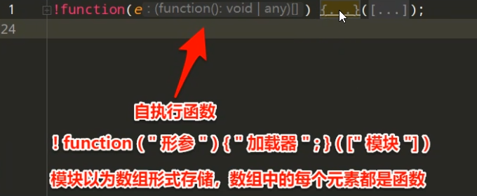
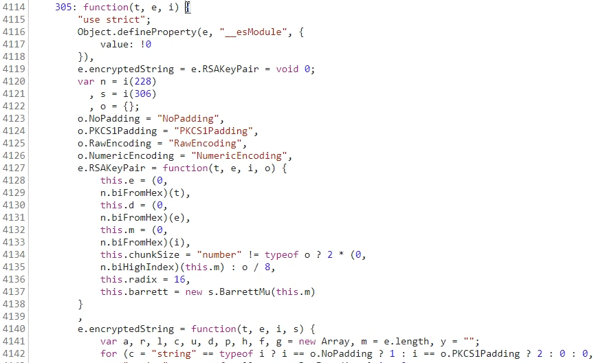
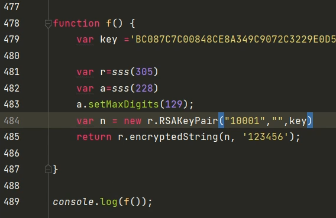

Vue类型的框架网站，通过Webpack等工具打包成html，一些自定义的函数和变量名往往做了混淆，一些环境模块函数通过加载实现引入。

webpack：
<https://www.cnblogs.com/zichliang/p/17517073.html>
<https://blog.csdn.net/Zuko_chen/article/details/131486608>

vue：
<https://blog.csdn.net/Lidppp/article/details/119732245>

## **加载器**
有的会在!function前声明是webpack


数组中可能有我们需要的加密函数和自定义、依赖函数，可能这个文件非常长，最好全部拷贝，也可以只拷贝关键函数，如305。


## **webpack扣下来运行加密**
抓包请求包，某个参数被加密，搜索这个参数。
搜索到后，断点确认参数。
找到加密函数，可以控制台打印一些这个函数，进入函数分析加密方式。
找到加载器，他会加载模块加密库，如funtion n(t){  retruen xx.call()}
将这个加载器代码扣下来，
导出加载器为全局变量，声明var sss；加载器里面让sss=n;
加载器的模块的核心加密函数补充，如228，305模块或所有模块。
将调用加密函数的代码扣下来，里面通过sss加载器加载模块如sss(305)。
补环境全局变量。



^
<https://blog.csdn.net/sin_0119/article/details/129658679>
<https://www.cnblogs.com/zichliang/p/17517073.html>
操作
```
1.确定是否是webpack
2.找到加载器，扣下来
3.缺啥补啥。赋值全局变量。
```