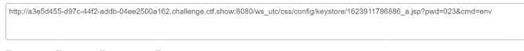

## **Weblogic 任意文件上传漏洞（CVE-2018-2894）**
漏洞前提
```
环境启动后，访问`http://your-ip:7001/console`，即可看到后台登录页面。

执行`docker compose logs | grep password`可查看管理员密码，管理员用户名为`weblogic`。

登录后台页面，点击`base_domain`的配置，在“高级”中开启“启用 Web 服务测试页”选项。
```

利用该漏洞，可以上传任意jsp文件，进而获取服务器权限。
```
访问IP/ws_utc/config.do，如果进入时不是设置页面而是登陆页面可以刷新一下多试几次

设置Work Home Dir
为/u01/oracle/user_projects/domains/base_domain/servers/AdminServer/tmp/_WL_internal/com.oracle.webservices.wls.ws-testclient-app-wls/4mcj4y/war/css

我将目录设置为ws_utc应用的静态文件css目录，访问这个目录是无需权限的，这一点很重要。

然后点击安全 -> 增加，然后上传webshell并找到这个文件的时间戳（可以抓包或F12查看回显的id标签中）：


然后访问IP/ws_utc/css/config/keystore/[时间戳]_[文件名]，即可执行webshell
(flag在环境变量里)
```
