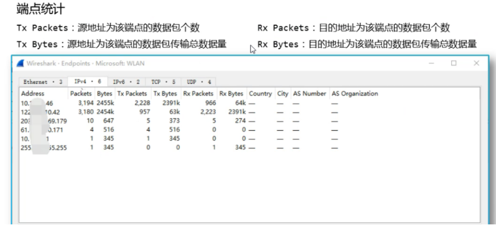
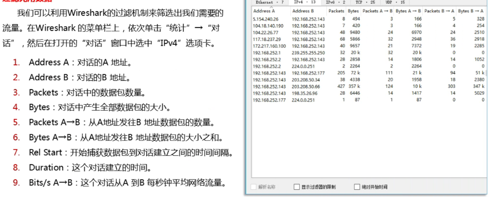
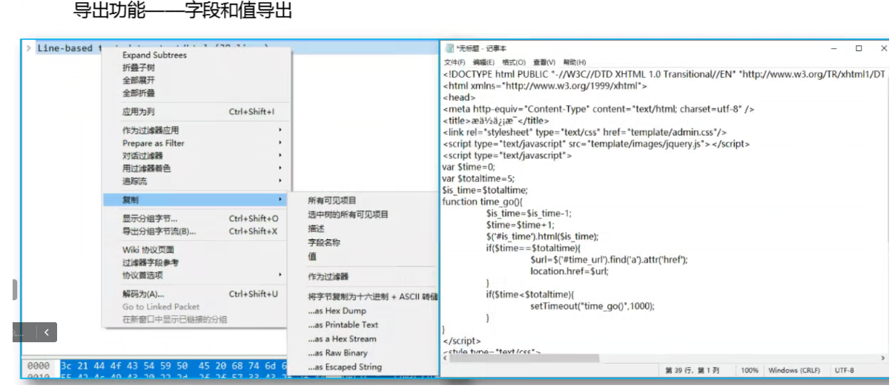

网络封包分析软件
Wireshark只能查看封包，不能修改封包内容或者发送封包。
可以监听查看网卡的包，或者手动导入数据包.cap/.pcap/.pcapng(由网络数据包捕获工具Wireshark、tcpdump 等生成)。
流量包可能是http,tcp,dns,mysql等。

linux的Tshark
sudo apt-get install tshark

在线pcap包分析：<https://as.zorelworld.com/list-pcap.html>
在线wireshark：https://www.cloudshark.org/captures

^
## **筛选过滤表达式**
1. 协议过滤：http (只查看http协议的记录)
2. IP过滤：ip.src==192.168.1.102 (只显示源地址是192.168.1.102)
3. mac地址过滤：eth.dst == A0:00:00:00:00:00 目标mac地址筛选 
4. 端口过滤：tcp.port==80 （只显示端口为80）
5. Http模式过滤：http.request.method=="POST" (只显示HTTP POST方法) 

http
```
ip.addr==xxx && http
http contains "whoami"
http contains ".php"
http.request.full_uri contains "SELECT"
```
命令执行，webshell
```
http contains "whoami"
http contains ".php"
http contains "eval("
```
sql注入
```
http.request.full_uri contains "SELECT"
```
下载文件
```
http contains ".sql"
http contains ".bak"
```
分段攻击
```
frame.number >= 136872 && http.request.method == POST http.request.uri contains"202005081648075663.php" && http.request.method == POST
```
其他协议
```
icmp
mysql
smtp 邮件
```
ip.src eq 192.168.0.1： 指定的来源IP
ip.dst eq 192.168.0.1： 指定的目标IP 
tcp.srcport eq 8080：来源端口等于 8080
tcp.port gt 3000：来源或目标端口大于 3000 
tcp.len > 100：TCP 数据包大于 100 
http.request.method == "GET"：HTTP 请求类型为 GET 
http.request.method == "POST" && http contains "HTTP/1.0 200 OK"：HTTP 请求类型为 POST 并且包含指定内容
http.reqeust.uri matches ".php$"： 基于正则匹配的过滤
^
tcp contains "whomai"
tcp.payload contains"flag"
ip contains "CTF"
http contains "<?php @eval"
http contains "login"
http contains "data:image/"
过滤，显示包中含有。


^
## **操作**
#### **统计操作**
**统计-协议分级**
在面对某些特定类型的恶意攻击（例如ARP攻击）时，需要从协议的角度进行分析。

**统计-对话**
这里查看IPV4流量的统计信息，可以看到在该流量包中主要是172.17.0.1和172.17.0.2之间的通信流量占绝大部分，可以初步怀疑这两个IP中的一方是攻击者IP，另一方是受害主机IP。



#### **导出**
右键可导出。



^
流量包大，打开慢可以拆包
```
>"C:\Program Files\Wireshark\editcap.exe" -c 100000 C:\Users\Administrator\Desktop\流量分析\21-task\数据采集D_eth0_NS_20160809_170106.pcap 2.pcap
```


^
pacp包损坏，使用 http://f00l.de/hacking/pcapfix.php 修复

^
点击搜索按钮，搜索。如搜索网卡eth0
^
先过滤http.request.method == "POST"，再按数据包大小排序
^
mysql，ftp传输是明文传输，可能泄露密码。
ftp流量包中有文件传输用kali中foremost分离出文件。
用法：foremost 文件名 -o 输出目录名


右击-追踪流-TCP流，搜索flag。
^
分析请求响应过程的资源
左上角，导出对象，http，选择要保存的资源(如图片)

流量包中有文件传输用kali中foremost分离出文件。
用法：foremost 文件名 -o 输出目录名

^
导出http，移到linux，搜索grep -r 'CTF' ./

^
流量记录后面加中文注释：
<https://www.yuque.com/hxfqg9/misc/tyvm6rtnlgqzsvqg>


^
## **分析web攻击场景**
#### **分析布尔sql注入流量包**
过滤http
左上导出分组结果为1.csv文件
看最后获取字段值的注入sql的请求url参数
对于布尔盲注，如果判断了两次>后的数据，就是正确数据acsii码值。
所有两次的记录下来，再转为acsii值即可看到字段值的正确数据。


^
#### **分析head协议的扫描器**
目录爆破

#### **分析特征流量**
icmp
ping分析，查看ping包的大小奇怪，是人为指定的，大小转成ascii即为flag