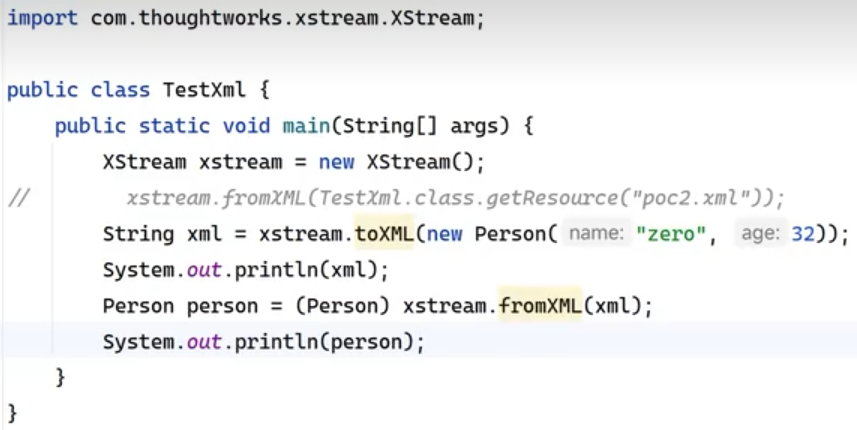

类似于原生，反序列化也会运行目标类readObject方法。有入口类的readObject()方法。
去执行JdbcRowSetImpl类里的JNDI注入。
<https://xz.aliyun.com/t/12784?time__1311=GqGxu7G%3DqCqqlrzG77DO7mxAIeh7%3DQioD>

^
XStream主要用于将对象(实现Serializable接口)序列化成XML（JSON）或反序列化为对象。

XStream在解析XML文本时使用黑名单机制来防御反序列化漏洞，但是其1.4.15前版本黑名单存在缺陷，攻击者可利用目标类中实现了readObject方法反序列化会被自动调用。
如javax.naming.Ldap.Rdn$RdnEntry 及javax.sql.rowset.BaseRowSet(com.sun.rowset.JdbcRowSetImpl)构造JNDI注入，进而执行任意命令。

^
```
<dependency>
    <groupId>com.thoughtworks.xstream</groupId>
    <artifactId>xstream</artifactId>
    <version>1.4.10</version>
</dependency>
```


我们构造恶意XML即可。
<https://xz.aliyun.com/news/12230>