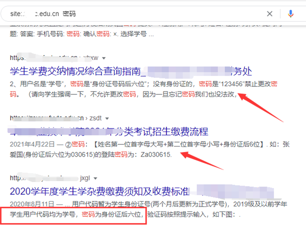

## **edu挖掘必备**
用fofa_api_edu脚本扫描
fofa
```
"系统" && org="China Education and Research Network Center"
org="China Education and Research Network Center"
org="China Education and Research Network Center" && icon_hash="1691956220"
body="大学"
domain="edu.cn" 不行
host="edu.cn" 
country="CN"

```


谷歌
```
site: ***.edu.cn
site: *.edu.cn
site:.xxx.edu.cn 密码
filetype:xls site:xxx.edu  身份证
filetype:xls  site:xxx.edu  sh  gh  SFZ
```



^

### **其他url**
```
人教社
***.pep.com.cn、
***.peeavp.com.cn、
***.peplexue.com、
***.mypep.cn、
***.mypep.com.cn、
***.pepchangdu.com、
***.pecec.com.cn、
***.gopep.cn
```