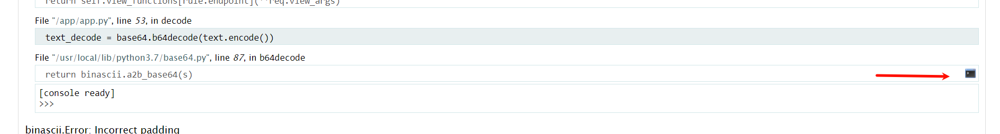

Flask模板注入中debug模式下pin码的获取和利用:
什么是pin码pin码是flask在开启debug模式下，进行代码调试模式所需的进入密码，需要正确的PIN码才能进入调试模式，可以理解为自带的webshell。
有了pin，然后报错或访问/consloe进，点击一个条列的右边有一个终端按钮，点击进入控制台rce


```
os.popen("ls -l /").read()
os.popen("cat /this_is_the_flag.txt").read()
```



^
<https://blog.csdn.net/rfrder/article/details/110240245>

<https://www.cnblogs.com/MisakaYuii-Z/p/12407760.html>