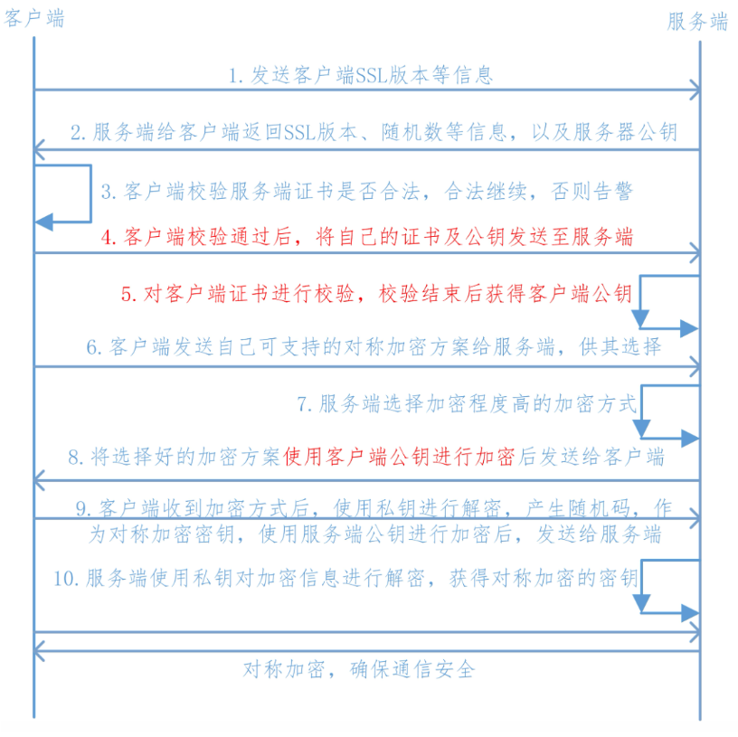
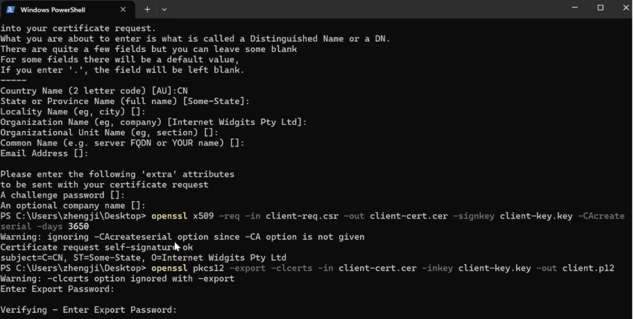
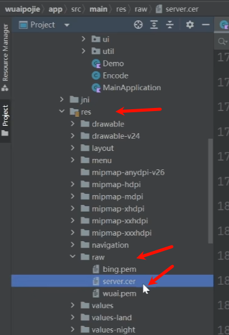
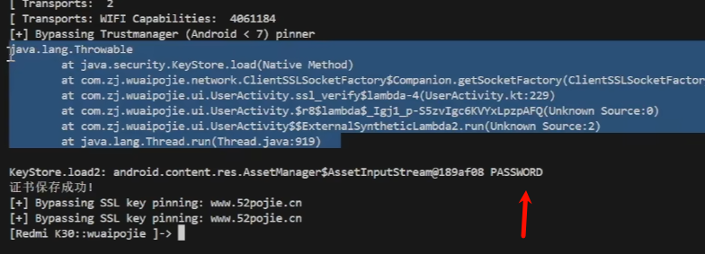

双向证书校验。(网络请求发出去了，中断没有响应)
提取证书和密码，或Frida底层绕过证书抓包。

绕过双向认证中客户端证书密码经历：<https://mp.weixin.qq.com/s/XxA4kXD_cz2NYNnDe_Wlcw>

## **双向认证**
双向验证，顾名思义就是客户端验证服务器端证书的正确性，服务器端也验证客户端的证书正确性  

```  
1.客户端向服务端发送SSL协议版本号、加密算法种类、随机数等信息。  
2.服务端给客户端返回SSL协议版本号、加密算法种类、随机数等信息，同时也返回服务器端的证书，即公钥证书  
3.客户端使用服务端返回的信息验证服务器的合法性，包括：  
    (1)证书是否过期  
    (2)发型服务器证书的CA是否可靠  
    (3)返回的公钥是否能正确解开返回证书中的数字签名  
    (4)服务器证书上的域名是否和服务器的实际域名相匹配、验证通过后，将继续进行通信，否则，终止通信  
4.服务端要求客户端发送客户端的证书，客户端会将自己的证书发送至服务端  
5.验证客户端的证书，通过验证后，会获得客户端的公钥  
6.客户端向服务端发送自己所能支持的对称加密方案，供服务器端进行选择  
7.服务器端在客户端提供的加密方案中选择加密程度最高的加密方式  
8.将加密方案通过使用之前获取到的公钥进行加密，返回给客户端  
9.客户端收到服务端返回的加密方案密文后，使用自己的私钥进行解密，获取具体加密方式，而后，产生该加密方式的随机码，用作加密过程中的密钥，使用之前从服务端证书中获取到的公钥进行加密后，发送给服务端  
10.服务端收到客户端发送的消息后，使用自己的私钥进行解密，获取对称加密的密钥，在接下来的会话中，服务器和客户端将会使用该密码进行对称加密，保证通信过程中信息的安全。  
```  
`实现方案:`  
1.首先借助openssl生成**服务端证书**  
```  
# 生成CA私钥  
openssl genrsa -out ca.key 2048  
  
# 生成CA自签名证书  
openssl req -x509 -new -nodes -key ca.key -sha256 -days 1024 -out ca.crt  
```  
2.生成**服务端证书**  
```shell  
openssl genrsa -out server.key 2048  
```  
这个指令生成一个2048位的RSA私钥，并将其保存到名为`server.key`的文件中  
```shell  
openssl req -new -key server.key -out server.csr -config server_cert.conf  
```  
这个指令基于第一步生成的私钥创建一个新的证书签名请求（CSR）。CSR包含了公钥和一些身份信息，这些信息在证书颁发过程中用于识别证书持有者。`-out server.csr`指定了CSR的输出文件名。  
执行这个指令时，系统会提示你输入一些身份信息，如国家代码、组织名等，这些信息将被包含在CSR中。(我们这边测试直接全部按回车键默认即可)  
  
| 字段名称                         | 描述                                                         | 默认值/示例值    | 是否必填 |  
|----------------------------------|----------------------------------|-------------------|----------|  
| Country Name (2 letter code)     | 国家代码，两位字母代码。                                 | AU               | 否       |  
| State or Province Name          | 州或省份的全名。                                           |                  | 否       |  
| Locality Name (eg, city)         | 城市或地区名称。                                           |                  | 否       |  
| Organization Name                | 组织名称，通常是公司或机构的名称。                         |                  | 否       |  
| Organizational Unit Name (eg, section) | 组织单位名称，可以是部门或团队的名称。               |                  | 否       |  
| Common Name (CN)                | 完全限定的域名（FQDN）或个人名称，用于标识证书持有者。 |                  | 是       |  
| Email Address                   | 与证书持有者关联的电子邮件地址。                           |                  | 否       |  
| Challenge Password              | 挑战密码，用于CSR的额外安全措施。                         |                  | 否       |  
| Optional Company Name           | 可选的公司名称字段。                                       |                  | 否       |  
  
`-config server_cert.conf`创建一个OpenSSL配置文件（如 `server_cert.conf`）并指定IP地址，具体的ip地址可以由ipconfig获取  
```  
[req]  
distinguished_name = req_distinguished_name  
req_extensions = v3_req  
prompt = no  
  
[req_distinguished_name]  
CN = 192.168.199.108  
  
[v3_req]  
subjectAltName = @alt_names  
  
[alt_names]  
IP.1 = 192.168.199.108  
  
```  
  
```shell  
openssl x509 -req -in server.csr -CA ca.crt -CAkey ca.key -CAcreateserial -out server.crt -days 365 -extfile server_cert.conf -extensions v3_req  
openssl x509 -req -days 365 -in server.csr -signkey server.key -out server.cer  
```  
使用CA证书签发服务器证书。  
生成cer证书供服务端验证。  
  
**客户端证书：**  
```shell  
openssl genrsa -out client.key 2048  
openssl req -new -out client.csr -key client.key  
openssl x509 -req -in client.csr -CA ca.crt -CAkey ca.key -CAcreateserial -out client.crt -days 500 -sha256  
```  
生成客户端带密码的p12证书（这步很重要，双向认证的话，浏览器访问时候要导入该证书才行；可能某些Android系统版本请求的时候需要把它转成bks来请求双向认证）：  
```shell  
openssl pkcs12 -export -out client.p12 -inkey client.key -in client.crt -certfile ca.crt  
```  
到这一步的时候，设置密码和验证密码光标不会显示，直接输入即可  


^
#### 环境配置  
PS:因为双向认证是本地搭建，所以需要完成几个前置条件:  
1.确保电脑和手机处于同一wifi连接下  
2.重打包替换生成的server.cer(路径在res/raw)，替换UserActivity中ssl_verify方法里的ip地址以及res/xml/network_config.xml的ip地址(通过ipconfig获取实际的ipv4地址)  

3.运行服务端代码，然后再请求看看是否能正常输出  
  
**服务端代码：**  
```python  
from flask import Flask, jsonify  
import ssl  
  
app = Flask(__name__)  
  
# ssl 证书校验  
@app.route('/ca')  
def ssl_verify():  
    return jsonify({"message": "HTTPS server with mutual SSL verification started."})  
  
# 配置ssl上下文，关键函数  
def get_ssl_context():  
    # CA根证书路径  
    ca_crt_path = 'certs/ca.crt'  
    # 服务端证书和密钥路径  
    server_crt_path = 'certs/server.crt'  
    server_key_path = 'certs/server.key'  
    # 创建SSL上下文，使用TLS服务器模式  
    ssl_context = ssl.SSLContext(ssl.PROTOCOL_TLS_SERVER)  
    # 设置验证模式为需要客户端证书  
    ssl_context.verify_mode = ssl.CERT_REQUIRED  
    # 启用主机名检查（根据需要设置）  
    ssl_context.check_hostname = False  
    # 设置加密套件  
    ssl_context.set_ciphers("HIGH:!SSLv3:!TLSv1:!aNULL:@STRENGTH")  
    # 加载CA根证书，用于验证客户端证书  
    ssl_context.load_verify_locations(cafile=ca_crt_path)  
    # 加载服务端证书和私钥  
    ssl_context.load_cert_chain(certfile=server_crt_path, keyfile=server_key_path)  
    return ssl_context  
  
if __name__ == '__main__':  
    ssl_context = get_ssl_context()  
    app.run(host="192.168.124.21", port=8088,ssl_context=ssl_context)  
  
```  
**客户端代码:**  
```kotlin  
fun ssl_verify() = Thread {  
// 初始化一个用于信任管理的对象  
    var trustManager: X509TrustManager? = null  
    try {  
        // 获取默认的信任管理工厂实例  
        val trustManagerFactory = TrustManagerFactory.getInstance(TrustManagerFactory.getDefaultAlgorithm())  
        // 初始化信任管理工厂，传入null表示使用系统默认的信任存储  
        trustManagerFactory.init(null as KeyStore?)  
        // 获取信任管理器列表  
        val trustManagers = trustManagerFactory.trustManagers  
        // 检查信任管理器列表是否只有一个X509TrustManager类型的对象  
        if (trustManagers.size != 1 || trustManagers[0] !is X509TrustManager) {  
            // 如果不符合预期，则抛出异常  
            throw IllegalStateException("Unexpected default trust managers: ${trustManagers.contentToString()}")  
        }  
        // 赋值信任管理器  
        trustManager = trustManagers[0] as X509TrustManager  
    } catch (e: Exception) {  
        // 捕获异常并打印堆栈跟踪信息  
        e.printStackTrace()  
    }  
    // 创建 OkHttpClient 实例并配置SSL套接字工厂和主机名验证器  
    val client = OkHttpClient.Builder()  
        .sslSocketFactory(  
            // 使用应用程序上下文获取自定义的SSL套接字工厂  
            ClientSSLSocketFactory.getSocketFactory(applicationContext),  
            // 设置信任管理器，如果为null则抛出异常  
            trustManager ?: throw IllegalStateException("TrustManager is null")  
        )  
		.hostnameVerifier { hostname, session -> true }  
        .build()  
    // 构建请求  
    val request = Request.Builder()  
        .url("https://192.168.124.21:8088/ca") // 设置请求的URL  
        .build()  
    try {  
        // 发送HTTP请求并获取响应  
        val response = client.newCall(request).execute()  
        // 打印响应的状态码，表明HTTPS双向认证成功  
        Log.d(TAG, "双向检测通过:${response.code()}")  
    } catch (e: IOException) {  
        // 如果请求失败，打印错误信息，并记录堆栈跟踪  
        Log.d(TAG, "双向检测不通过")  
        e.printStackTrace()  
    }  
}.start()  
  
```  
 
^
### **服务端校验绕过**
hook dump客户端内置证书
hook dump正确的客户端证书.p12和密码，交给抓包工具作为客户端，再给服务端校验。

也可能直接安装包里结合代码找到.p12和密码。
```js  
function hook_KeyStore_load() {  
    Java.perform(function () {  
        var ByteString = Java.use("com.android.okhttp.okio.ByteString");  
        var myArray=new Array(1024);  
        var i = 0  
        for (i = 0; i < myArray.length; i++) {  
            myArray[i]= 0x0;  
         }  
        var buffer = Java.array('byte',myArray);  
        var StringClass = Java.use("java.lang.String");  
        var KeyStore = Java.use("java.security.KeyStore");  
        KeyStore.load.overload('java.security.KeyStore$LoadStoreParameter').implementation = function (arg0) {  
            console.log(Java.use("android.util.Log").getStackTraceString(Java.use("java.lang.Throwable").$new()));  
            console.log("KeyStore.load1:", arg0);  
            this.load(arg0);  
        };  
        KeyStore.load.overload('java.io.InputStream', '[C').implementation = function (arg0, arg1) {  
            console.log(Java.use("android.util.Log").getStackTraceString(Java.use("java.lang.Throwable").$new()));  
            console.log("KeyStore.load2:", arg0, arg1 ? StringClass.$new(arg1) : null);  
            if (arg0){  
                var file =  Java.use("java.io.File").$new("/data/user/0/com.zj.wuaipojie/files/client"+".p12");  //dump保存的路径
                var out = Java.use("java.io.FileOutputStream").$new(file);  
                var r;  
                while( (r = arg0.read(buffer)) > 0){  
                    out.write(buffer,0,r)  
                }  
                console.log("证书保存成功!")  
                out.close()  
            }  
            this.load(arg0, arg1);  
        };  
    });  
}  
```


  
burp导入客户端证书： setting -> TLS -> Client TLS Certificates
<https://blog.csdn.net/qq_33530840/article/details/144085439>

^
### **客户端校验绕过**
本地校验继续用单向的hook，或者JustTrustMe模块。

```js  
function anti_ssl_cert() {  
        // 使用Frida获取Java类X509TrustManager的引用  
    var X509TrustManager = Java.use('javax.net.ssl.X509TrustManager');  
    // 使用Frida获取Java类SSLContext的引用  
    var SSLContext = Java.use('javax.net.ssl.SSLContext');  
    // 注册一个自定义的TrustManager类  
    var TrustManager = Java.registerClass({  
        // 指定自定义TrustManager的全名  
        name: 'dev.asd.test.TrustManager',  
        // 指定自定义TrustManager实现的接口  
        implements: [X509TrustManager],  
        // 定义自定义TrustManager的方法实现  
        methods: {  
            // 客户端证书信任检查，这里不实现任何逻辑  
            checkClientTrusted: function(chain, authType) {},  
            // 服务器证书信任检查，这里不实现任何逻辑  
            checkServerTrusted: function(chain, authType) {},  
            // 返回受信任的CA证书数组，这里返回空数组  
            getAcceptedIssuers: function() {return []; }  
        }  
    });  
    // 准备一个TrustManager数组，用于传递给SSLContext.init()方法  
    var TrustManagers = [TrustManager.$new()];  
    // 获取SSLContext.init()方法的引用，该方法用于初始化SSL上下文  
    var SSLContext_init = SSLContext.init.overload(  
        '[Ljavax.net.ssl.KeyManager;', '[Ljavax.net.ssl.TrustManager;', 'java.security.SecureRandom'  
    );  
    try {  
        // 覆盖init方法的实现，指定使用自定义的TrustManager  
        SSLContext_init.implementation = function(keyManager, trustManager, secureRandom) {  
            console.log('[+] Bypassing Trustmanager (Android < 7) pinner');  
            // 调用原始的init方法，并使用自定义的TrustManager数组  
            SSLContext_init.call(this, keyManager, TrustManagers, secureRandom);  
        };  
    } catch (err) {  
        // 如果覆盖init方法失败，打印错误信息  
        console.log('[-] TrustManager (Android < 7) pinner not found');  
        console.log(err); // 可以取消注释来打印异常的详细信息  
    }  
}  
  
```  