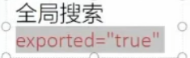
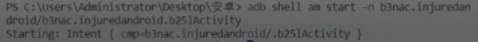

## **Frida和HOOK**
Frida可以通过将JavaScript 脚本插入到APP的内存中来对APP的逻辑进行跟踪和监视乃至修改原程序的逻辑，实现逆向开发和分析人员想要实现的功能称之为HOOK。


Frida 是一个动态代码插桩工具，它允许用户将 JavaScript 代码注入到原生应用程序中，以监视、修改或增强其功能。这个过程通常被称为 "HOOK"。通过 HOOK，逆向工程师和开发者可以拦截函数调用、修改函数参数、查看函数返回值、操作内存等，从而实现对应用程序行为的深入分析和修改。

在 Frida 中，HOOK 的实现主要依赖于以下几个步骤：

1. **选择目标函数**：确定你想要拦截的函数。这可以是一个库函数，也可以是一个应用程序中的 Java 或 Native 方法。
2. **编写 HOOK 脚本**：使用 JavaScript 编写代码来定义你希望在函数被调用时执行的操作。这可能包括记录函数调
 用、修改参数、更改返回值等。
 Frida脚本如果用python，python里面：JavaScript 脚本用于与 Frida 框架的交互，python用于和JavaScript交互篡改。

3. **注入脚本**：使用 Frida 的命令行工具或 API 将你的 HOOK 脚本注入到目标应用程序中。
4. **监控和分析**：观察应用程序的行为，分析 HOOK 脚本的输出，以了解应用程序的内部工作机制或寻找潜在的安全漏洞。

例如，以下是一个简单的 Frida 脚本js，它 HOOK 了一个名为 `example_func` 的函数，并在函数进入和退出时打印消息：

```
Interceptor.attach(Module.findExportByName("libexample.so", "example_func"), {
  onEnter: function(args) {
    console.log("example_func enter");
  },
  onLeave: function(retval) {
    console.log("example_func leave");
  }
});
```

在这个例子中，`Interceptor.attach` 用于拦截函数调用，`onEnter` 和 `onLeave` 回调函数分别在函数调用之前和之后执行


## **Frida操作**
快速入门操作：<https://www.freebuf.com/articles/system/190565.html>
功能：打印定位，中间截取数据篡改等。
配合算法助手的hook日志，继续hook。
实现：重写方法、重载方法，RPC，实例找到类中所有方法并调用。


如：hook安卓常见请求库。
hook `okhttp3` `java.net.HttpURLConnection` `java.net.URL` 三个常见请求库，
如：发现捕获到的所有请求均来自`java.net.URL`。

jadx也可以快速右键复制hook函数代码。

adb进入任意暴露的activity页面。

