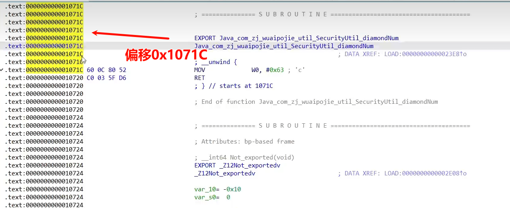
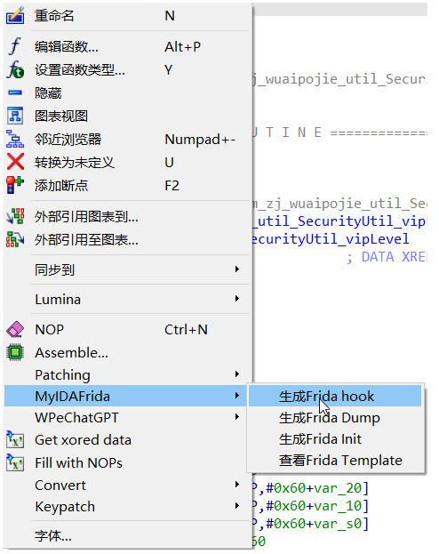

使用frida来native层hook so

看到有so函数静态注册（ida打开导出，搜java找到静态注册函数），可以直接java层hook。
也可以hook native层，这里最好使用root的真机（否则可能会出现找不到arm地址）。

## 1.Process、Module、Memory基础
frida库中的对象。
### 1.Process
`Process` 对象代表当前被Hook的进程，能获取进程的信息，枚举模块，枚举范围等
| API                       | 含义 |
|-------------------------------|-------------|
| `Process.id`                  | 返回附加目标进程的 `PID` |
| `Process.isDebuggerAttached()`| 检测当前是否对目标程序已经附加 |
| `Process.enumerateModules()`  | 枚举当前加载的模块，返回模块对象的数组 |
| `Process.enumerateThreads()`  | 枚举当前所有的线程，返回包含 `id`, `state`, `context` 等属性的对象数组 |

### 2.Module
`Module` 对象代表一个加载到进程的模块(例如，在 Windows 上的 DLL，或在 Linux/Android 上的 .so 文件),能查询模块的信息，如模块的基址、名称、导入/导出的函数等
| API                                                        | 含义                                                           |
|------------------------------------------------------------|----------------------------------------------------------------|
| `Module.load()`                                            | 加载指定so文件，返回一个Module对象                              |
| `enumerateImports()`                                       | 枚举所有Import库函数，返回Module数组对象                         |
| `enumerateExports()`                                       | 枚举所有Export库函数，返回Module数组对象                         |
| `enumerateSymbols()`                                       | 枚举所有Symbol库函数，返回Module数组对象                         |
| Module.findExportByName(exportName)、Module.getExportByName(exportName) | 寻找指定so中export库中的函数地址 |
| Module.findBaseAddress(name)、Module.getBaseAddress(name) | 返回so的基地址 |
### 3.Memory
`Memory`是一个工具对象，提供直接读取和修改进程内存的功能，能够读取特定地址的值、写入数据、分配内存等

| 方法                      | 功能                                                        |
| ------------------------- | ----------------------------------------------------------- |
| `Memory.copy()`           | 复制内存                                                    |
| `Memory.scan()`           | 搜索内存中特定模式的数据                                    |
| `Memory.scanSync()`       | 同上，但返回多个匹配的数据                                  |
| `Memory.alloc()`          | 在目标进程的堆上申请指定大小的内存，返回一个`NativePointer` |
| `Memory.writeByteArray()` | 将字节数组写入一个指定内存                                  |
| `Memory.readByteArray`                          | 读取内存                                                            |

## 2.枚举导入导出表

1. **导出表（Export Table）**：列出了库中可以被其他程序或库访问的所有公开函数和符号的名称。
2. **导入表（Import Table）**：列出了库需要从其他库中调用的函数和符号的名称。

简而言之，导出表告诉其他程序：“这些是我提供的功能。”，而导入表则表示：“这些是我需要的功能。”。

```js
function hookTest1(){
    Java.perform(function(){
        //打印导入表
        var imports = Module.enumerateImports("lib52pojie.so");
        for(var i =0; i < imports.length;i++){
            if(imports[i].name == "vip"){
                console.log(JSON.stringify(imports[i])); //通过JSON.stringify打印object数据
                console.log(imports[i].address);
            }
        }
        //打印导出表
        var exports = Module.enumerateExports("lib52pojie.so");
        for(var i =0; i < exports.length;i++){
            console.log(JSON.stringify(exports[i]));
        }
        
    })
}
```
## 3.Native函数的基础Hook打印
1. 整数型、布尔值类型、char类型
```JS
function hookTest2(){
    Java.perform(function(){
        //根据导出函数名打印地址
        var helloAddr = Module.findExportByName("lib52pojie.so","Java_com_zj_wuaipojie_util_SecurityUtil_checkVip");
        console.log(helloAddr); 
        if(helloAddr != null){
	        //Interceptor.attach是Frida里的一个拦截器
            Interceptor.attach(helloAddr,{
	            //onEnter里可以打印和修改参数
                onEnter: function(args){  //args传入参数
                    console.log(args[0]);  //打印第一个参数的值
                    console.log(this.context.x1);  // 打印寄存器内容
                    console.log(args[1].toInt32()); //toInt32()转十进制
					console.log(args[2].readCString()); //读取字符串 char类型
					console.log(hexdump(args[2])); //内存dump

                },
                //onLeave里可以打印和修改返回值
                onLeave: function(retval){  //retval返回值
                    console.log(retval);
                    console.log("retval",retval.toInt32());
                }
            })
        }
    })
}
```
2. 字符串类型
```js
function hookTest2(){
    Java.perform(function(){
        //根据导出函数名打印地址
        var helloAddr = Module.findExportByName("lib52pojie.so","Java_com_zj_wuaipojie_util_SecurityUtil_vipLevel");
        if(helloAddr != null){
            Interceptor.attach(helloAddr,{
                //onEnter里可以打印和修改参数
                onEnter: function(args){  //args传入参数
                    // 方法一
                    var jString = Java.cast(args[2], Java.use('java.lang.String'));
                    console.log("参数:", jString.toString());
                    // 方法二
                    var JNIEnv = Java.vm.getEnv();
                    var originalStrPtr = JNIEnv.getStringUtfChars(args[2], null).readCString();	
                    console.log("参数:", originalStrPtr);				
                },
                //onLeave里可以打印和修改返回值
                onLeave: function(retval){  //retval返回值
                    var returnedJString = Java.cast(retval, Java.use('java.lang.String'));
                    console.log("返回值:", returnedJString.toString());
                }
            })
        }
    })
}

```

## 4.Native函数的基础Hook修改
1. 整数型修改
```js
function hookTest3(){
    Java.perform(function(){
        //根据导出函数名打印地址
        var helloAddr = Module.findExportByName("lib52pojie.so","func_four");
        console.log(helloAddr);
        if(helloAddr != null){
            Interceptor.attach(helloAddr,{
                onEnter: function(args){  //args参数
                    args[0] = ptr(1000); //第一个参数修改为整数 1000，先转为指针再赋值
                    console.log(args[0]);
                      
                },
                onLeave: function(retval){  //retval返回值
                    retval.replace(20000);  //返回值修改
                    console.log("retval",retval.toInt32());
                }
            })
        }
    })
}
```
2. 字符串类型修改
```js
function hookTest2(){
    Java.perform(function(){
        //根据导出函数名打印地址
        var helloAddr = Module.findExportByName("lib52pojie.so","Java_com_zj_wuaipojie_util_SecurityUtil_vipLevel");
        if(helloAddr != null){
            Interceptor.attach(helloAddr,{
                //onEnter里可以打印和修改参数
                onEnter: function(args){  //args传入参数
                    var JNIEnv = Java.vm.getEnv();
                    var originalStrPtr = JNIEnv.getStringUtfChars(args[2], null).readCString();	
                    console.log("参数:", originalStrPtr);
                    var modifiedContent = "至尊";
                    var newJString = JNIEnv.newStringUtf(modifiedContent);
                    args[2] = newJString;				
                },
                //onLeave里可以打印和修改返回值
                onLeave: function(retval){  //retval返回值
                    var returnedJString = Java.cast(retval, Java.use('java.lang.String'));
                    console.log("返回值:", returnedJString.toString());
                    var JNIEnv = Java.vm.getEnv();
                    var modifiedContent = "无敌";
                    var newJString = JNIEnv.newStringUtf(modifiedContent);
                    retval.replace(newJString);
                }
            })
        }
    })
}
```

## 5.SO基址的获取方式
```js
var moduleAddr1 = Process.findModuleByName("lib52pojie.so").base;  
var moduleAddr2 = Process.getModuleByName("lib52pojie.so").base;  
var moduleAddr3 = Module.findBaseAddress("lib52pojie.so");
```
## 6.Hook未导出函数与函数地址计算
```js
function hookTest6(){
    Java.perform(function(){
        //根据导出函数名打印基址
        var soAddr = Module.findBaseAddress("lib52pojie.so");
        console.log(soAddr);
        var funcaddr = soAddr.add(0x1071C);  
        console.log(funcaddr);
        if(funcaddr != null){
            Interceptor.attach(funcaddr,{
                onEnter: function(args){  //args参数
 
                },
                onLeave: function(retval){  //retval返回值
                    console.log(retval.toInt32());
                }
            })
        }
    })
}
```

函数地址计算
1. 安卓里一般32 位的 so 中都是`thumb`指令，64 位的 so 中都是`arm`指令
2. 通过IDA里的opcode bytes来判断，arm 指令为 4 个字节(options -> general -> Number of opcode bytes (non-graph)  输入4)
3. thumb 指令，函数地址计算方式： so 基址 + 函数在 so 中的偏移0x1071C + 1  
	arm 指令，函数地址计算方式： so 基址 + 函数在 so 中的偏移0x1071C



^
## 7.Hook_dlopen

dlopen是加载库的一类函数。
有的apk在一开始的时候就加载的so，我们不注意就可能hook不到这个so。
因此我们使用下面这种hook dlopen。

[dlopen源码](http://aospxref.com/android-8.0.0_r36/xref/bionic/libdl/libdl.c?r=&mo=4035&fi=101#101)
[android_dlopen_ext源码](http://aospxref.com/android-8.0.0_r36/xref/bionic/libdl/libdl.c#146)
```
function hook_dlopen() {
    var dlopen = Module.findExportByName(null, "dlopen");
    Interceptor.attach(dlopen, {
        onEnter: function (args) {
            var so_name = args[0].readCString();
            if (so_name.indexOf("lib52pojie.so") >= 0) this.call_hook = true;
        }, onLeave: function (retval) {
            if (this.call_hook) hookTest2();
        }
    });
    // 高版本Android系统使用android_dlopen_ext
    var android_dlopen_ext = Module.findExportByName(null, "android_dlopen_ext");
    Interceptor.attach(android_dlopen_ext, {
        onEnter: function (args) {
            var so_name = args[0].readCString();
            if (so_name.indexOf("lib52pojie.so") >= 0) this.call_hook = true;
        }, onLeave: function (retval) {
            if (this.call_hook) hookTest2();
        }
    });
}
```
同时最好以Spawn模式hook
```
frida -U -f 进程名 -l hook.js
```


^
## 8.借助IDA脚本实现一键式hook


[IDA&Frida 学习](https://www.52pojie.cn/forum.php?mod=viewthread&tid=1759879&highlight=frida)
