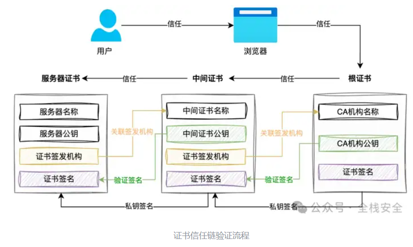

## **https原理**
使用非对称加密建立https连接，使用对称加密进行加密数据传输。

HTTPS 加密的主要目的是保护通信的内容(如：请求体、包括方法、URI、头、body)，使得通信内容在传输过程中不被窃听或篡改。但是 HTTPS 并不会对通信的元数据进行加密，因此请求的目标域名仍然是可见的。
<https://www.zhihu.com/question/326876165/answer/2978754556>

^
## **流程**
<https://www.zhihu.com/question/37370216>

<https://www.zhihu.com/question/37370216/answer/1906099416923903684>

### 1.服务端证书请求CSR申请证书文件：
服务端会生成一对公私钥，然后将公钥包含在CSR中，向证书颁发代理机构CA提交CSR，代理CA会使用这个CSR来生成证书，同时也会通过代理CA的私钥生成一个数字签名用于验证证书的真实性。
>如何保证公钥不被篡改?： 通过数字证书和证书内容数字签名来验证公钥的真实性。
>数字签名是使用私钥对数据进行加密生成的一段特殊信息，用于验证数据的完整性和真实性。在TLS中，CA使用自己的私钥对证书内容进行数字签名，形成数字签名。
>证书是一种包含身份信息和数字签名的数据结构
>数字签名用于确保证书的真实性和完整性。客户端可以使用本地根CA的公钥来解密验证证书的数字签名，从而确认证书的来源和未被篡改。

服务端会收到由CA签发的SSL/TLS证书文件（包含公钥，服务端信息，数字签名等），而私钥文件则一直保留在服务端。

服务端配置网关程序监听或转发到443端口，配置证书文件和私钥文件所在位置，还可配置http重定向到https。

^
### 2.SSL/TLS握手：
客户端请求服务端，服务端发送证书文件和公钥给客户端。
客户端使用本地的CA签发的根证书，里面有CA的公钥验证服务端发来的证书文件是否合法。
客户端验证合法后，协商对称加密的算法生成【预主密钥】，并用服务端发来的公钥加密【预主密钥】 ，再将【预主密钥】发送给服务端，服务端使用私钥成功解密【预主密钥】，握手成功。

SSL/TLS握手：
1. **客户端发送 Client Hello**：客户端向服务器发送 Client Hello 消息，其中包含了客户端支持的加密算法、协商的协议版本号、支持的 TLS 扩展等信息。
2. **服务器响应 Server Hello**：服务器接收到客户端的 Client Hello 消息后，会选择合适的加密算法和协议版本，并向客户端发送 Server Hello 消息，其中包含了服务器选择的加密算法、协议版本号等信息。
3. **服务器发送证书文件和公钥给客户端**：服务器在 Server Hello 消息之后发送自己的证书和公钥给客户端，以供客户端验证和加密通信使用。
4. **客户端验证服务端证书**：客户端使用本地根CA的公钥来验证证书的数字签名验证服务端的证书的合法性，确保它是由可信的证书颁发机构签发的。
5. **客户端生成预主密钥并用服务端公钥加密**：客户端生成一个随机数作为预主密钥，并使用服务端发来的公钥加密该预主密钥，以便安全地将其发送给服务器。
6. **客户端发送加密后的预主密钥给服务端**：客户端将加密后的预主密钥发送给服务器。
7. **服务器使用私钥成功解密预主密钥**：服务器使用自己的私钥成功解密客户端发送的预主密钥，从而确保双方都拥有相同的预主密钥。
8. **双方协商生成对称加密密钥**：客户端和服务器使用协商的加密算法和预主密钥派生出对称加密密钥，用于后续的安全通信。
9. **握手成功**：一旦对称加密密钥协商成功，SSL/TLS 握手就算成功完成了，双方可以使用该密钥进行加密通信。

^
### 3.加密传输：
客户端和服务端自动使用这个【预主密钥】进行数据的对称加密传输。

^
## **https抓包原理**

抓包软件如Burp Suite 进行 HTTPS 代理抓包的原理大致如下：

1. **中间人攻击：** Burp Suite 通过中间人攻击（MITM）的方式来进行代理抓包。它在客户端和服务器之间充当代理，中间拦截了 HTTPS 通信。
2. **安装根证书：** Burp Suite 打开浏览器访问`http://burp`，点击CA，会生成自签名的根证书，然后将这个证书安装在你的操作系统或浏览器中，用于验证Burp Suite的SSL/TLS证书合法性。
3. **拦截和解密：** 
当使用 Burp Suite 代理浏览器发送 HTTPS 请求时，Burp Suite 将请求拦截并使用其自己的证书与浏览器进行通信，然后再将请求发送给目标服务器，和目标服务器通信。
收到服务器响应后，Burp Suite再用自己的证书和加密方式将数据发送给浏览器。
从中，Burp Suite 可以解密和查看 HTTPS 请求和响应的内容。

^
## **证书**

证书是 https 里非常重要的主体，可用来识别对方是否可信，以及用其公钥做密钥交换。可以看见证书里面包含证书的颁发者，证书的使用者，证书的公钥，颁发者的签名等信息。其中 Issuer Name 是签发此证书的 CA 名称,用来指定签发证书的 CA 的可识别的唯一名称(DN, Distinguished Name)，用于证书链的认证，这样通过各级实体证书的验证，逐渐上溯到链的终止点，即可信任的根 CA，如果到达终点在自己的信任列表内未发现可信任的 CA 则认为此证书不可信。\
https 握手过程的证书校验环节就是为了识别证书的有效性唯一性等等，所以严格意义上来说 https 下不存在中间人攻击，**存在中间人攻击的前提条件是没有严格的对证书进行校验，或者人为的信任伪造证书**，下面一起看下几种常见的https“中间人攻击”场景。

## 证书未校验

由于客户端没有做任何的证书校验，所以此时随意一张证书都可以进行中间人攻击，可以使用 burp 里的这个模块进行中间人攻击。通过浏览器查看实际的 https 证书，是一个自签名的伪造证书。

## 部分校验

做了部分校验，例如在证书校验过程中只做了证书域名是否匹配的校验，可以使用 burp 的如下模块生成任意域名的伪造证书进行中间人攻击。实际生成的证书效果，如果只做了域名、证书是否过期等校验可轻松进行中间人攻击(由于 chrome 是做了证书校验的所以会提示证书不可信任)。

## 证书链校验

如果客户端对证书链做了校验，那么攻击难度就会上升一个层次，此时需要人为的信任伪造的证书或者安装伪造的 CA 公钥证书从而间接信任伪造的证书，可以使用 burp 的如下模块进行中间人攻击。\
可以看见浏览器是会报警告的，因为 burp 的根证书 PortSwigger CA 并不在浏览器可信任列表内，所以由它作为根证书签发的证书都是不能通过浏览器的证书校验的，如果将 PortSwigger CA 导入系统设置为可信任证书，那么浏览器将不会有任何警告。

### 手机客户端 Https 数据包抓取

上述第一、二种情况不多加赘述，第三种情况就是我们经常使用的抓手机应用https 数据包的方法，即导入代理工具的公钥证书到手机里，再进行 https 数据包的抓取。导入手机的公钥证书在 android 平台上称之为受信任的凭据，可以看见是 Issuer 和 Subject 一样的自签名 CA 公钥证书，另外我们也可以通过证书类型就可以知道此为公钥证书，crt、der 格式的证书不支持存储私钥或证书路径(有兴趣的同学可查找证书相关信息)。导入 CA 公钥证书之后，参考上文的证书校验过程不难发现通过此方式能通过证书链校验，从而形成中间人攻击，客户端使用代理工具的公钥证书加密随机数，代理工具使用私钥解密并计算得到对称加密密钥，再对数据包进行解密即可抓取明文数据包。

## 中间人攻击原理

一直在说中间人攻击，那么中间人攻击到底是怎么进行的呢，下面我们通过一个流行的 MITM 开源库 mitmproxy 来分析中间人攻击的原理。中间人攻击的关键在于 https 握手过程的 ClientKeyExchange，由于 pre key 交换的时候是使用服务器证书里的公钥进行加密，如果用的伪造证书的公钥，那么中间人就可以解开该密文得到 pre\_master\_secret 计算出用于对称加密算法的 master\_key，从而获取到客户端发送的数据;然后中间人代理工具再使用其和服务端的master\_key 加密传输给服务端;同样的服务器返回给客户端的数据也是经过中间人解密再加密，于是完整的 https 中间人攻击过程就形成了。

## App 证书校验

app 证书校验已经是一个老生常谈的问题了，但是市场上还是有很多的 app 未做好证书校验，有些只做了部分校验，例如检查证书域名是否匹配证书是否过期，更多数的是根本就不做校验，于是就造成了中间人攻击。**做证书校验需要做完全，只做一部分都会导致中间人攻击，对于安全要求并不是特别高的 app 可使用如下校验方式：**\
查看证书是否过期\
服务器证书上的域名是否和服务器的实际域名相匹配\
校验证书链

