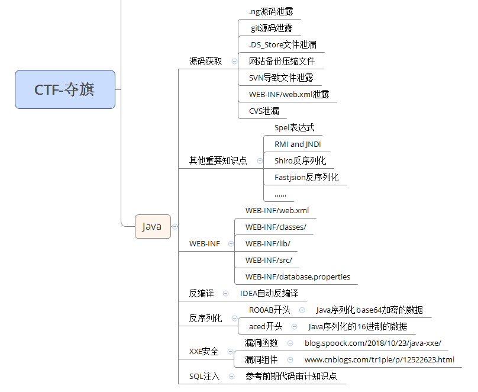

考点技术：xxe，spel表达式，反序列化，文件安全，最新框架插件漏洞等

设法间接给出源码或相关配置提示文件，间接性源码或直接源码体现等形式
CTF中常见Web源码泄露总结(参考：https\://www\.cnblogs.com/xishaonian/p/7628153.html)
1. .ng源码泄露
2. git源码泄露
3. .Ds_store文件泄漏
4. 网站备份压缩文件
5. SVN导致文件泄露
6. WEB-INF/web.xml泄露。泄露servlet路径：WEB-INF/classes/com/ctfshow/servlet/GetFlag.class
7. CVS泄漏

