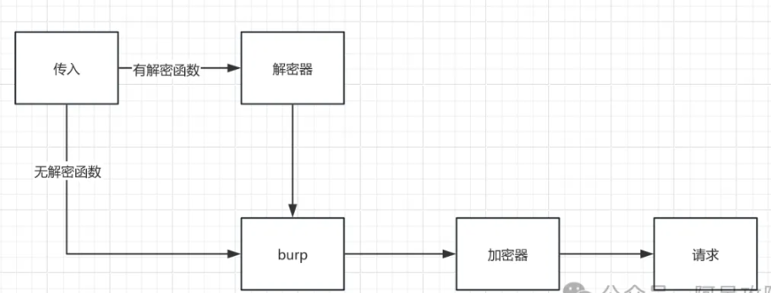

<https://mp.weixin.qq.com/s/LDPwjUXagvvJfLOkq51n0g>
通过jsRPC免去抠代码。适用于金融项目、请求和响应体全加密的场景。
针对请求接口加密/响应需要解密的情况，在使用Burp测试时无法对数据进行操作，需要确认传输都为明文我们才可以进行常规测试。这块有点JS基础和Python基础基本都可以通杀。

原理：往浏览器里弄个ws的客户端，然后接受服务器的指令，去调用已经加载好的js方法。




## **使用**
1、分析JS中加密解密
如果加密解密函数的调用：my1("123456"); my2("#fahkbf");
代理加密函数到windows变全局：windows.encode=my1
代理解密函数到windows变全局：windows.decode=my2

2、启动本地RPC服务端

3、浏览器中创建RPC客户端，将关键函数注入其中
F12-源代码-片段：里面是RPC客户端的代码，点击下面▲运行。
<https://github.com/jxhczhl/JsRpc/blob/main/resouces/JsEnv_Dev.js>
```
let Hlclient =function(wsURL) {
    this.wsURL = wsURL;
    this.handlers = {
        _execjs: function (resolve, param) {
            var res = eval(param)
            if (!res) {
                resolve("没有返回值")
            } else {
                resolve(res)
            }

        }
    };
    this.socket = undefined;
    if (!wsURL) {
        throw new Error('wsURL can not be empty!!')
    }
    this.connect()
}

Hlclient.prototype.connect = function () {
    console.log('begin of connect to wsURL: ' + this.wsURL);
    var _this = this;
    try {
        this.socket = new WebSocket(this.wsURL);
        this.socket.onmessage = function (e) {
            _this.handlerRequest(e.data)
        }
    } catch (e) {
        console.log("connection failed,reconnect after 10s");
        setTimeout(function () {
            _this.connect()
        }, 10000)
    }
    this.socket.onclose = function () {
        console.log('rpc已关闭');
        setTimeout(function () {
            _this.connect()
        }, 10000)
    }
    this.socket.addEventListener('open', (event) => {
        console.log("rpc连接成功");
    });
    this.socket.addEventListener('error', (event) => {
        console.error('rpc连接出错,请检查是否打开服务端:', event.error);
    });

};
Hlclient.prototype.send = function (msg) {
    this.socket.send(msg)
}

Hlclient.prototype.regAction = function (func_name, func) {
    if (typeof func_name !== 'string') {
        throw new Error("an func_name must be string");
    }
    if (typeof func !== 'function') {
        throw new Error("must be function");
    }
    console.log("register func_name: " + func_name);
    this.handlers[func_name] = func;
    return true

}

//收到消息后这里处理，
Hlclient.prototype.handlerRequest = function (requestJson) {
    var _this = this;
    try {
        var result = JSON.parse(requestJson)
    } catch (error) {
        console.log("catch error", requestJson);
        result = transjson(requestJson)
    }
    //console.log(result)
    if (!result['action']) {
        this.sendResult('', 'need request param {action}');
        return
    }
    var action = result["action"]
    var theHandler = this.handlers[action];
    if (!theHandler) {
        this.sendResult(action, 'action not found');
        return
    }
    try {
        if (!result["param"]) {
            theHandler(function (response) {
                _this.sendResult(action, response);
            })
            return
        }
        var param = result["param"]
        try {
            param = JSON.parse(param)
        } catch (e) {}
        theHandler(function (response) {
            _this.sendResult(action, response);
        }, param)

    } catch (e) {
        console.log("error: " + e);
        _this.sendResult(action, e);
    }
}

Hlclient.prototype.sendResult = function (action, e) {
    if (typeof e === 'object' && e !== null) {
        try {
            e = JSON.stringify(e)
        } catch (v) {
            console.log(v)//不是json无需操作
        }
    }
    this.send(action + atob("aGxeX14") + e);
}

let transjson = function(formdata) {
    var regex = /"action":(?<actionName>.*?),/g
    var actionName = regex.exec(formdata).groups.actionName
    stringfystring = formdata.match(/{..data..:.*..\w+..:\s...*?..}/g).pop()
    stringfystring = stringfystring.replace(/\\"/g, '"')
    paramstring = JSON.parse(stringfystring)
    tens = `{"action":` + actionName + `,"param":{}}`
    tjson = JSON.parse(tens)
    tjson.param = paramstring
    return tjson
}
```
控制台创建一个浏览器中的RPC客户端，连接本地启动的RPC服务端
```
var demo = new Hlclient("ws://127.0.0.1:12080/ws?group=zzz");
```
将代理的加解密函数注册到RPC服务里面。
```
demo.regAction("encode", function (resolve,param) {
    //这样添加了一个param参数，http接口带上它，这里就能获得
    var ret = window.encode(JSON.stringify(param))
    resolve(ret);
})
```
此时可以通过本地的RPC服务，调用浏览器中加密函数
```
curl 'http://127.0.0.1:12080/go?group=zzz&action=encode&param='

curl -X POST -H 'Content-Type: application/x-www-form-urlencoded' -H 'User-Agent: Mozilla/5.0 (Windows NT 10.0; Win64; x64) AppleWebKit/537.36 (KHTML, like Gecko) Chrome/83.0.4103.116 Safari/537.36' -d 'action=encode&group=zzz&param=' 'http://127.0.0.1:12080/go'
```
这里使用curl测试，优化成python的调用
```

import requests


def getRpc(param,method):
    headers = {
        'Content-Type': 'application/x-www-form-urlencoded'
    }

    data = {
        'action': method,
        'group': 'zzz',
        'param': param
    }
    resJson = requests.post('http://127.0.0.1:12080/go', headers=headers, data=data).json()
    return resJson["data"]

def encode(param):
    return getRpc(param, 'encode')

def decode(param):
    return getRpc(param, 'decode')

print(encode('{"username":"admin","password":"123456","code":"2","uuid":"xxxxx"}'))
```
继续优化python通用模板，使得可以通过mitmproxy自动调用。

4、整合mitmproxy和yakit
yakit重发明文请求代理到mitmproxy的服务，mitmproxy通过指定的py通用模板对请求体全加密。并对响应体全解密。

mitmproxy服务启动，可以使用web版也可以命令行版。

```
mitmdump.exe -p 6666 -s totalRpc.py --mode upstream:http://127.0.0.1:8083  --ssl-insecure
若安装了mitmproxy证书，可不使用--ssl-insecure
```
