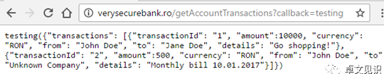

JSONP 劫持是一种敏感信息泄露的漏洞，经过攻击者巧妙而持久地利用，会对企业和用户造成巨大的危害。JSONP 漏洞主要被攻击者用来在受害者不知不觉中窃取他们的隐私数据。
蜜罐获取攻击者信息原理：<https://www.wangan.com/p/7fy74752651cfb23> 
<https://www.cnblogs.com/ph4nt0mer/p/16538600.html>


^
前端页面通过创建<script>标签并指定回调函数来获取数据，前端会向<script>中src的接口自动发送get请求，且不跨域问题会自动携带cookie，接口响应的JSON会作为参数传入回调函数，服务端可以使用回调函数中的参数获取接口的JSON数据。

JSONP 的基本原理是通过动态创建一个 `<script>` 标签，其 `src` 属性指向远程服务器上的一个 URL，该 URL 返回的数据包裹在一个函数调用中。这个函数通常是在客户端上预定义好的，而服务器端返回的数据将作为该函数的参数传入。

例如，如果在页面中引入以下代码：

```
<script src="http://example.com/data?callback=callback"></script>
```
自动请求接口，且携带cookie，如果接口是敏感接口，如：社交平台个人信息。
服务器返回的数据会是如下形式：
F12-网络
勾选Preserve log
搜索callback
```
callback({"key": "value"});
```

这样，当浏览器加载 `<script>` 标签时，会执行服务器返回的 JavaScript 数据，调用 `callback` 函数。
而蜜罐就是收集各大社交平台的个人信息的jsop回调的接口，实现获取攻击者登录过的个人信息。

^
BP插件：
JSONP-Hunter-master
自动记录有回调的接口url
<https://github.com/p1g3/JSONP-Hunter>

^
json返回敏感信息，如果不能跨域，可以尝试url加个参数 callback=xxx，返回jsonp则存在漏洞。并且可以测试反射XSS。
