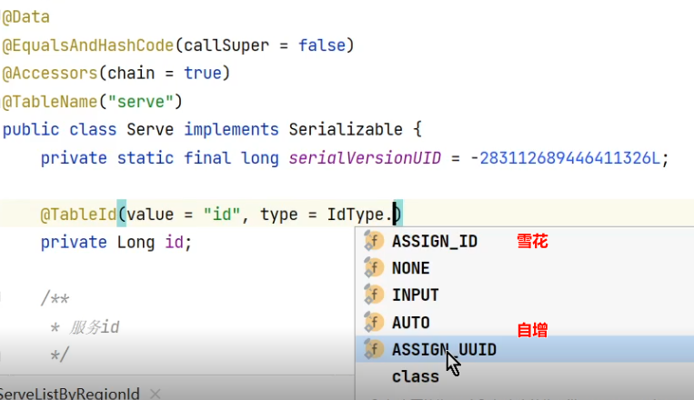

使用mybatisplus，安装mybatisplus插件后，通过右上角[其他]，可以链接数据库后，选择表自动创建的模型domain实体类。
实体类的主键id类型，有自增，雪花，uuid

^
## **分页方法**
在服务层可以用
PageHelper插件来分页。(自己拼接的联合sql时推荐)
也可以
MyBatisPlus带有的baseMapper.selectPage

通过低层拦截器，修改查询sql语句，如加limit。