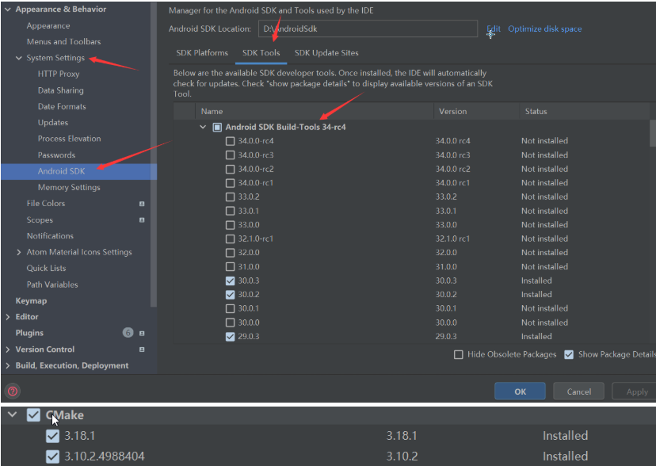
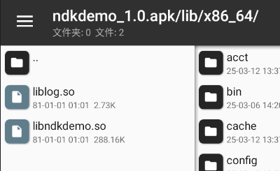
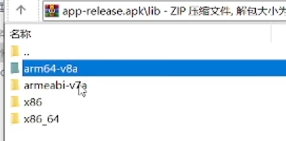
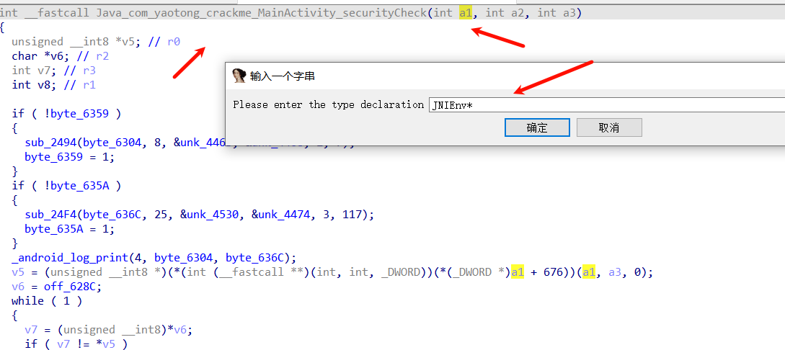
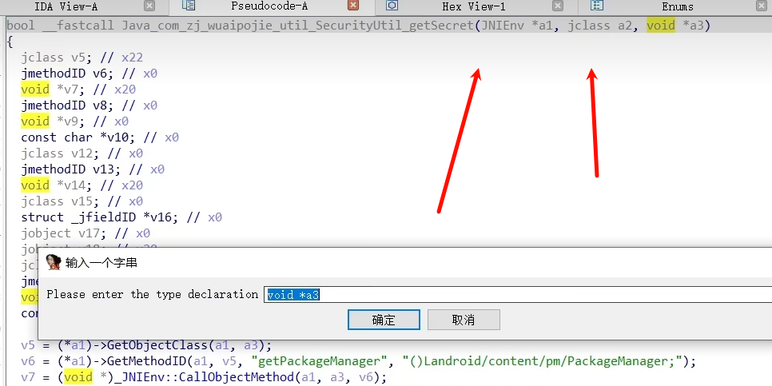

## **NDK开发**
NDK（Native Development Kit）是一套用于开发Android应用程序的工具集，它允许您在C/C++中编写性能关键的部分代码，并将这些代码与Java代码进行连接。

^


1.AS下载NDK和CMake


2.AS新建一个项目,往下拉,找到"c++"这个选项


3.查看src/main/cpp/ CMakeLists.txt和编写native-lib.cpp 下面是cmakelist.txt和native-lib.cpp文件的作用以及简要说明：

| 文件名            | 作用       | 说明                                                                                                     |
| -------------- | -------- | ------------------------------------------------------------------------------------------------------ |
| CMakeLists.txt | 构建配置文件   | CMakeLists.txt是用于配置NDK项目的构建系统的文件。它指定了构建所需的源文件、依赖项、编译选项等。在构建过程中，CMake会根据该文件的指示生成对应的构建脚本，用于编译本地代码并生成本地库。 |
| native-lib.cpp | 本地代码实现文件 | native-lib.cpp是包含本地代码实现的文件。它定义了通过Java和本地代码之间进行通信的本地方法。该文件中的函数实现将被编译为本地库，供Java代码调用。                     |


解释：
MainActivity类
```java
public class MainActivity extends AppCompatActivity {

    // Used to load the 'ndkdemo' library on application startup.
    static {
        System.loadLibrary("ndkdemo"); // 加载名为"ndkdemo"的库
    }

    private ActivityMainBinding binding; // 声明一个ActivityMainBinding变量

    @Override
    protected void onCreate(Bundle savedInstanceState) {
        super.onCreate(savedInstanceState);

        binding = ActivityMainBinding.inflate(getLayoutInflater()); // 使用ViewBinding将布局文件解析为一个ActivityMainBinding对象
        setContentView(binding.getRoot()); // 将Activity的布局设置为根布局

        // Example of a call to a native method
        TextView tv = binding.sampleText; // 获取布局文件中的TextView控件
        tv.setText(stringFromJNI()); // 调用本地方法stringFromJNI()并将其返回的字符串设置为TextView的文本内容
    }

    /**
     * A native method that is implemented by the 'ndkdemo' native library,
     * which is packaged with this application.
     */
    public native String stringFromJNI(); // 声明一个native方法stringFromJNI()
}

```
CMakeLists.txt
```java
# For more information about using CMake with Android Studio, read the
# documentation: https://d.android.com/studio/projects/add-native-code.html

# 设置构建本地库所需的CMake的最小版本要求
cmake_minimum_required(VERSION 3.22.1)

# 声明和命名项目
project("ndkdemo")

# 创建并命名一个库，设置其类型为STATIC或SHARED，并指定源代码的相对路径
# 可以定义多个库，CMake会为您构建它们
# Gradle会自动将共享库打包到APK中
add_library(
        # 设置库的名称
        ndkdemo

        # 设置库类型为共享库
        SHARED

        # 提供源文件的相对路径
        native-lib.cpp)

# 搜索指定的预构建库并将路径存储为变量。
# 由于CMake默认在搜索路径中包含系统库，因此您只需指定要添加的公共NDK库的名称。
# CMake会在完成构建之前验证该库是否存在。
find_library(
        # 设置路径变量的名称
        log-lib

        # 指定要让CMake定位的NDK库的名称
        log)

# 指定CMake应链接到目标库的库。
# 您可以链接多个库，例如在此构建脚本中定义的库、预构建的第三方库或系统库。
target_link_libraries(
        # 指定目标库
        ndkdemo

        # 将目标库链接到NDK中包含的log库
        ${log-lib})

```
native-lib.cpp
```c++
#include <jni.h> // JNI头文件，提供了JNI函数和数据类型的定义
#include <string> // C++标准库的string类

// 声明一个jni函数，该函数将会被Java代码调用
// JNIEXPORT表示这个函数是可导出的，并且可以被其他代码使用
// jstring表示这个函数返回的是一个Java字符串对象
// JNICALL是JNI函数的调用约定
// Java_com_example_ndkdemo_MainActivity_stringFromJNI是JNI函数的命名规则，与Java中对应的方法名对应
// Java打头，1包名,2类名,3方法名字;"_"号隔开
extern "C" JNIEXPORT jstring JNICALL
Java_com_example_ndkdemo_MainActivity_stringFromJNI(
        JNIEnv* env, // JNIEnv是指向JNI环境的指针，可以用来访问JNI提供的功能
        jobject /* this */) { // jobject是指向Java对象的指针，在本例中并没有使用

    std::string hello = "Hello from C++"; // 创建一个C++字符串对象
    return env->NewStringUTF(hello.c_str()); // 将C++字符串对象转换为Java字符串对象并返回
}


```


^
## **JNI的注册方式**
### 1.JNI的前世今生
NDK是开发套件，JNI才是调用的框架。所以与其说是NDK开发，不如说是JNI的开发。不过NDK是Android提供的开发套件。JNI可不是，JNI全称Java Native Interface,即Java本地接口，JNI是Java调用Native 语言的一种特性。通过JNI可以使得Java与C/C++机型交互。即可以在Java代码中调用C/C++等语言的代码或者在C/C++代码中调用Java代码。
### 2.JNI的两种注册方式
#### jni静态注册方式
静态注册的核心特点：命名规则严格遵循JNI规范。
上方的默认例子就是静态注册。本地方法的C++函数名严格按照 `Java_包名_类名_方法名` 的格式命名，例如：
```
Java_com_example_ndkdemo_MainActivity_stringFromJNI
      * `com.example.ndkdemo` 是Java类的包名
      * `MainActivity` 是包含native方法的Java类名
      * `stringFromJNI` 是Java层的native方法名
```


 
-   优点: 理解和使用方式简单, 属于傻瓜式操作, 使用相关工具按流程操作就行, 出错率低
-   缺点: 当需要更改类名,包名或者方法时, 需要按照之前方法重新生成头文件, 灵活性不高
#### jni动态注册方式

native-lib.cpp
```
#include <jni.h>
#include <string>

extern "C" {

JNIEXPORT jstring JNICALL Java_com_example_ndkdemo_MainActivity_nativeGetStringFromJNI(JNIEnv* env, jobject obj) {
    std::string hello = "Hello wuaipojie";
    return env->NewStringUTF(hello.c_str());
}

// 定义本地方法注册函数
JNIEXPORT jint JNICALL JNI_OnLoad(JavaVM* vm, void* reserved) {
    JNIEnv* env;
    if (vm->GetEnv(reinterpret_cast<void**>(&env), JNI_VERSION_1_6) != JNI_OK) {
        return -1;
    }

    // 定义要注册的本地方法
    JNINativeMethod methods[] = {
        {"nativeGetStringFromJNI", "()Ljava/lang/String;", reinterpret_cast<void*>(Java_com_example_ndkdemo_MainActivity_nativeGetStringFromJNI)}
    };

    // 获取类引用
    jclass clazz = env->FindClass("com/example/ndkdemo/MainActivity");
    if (clazz == nullptr) {
        return -1;
    }

    // 注册本地方法
    if (env->RegisterNatives(clazz, methods, sizeof(methods) / sizeof(methods[0])) < 0) {
        return -1;
    }

    return JNI_VERSION_1_6;
}

} // extern "C"


```

####  数据类型
下面是一些常见的C++数据类型和它们在Java中的对应关系，以及它们在JNI动态注册中的数据类型签名（signature）：


| C++ 数据类型 | Java 数据类型     | JNI 数据类型签名 |
| ------------ | ---------------- | ---------------- |
| jint         | int              | "I"              |
| jboolean     | boolean          | "Z"              |
| jbyte        | byte             | "B"              |
| jchar        | char             | "C"              |
| jshort       | short            | "S"              |
| jlong        | long             | "J"              |
| jfloat       | float            | "F"              |
| jdouble      | double           | "D"              |
| jobject      | Object           | "Ljava/lang/Object;" |
| jstring      | String           | "Ljava/lang/String;" |
| jarray       | Array            | "[elementType"    |
| jobjectArray | Object[]         | "[Ljava/lang/Object;" |
| jbooleanArray| boolean[]        | "[Z"             |
| jbyteArray   | byte[]           | "[B"             |
| jcharArray   | char[]           | "[C"             |
| jshortArray  | short[]          | "[S"             |
| jintArray    | int[]            | "[I"             |
| jlongArray   | long[]           | "[J"             |
| jfloatArray  | float[]          | "[F"             |
| jdoubleArray | double[]         | "[D"             |


在JNI动态注册中，需要使用正确的数据类型签名来声明本地方法。例如，如果你要注册一个返回`int`类型的本地方法，其数据类型签名应为`I`。


^
## **so分析**
此时打包出来的apk中，有lib目录中有so文件。


v8a使用ida64分析即可。
v7a使用ida32分析即可。

^
对于静态注册，ida中exports模块搜索java，即可找到固定的java开头的导出函数。
或者搜索java反编译后看到的native方法名。
找到方法可以修改第一个参数类型名，右键设置lr type值为JNIEnv*，自动识别函数，更好理解。



可以使用ida中的key patch插件修改汇编重写so。
将so替换回去，删除其他同类so，再apk重签名安装。

^
so中打印日志
 __android_log_print(4, "humen", "%c", v11);
第三个参数是内容